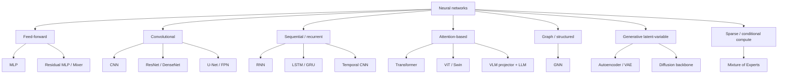

# Neural Architecture Tradeoffs

This note gives a high-level map of the main neural-network families and the tradeoffs that determine when to use them.

The right architecture is not just about raw accuracy. It is about matching the model's **inductive bias** to the
structure of the data and the production constraints.

## A compact selection principle

Choose the architecture whose assumptions best match the problem:

$$
\begin{aligned}
\text{best architecture}
&\approx \arg\max_{f \in \mathcal{F}} \big(
    \text{task fit} + \text{data fit} \\
&\quad + \text{systems fit} - \text{cost}
\big).
\end{aligned}
$$

Here, "systems fit" means latency, memory, throughput, parallelism, and deployability.

For a hardware-aware view of how these architecture choices translate into runtime,
see [Model complexity, parallelism, and hardware](../serving/model_complexity_parallelism_and_hardware.md).

## Architecture taxonomy

## 1. MLPs and residual MLPs

A multilayer perceptron alternates affine maps and nonlinearities:

$$
h^{(\ell+1)} = \phi\big(W^{(\ell)} h^{(\ell)} + b^{(\ell)}\big).
$$

### What problem it solves

An MLP is the default universal approximator for fixed-size vectors. It is strongest when the input is already a good
feature representation.

### Strengths

- simple and general
- easy to implement
- works well on learned embeddings, tabular features, and small heads on top of larger backbones

### Weaknesses

- does not encode locality, sequence order, or graph structure by default
- parameter count can become large on raw high-dimensional inputs
- weaker sample efficiency than architectures with better structural priors

### When to use

- classification/regression heads
- small tabular nets when trees are not preferred
- adapters, projection heads, and residual MLP blocks inside larger systems

### Residual MLP idea

Residual connections stabilize deep networks:

$$
y = x + F(x).
$$

They help gradient flow and make optimization easier, especially in very deep stacks.

## 2. CNNs

A convolutional layer uses local kernels with shared weights:

$$
y_{i,j,k} = \sum_{u,v,c} K_{u,v,c,k}\,x_{i+u,j+v,c}.
$$

### What problem it solves

CNNs assume that local spatial neighborhoods matter and that useful detectors should be reused across positions.

### Strengths

- excellent inductive bias for images
- parameter efficient due to weight sharing
- strong on limited-to-medium data regimes
- efficient for dense spatial feature extraction

### Weaknesses

- global context is indirect unless the receptive field becomes large
- hand-crafted locality bias can be too rigid for some large-scale tasks

### Best use cases

- image classification, detection, segmentation
- OCR and document pipelines
- any vision problem with strong local spatial structure

## 3. RNNs, LSTMs, and GRUs

An RNN evolves a hidden state through time:

$$
h_t = f(W_{xh}x_t + W_{hh}h_{t-1} + b).
$$

### What problem it solves

Sequential data arrives in order. Recurrent models compress past information into a compact state that can be updated
online.

### Strengths

- natural online/streaming processing
- compact state
- low per-step memory compared with full self-attention

### Weaknesses

- sequential dependency limits parallelism
- long-range dependencies are hard
- vanishing/exploding gradients complicate training

### Best use cases

- low-latency streaming
- moderate-length time series
- edge or embedded systems with strict memory constraints

See [RNN, LSTM, GRU, and gradient stability](rnn_lstm_gru_and_gradient_stability.md) for the full mathematical
treatment.

## 4. Temporal CNNs

A temporal CNN uses 1D convolutions over time:

$$
y_t = \sum_{\tau=0}^{k-1} K_{\tau} x_{t-\tau}.
$$

With dilation, the receptive field grows quickly:

$$
y_t = \sum_{\tau=0}^{k-1} K_{\tau} x_{t-d\tau}.
$$

### Why it exists

Temporal CNNs provide a middle ground between RNNs and Transformers: more parallelizable than recurrence, cheaper than
full attention.

### Tradeoff

- better parallelism than RNNs
- weaker adaptive long-range dependency modeling than attention

## 5. Transformers

Self-attention forms pairwise interactions between tokens:

$$
\mathrm{Attention}(Q,K,V)=\mathrm{softmax}\!\left(\frac{QK^\top}{\sqrt{d_k}}\right)V.
$$

### What problem it solves

Instead of forcing information through a recurrent chain, each token can directly access other tokens in the same layer.

### Strengths

- strong long-range dependency modeling
- highly parallel training
- flexible context mixing
- foundation-model friendly

### Weaknesses

- quadratic memory/time in full attention with respect to sequence length
- often more data hungry without pretraining
- serving cost grows with KV-cache and context length

### Best use cases

- language models
- long-context reasoning
- encoder/decoder sequence transduction
- ViTs and multimodal stacks

## 6. Vision Transformers and hybrid vision stacks

ViTs treat image patches as tokens:

$$
N = \frac{H}{P}\frac{W}{P}
$$

for image size $H \times W$ and patch size $P \times P$.

### Why they matter

They relax the strong locality prior of CNNs and model global interactions more directly.

### Tradeoff

- better global context and scaling with large pretraining
- weaker built-in locality bias than CNNs
- token count can be large on high-resolution images

Hybrid designs often combine CNN-like patch extraction with Transformer blocks.

## 7. Graph Neural Networks (GNNs)

A simple message-passing layer updates a node using its neighbors:

$$
h_v^{(\ell+1)} = \phi\!\left(W_1 h_v^{(\ell)} + \sum_{u \in \mathcal{N}(v)} W_2 h_u^{(\ell)}\right).
$$

### What problem it solves

When the data is relational rather than grid-like or sequential, graph structure is the natural prior.

### Best use cases

- molecules
- recommender systems
- fraud networks
- knowledge graphs

### Main limitation

Deep GNNs can oversmooth node representations, and scaling to huge dynamic graphs is nontrivial.

## 8. Autoencoders and VAEs

An autoencoder learns to reconstruct its input:

$$
z = f_\theta(x), \qquad \hat{x} = g_\phi(z).
$$

A VAE adds a probabilistic latent space with ELBO objective:

$$
\begin{aligned}
\mathcal{L}_{\text{VAE}}
&= \mathbb{E}_{q_\phi(z\mid x)}[\log p_\theta(x\mid z)] \\
&\quad - D_{\mathrm{KL}}\big(q_\phi(z\mid x)\,\|\,p(z)\big).
\end{aligned}
$$

### Why they matter

They are useful for compression, denoising, latent representation learning, and probabilistic generation.

## 9. Diffusion backbones

Diffusion models learn to reverse a noising process. A standard training objective predicts the injected noise:

$$
\mathcal{L}_{\text{diff}} = \mathbb{E}_{x,\epsilon,t}\,\|\epsilon - \epsilon_\theta(x_t,t)\|_2^2.
$$

### Why they matter

They are strong generative models for images and multimodal generation, often using U-Net-like backbones with attention.

### Main serving drawback

Iterative denoising can be expensive unless accelerated by distillation or improved samplers.

## 10. Mixture-of-Experts (MoE)

MoE routes each token to a subset of experts:

$$
y = \sum_{i=1}^{E} g_i(x)\, f_i(x),
$$

where $g_i(x)$ is sparse and usually only top-$k$ experts are active.

### Why it exists

MoE increases model capacity without activating all parameters for every token.

### Tradeoff

- better parameter efficiency at fixed FLOP budget
- routing imbalance, communication cost, and serving complexity

## Comparison table

| Family          | Core inductive bias                      |      Parallelism |                     Long-range modeling |                  Data efficiency | Serving implications                 | Typical best use                     |
|-----------------|------------------------------------------|-----------------:|----------------------------------------:|---------------------------------:|--------------------------------------|--------------------------------------|
| MLP             | None beyond dense function approximation |             High | Weak unless features already contain it |                         Moderate | Simple and cheap heads               | Vector features, projection heads    |
| CNN             | Locality + translation reuse             |             High |                                Indirect |                           Strong | Efficient spatial compute            | Vision, OCR, dense image features    |
| RNN/LSTM/GRU    | Ordered recurrence + compact state       |  Low across time |                                Moderate | Good on smaller sequential tasks | Small state, streaming-friendly      | Time series, streaming               |
| Temporal CNN    | Local temporal locality                  |             High |                  Moderate with dilation |                             Good | Cheap and parallel                   | Signals, time series                 |
| Transformer     | Pairwise content-based interactions      | High in training |                                  Strong |       Excellent with pretraining | KV-cache + context cost              | LLMs, seq2seq, ViTs                  |
| GNN             | Relational neighborhoods                 |           Medium |                  Depends on depth/graph |             Strong on graph data | Graph batching challenges            | Molecules, fraud, recommender graphs |
| Autoencoder/VAE | Compression through latent code          |             High |                                     N/A |                         Moderate | Useful for compression / pretraining | Denoising, representation learning   |
| Diffusion       | Denoising score matching                 |           Medium |                     Depends on backbone |                 Strong with data | Expensive iterative sampling         | Image / multimodal generation        |
| MoE             | Sparse conditional compute               |           Medium |                 Often Transformer-based |                  Strong at scale | Routing and communication overhead   | Large foundation models              |

## Architecture choice as a systems decision

A useful way to compare architectures is to connect the model family to its training and serving consequences.

### Example reasoning pattern

- A **CNN** is often easier to serve than a ViT at modest scale because its compute is structured and locality is
  explicit.
- A **Transformer** may outperform an RNN on long context, but at serving time it creates KV-cache pressure and latency
  tradeoffs.
- A **MoE model** can have attractive training-time or quality-per-FLOP properties, but production serving becomes
  harder because expert routing increases communication and load-balancing complexity.
- A **VLM** may inherit the serving pathologies of both the vision stack and the LLM stack, so architecture choice
  matters twice.

## Concise summary

A concise framing is:

> I choose architectures by matching the inductive bias to the data structure and then checking whether the resulting
> training and serving costs are acceptable. CNNs are strong when locality matters, RNNs when online state matters,
> Transformers when global context matters, and VLMs when cross-modal grounding matters. The interesting engineering
> work starts when the best modeling choice conflicts with the best serving choice.
