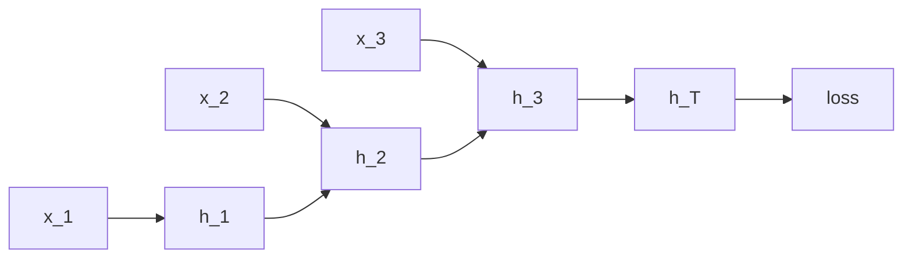

# RNN, LSTM, GRU, and Gradient Stability

This note is the detailed companion to [Sequential models](sequential_models.md). It focuses on recurrent architectures,
why they are difficult to optimize, and how the main mitigation techniques work mathematically.

## 1. Vanilla RNN recap

A standard RNN updates a hidden state one step at a time:

$$
a_t = W_{xh}x_t + W_{hh}h_{t-1} + b,
\qquad
h_t = \phi(a_t).
$$

The network is trained by **backpropagation through time (BPTT)**.



## 2. Why vanishing and exploding gradients happen

Let the loss be $\mathcal{L}$. For an early hidden state $h_k$, the gradient depends on products of Jacobians:

$$
\frac{\partial \mathcal{L}}{\partial h_k}
=
\frac{\partial \mathcal{L}}{\partial h_T}
\prod_{t=k+1}^{T}
\frac{\partial h_t}{\partial h_{t-1}}.
$$

For a vanilla RNN,

$$
\frac{\partial h_t}{\partial h_{t-1}}
=
\operatorname{diag}\big(\phi'(a_t)\big) W_{hh}.
$$

Therefore,

$$
\left\|\frac{\partial \mathcal{L}}{\partial h_k}\right\|
\lesssim
\left\|\frac{\partial \mathcal{L}}{\partial h_T}\right\|
\prod_{t=k+1}^{T}
\big\|\operatorname{diag}(\phi'(a_t)) W_{hh}\big\|.
$$

If the typical spectral norm of these factors is below $1$, the gradient shrinks exponentially: **vanishing gradient**.

If it is above $1$, the gradient grows exponentially: **exploding gradient**.

## 3. Intuition

### Vanishing gradients

The signal from late time steps to early time steps becomes extremely small. Then:

- early tokens/events have little influence on parameter updates
- long-term dependencies are hard to learn
- training may appear stable but the model forgets long contexts

### Exploding gradients

The gradient norm becomes huge. Then:

- parameter updates become unstable
- loss spikes or diverges
- hidden states can saturate or overflow numerically

## 4. Why activation functions matter

### Sigmoid and tanh

For sigmoid,

$$
\sigma'(z) = \sigma(z)(1-\sigma(z)) \le \frac{1}{4}.
$$

For tanh,

$$
\tanh'(z) = 1 - \tanh^2(z) \le 1.
$$

In saturation regions, both derivatives are near zero. Repeated multiplication by these small derivatives strongly
contributes to vanishing gradients.

### ReLU

ReLU avoids positive-side saturation:

$$
\operatorname{ReLU}(z) = \max(0,z),
\qquad
\operatorname{ReLU}'(z) \in \{0,1\}.
$$

This can help with vanishing in some feed-forward settings, but recurrent ReLU networks can still be unstable because
the recurrent matrix can amplify activations and gradients. ReLU is not a universal fix for RNN stability.

## 5. Gradient clipping

Gradient clipping is a fix for **exploding** gradients, not for vanishing gradients.

If the gradient vector is $g$, clip by global norm:

$$
\tilde g =
\begin{cases}
g & \text{if } \|g\|_2 \le c, \\
c \dfrac{g}{\|g\|_2} & \text{if } \|g\|_2 > c.
\end{cases}
$$

This scales down overly large gradients while preserving their direction.

### Best practice

- clip by global norm rather than elementwise when possible
- treat clipping as a stability guard, not a substitute for better architecture or initialization
- log gradient norms during training

## 6. Weight initialization and spectral control

The recurrent matrix $W_{hh}$ strongly affects gradient dynamics.

### Orthogonal initialization

If $W_{hh}$ is approximately orthogonal,

$$
W_{hh}^\top W_{hh} \approx I,
$$

then it preserves norms better than an arbitrary random matrix. This helps reduce both shrinkage and blow-up.

### Identity-like initialization

For some recurrent variants, initializing the recurrent matrix near identity helps preserve state over time:

$$
h_t \approx \phi(x_t + h_{t-1}).
$$

### Best practice

- use orthogonal or identity-like recurrent initialization
- initialize forget gates in LSTMs with a positive bias so the network initially remembers more
- avoid recurrent matrices with large uncontrolled spectral radius

## 7. Gated cells: why LSTM works

LSTM introduces a cell state $c_t$ and gates:

$$
i_t = \sigma(W_i x_t + U_i h_{t-1} + b_i),
$$
$$
f_t = \sigma(W_f x_t + U_f h_{t-1} + b_f),
$$
$$
o_t = \sigma(W_o x_t + U_o h_{t-1} + b_o),
$$
$$
g_t = \tanh(W_g x_t + U_g h_{t-1} + b_g),
$$
$$
c_t = f_t \odot c_{t-1} + i_t \odot g_t,
$$
$$
h_t = o_t \odot \tanh(c_t).
$$

```mermaid
flowchart LR
    X[x_t] --> GATES[input, forget, output gates]
    HPREV[h_{t-1}] --> GATES
    CPREV[c_{t-1}] --> SUM[(cell update)]
    GATES --> SUM
    SUM --> C[c_t]
    C --> H[h_t]
    GATES --> H
```

### Why the cell state helps

The key is the additive update

$$
c_t = f_t \odot c_{t-1} + i_t \odot g_t.
$$

The derivative with respect to the previous cell is approximately

$$
\frac{\partial c_t}{\partial c_{t-1}} = f_t.
$$

If the forget gate stays near $1$, gradients can flow through many steps with much less attenuation than in a plain RNN.
This is the intuition behind the so-called **constant error carousel**.

### Why the gates help

- **forget gate** decides how much old memory to retain
- **input gate** decides how much new content to write
- **output gate** decides how much cell content to expose

Because these decisions are multiplicative and learned, the network can preserve or overwrite memory selectively.

## 8. Why GRU works

A GRU merges memory and hidden state more compactly:

$$
z_t = \sigma(W_z x_t + U_z h_{t-1}),
$$
$$
r_t = \sigma(W_r x_t + U_r h_{t-1}),
$$
$$
\tilde h_t = \tanh(W_h x_t + U_h(r_t \odot h_{t-1})),
$$
$$
h_t = (1-z_t) \odot h_{t-1} + z_t \odot \tilde h_t.
$$

The update is again partly additive:

$$
h_t = h_{t-1} + z_t \odot (\tilde h_t - h_{t-1}),
$$

which creates a shorter and more controlled gradient path than a vanilla RNN.

### LSTM vs GRU

- **LSTM**: more explicit memory control, often preferred for harder long-memory problems
- **GRU**: simpler, fewer parameters, often competitive in practice

## 9. Other mitigation techniques

### Layer normalization

Normalize intermediate activations within a time step:

$$
\operatorname{LN}(a) = \gamma \frac{a - \mu}{\sqrt{\sigma^2 + \epsilon}} + \beta.
$$

This stabilizes activation scale and often makes optimization smoother.

### Residual / skip connections across layers

For stacked recurrent layers,

$$
h^{(\ell+1)}_t = h^{(\ell)}_t + F\big(h^{(\ell)}_t\big)
$$

shortens gradient paths across depth.

### Truncated BPTT

Instead of backpropagating through the entire sequence, use windows of length $K$.

This reduces compute and memory cost, but it also limits the maximum learned dependency length.

### Curriculum on sequence length

Start with shorter sequences and gradually increase length. This can make optimization easier before asking the model to
manage harder long-range interactions.

### Masking, bucketing, and packed sequences

Grouping similar sequence lengths reduces padding waste and improves gradient signal quality because fewer operations
are spent on padded positions.

### Recurrent dropout and zoneout

Careful regularization can help generalization without destabilizing the hidden state. Variational/recurrent dropout is
typically preferred over naive time-step-independent dropout inside recurrence.

### Better optimizers and learning-rate schedules

Adam/AdamW with moderate learning rates is often more robust than plain SGD for recurrent training. Warmup and decay
schedules also help.

### Gradient noise monitoring

Track gradient norms, hidden-state norms, and loss spikes. Many "mysterious" recurrent failures are simply unnoticed
instability.

## 10. What does not really solve the problem

- **Gradient clipping** does not fix vanishing gradients.
- **Using ReLU alone** does not guarantee recurrent stability.
- **Making the hidden size larger** can increase capacity but does not remove the underlying gradient pathology.
- **Longer training** does not solve a broken gradient path.

## 11. RNN vs LSTM/GRU vs Transformer

| Architecture | Strength                               | Main weakness                         | Best regime                                |
|--------------|----------------------------------------|---------------------------------------|--------------------------------------------|
| Vanilla RNN  | Small, simple, online                  | Severe long-range gradient issues     | Teaching, tiny streaming tasks             |
| LSTM         | Better long-term memory via cell state | More parameters and slower per step   | Time series, speech, online sequence tasks |
| GRU          | Simpler than LSTM, often competitive   | Slightly less explicit memory control | Practical recurrent baseline               |
| Transformer  | Global interactions, parallel training | Attention cost and KV-cache pressure  | Long-context NLP and foundation models     |

## 12. Practical summary

A good summary usually contains these points:

1. In a vanilla RNN, gradients are products of many Jacobians, so they can decay or blow up exponentially.
2. Sigmoid and tanh saturation worsen vanishing gradients.
3. Gradient clipping is mainly for exploding gradients.
4. Orthogonal initialization and controlled spectral radius improve stability.
5. LSTM and GRU help because they create additive memory paths and learned gates.
6. In production, RNNs remain useful for streaming and compact-state settings, even though Transformers dominate many
   offline sequence tasks.

## 13. Concise summary

> Vanishing and exploding gradients in RNNs come from repeatedly multiplying the recurrent Jacobian through time. If the
> effective norm is below one, gradients vanish; if it is above one, they explode. I would mitigate explosion with
> gradient clipping and controlled recurrent initialization, and I would mitigate vanishing mainly with better
> architecture, especially LSTM or GRU, because the gated additive memory path gives a much shorter and more stable
> gradient route. I would also use layer norm, appropriate optimizer settings, and sequence-length-aware training
> practices.
