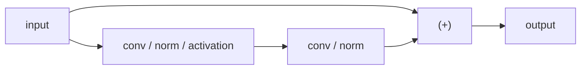
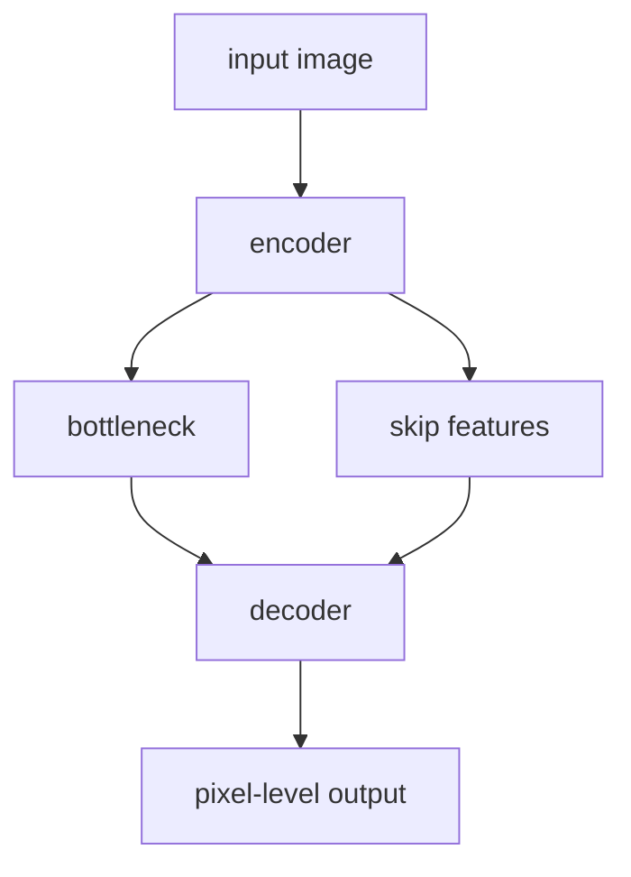

# Vision Models

Vision models learn representations from images or videos. The key design choice is how strongly the architecture should
encode spatial locality, translation structure, hierarchy, and global context.

## 1. Why vision needs structure

An image is not an arbitrary vector. It has two-dimensional geometry:

$$
x \in \mathbb{R}^{H \times W \times C}.
$$

A good vision architecture should answer four questions:

- how to extract local patterns
- how to build larger receptive fields
- how to preserve or recover spatial detail
- how to mix local and global context

## 2. CNNs: the classic vision prior

A convolutional layer applies a local kernel everywhere:

$$
y_{i,j,k} = \sum_{u,v,c} K_{u,v,c,k}\, x_{i+u, j+v, c}.
$$

### Why CNNs work

- **locality**: nearby pixels matter for local patterns
- **weight sharing**: the same feature detector can be reused at many positions
- **hierarchy**: edges $\to$ textures $\to$ parts $\to$ objects

### Core tradeoff

A CNN is highly sample-efficient on natural images, but its strong locality bias means long-range interactions are
indirect unless depth or attention is added.

## 3. Receptive field and downsampling

The receptive field is the input region that can affect a feature.

### Why it matters

- small receptive field preserves detail but misses global structure
- large receptive field captures objects and layout but may blur fine structure

### Pooling / striding

Downsampling increases the effective receptive field and reduces compute, but it loses spatial resolution. This is good
for classification, but dangerous for segmentation, OCR, and document understanding.

## 4. Residual CNNs

Residual blocks use skip connections:

$$
y = x + F(x).
$$

They improve gradient flow and enable much deeper networks.

### Why they matter

- stabilize optimization
- allow deeper feature hierarchies
- strong practical default for vision backbones

## 5. CNN design patterns

### 5.1 1x1 convolutions

A $1 \times 1$ convolution mixes channels without expanding spatial support. It is useful for bottlenecks and channel
projection.

### 5.2 Depthwise separable convolutions

Standard convolution is expensive. Depthwise separable convolution factorizes it into:

- depthwise spatial filtering per channel
- pointwise channel mixing

This reduces compute significantly and is common in mobile models.

### 5.3 Dilated convolutions

Dilated convolutions increase receptive field without extra pooling:

$$
y_{i,j} = \sum_{u,v} K_{u,v} x_{i+du, j+dv}.
$$

Useful for segmentation and dense prediction, but can create gridding artifacts if overused.

### 5.4 U-Net and encoder-decoder designs

U-Net uses a contracting path plus an expanding path with skip connections. It is ideal when you need both semantics and
precise localization.

### 5.5 Feature pyramids (FPN)

Detection and document analysis often need multi-scale features. FPN combines coarse semantic features with fine spatial
features across scales.

## 6. Vision Transformers (ViT)

A ViT divides the image into patches and treats them as tokens.

If the patch size is $P \times P$, then:

$$
N = \frac{H}{P}\frac{W}{P}
$$

patch tokens are produced.

### Why ViTs work

- direct global interaction through attention
- strong scaling with data and pretraining
- natural compatibility with multimodal stacks

### Main tradeoff

- weaker built-in locality prior than CNNs
- token count can become large at high resolution
- often needs more pretraining or augmentation than CNNs from scratch

## 7. Hierarchical Transformers: Swin-style idea

Pure global attention over all image patches is expensive. Hierarchical transformers reduce cost by using windows and
progressively downsampling features.

### Why this helps

- more scalable than full global attention on high-resolution images
- retains some of the multi-scale structure that CNNs naturally capture

## 8. CNN vs ViT

| Question                     | CNN answer                               | ViT answer                               |
|------------------------------|------------------------------------------|------------------------------------------|
| What prior is encoded?       | Strong locality and translation reuse    | More flexible global mixing              |
| Data efficiency from scratch | Usually better                           | Usually worse without large pretraining  |
| Global context               | Indirect unless depth/attention is added | Direct via self-attention                |
| High-resolution dense tasks  | Often efficient and strong               | Possible, but token count matters        |
| Fit for multimodal stacks    | Good as visual encoder                   | Very natural with Transformer/LLM stacks |

## 9. Architecture choices by task

### Image classification

- CNNs remain very strong defaults
- ViTs become especially attractive with enough pretraining data

### Object detection

- often uses CNN or hierarchical Transformer backbones plus FPN-style multi-scale features

### Semantic / instance segmentation

- U-Net, DeepLab-style, or encoder-decoder architectures are common because they preserve and recover spatial detail

### OCR and document understanding

- high resolution and layout sensitivity matter
- multi-scale features matter
- text can be tiny, so naive downsampling hurts

### Video understanding

- options include 2D CNN + temporal head, 3D CNNs, temporal attention, or factorized space-time Transformers

## 10. Best practices

### For CNN-heavy stacks

- avoid too much early downsampling if small text or fine detail matters
- use residual connections for depth
- use feature pyramids or skip connections for dense outputs
- prefer depthwise-separable blocks when mobile efficiency matters

### For ViT-heavy stacks

- pay attention to patch size because it trades spatial detail against token count
- use hierarchical designs for very high-resolution inputs
- expect stronger dependence on pretraining and data scale

## 11. Vision architectures in VLMs

Most VLMs use one of these visual encoders:

- CNN or ResNet-style backbone
- ViT / hierarchical Transformer backbone
- document-specific encoder with layout sensitivity

The choice affects serving directly:

- more patches or higher resolution increase visual token count
- more visual tokens increase attention cost and memory use downstream
- document VLMs are often harder to serve because they require both high resolution and long textual context

## 12. Concise summary

> CNNs are strong because they encode the right prior for natural images: locality, weight sharing, and hierarchical
> composition. ViTs are stronger when I want more flexible global context and I have enough data or pretraining. For
> dense tasks like segmentation or document understanding, I care a lot about not destroying spatial detail too early,
> so encoder-decoder and multi-scale designs become important.
