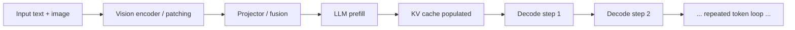
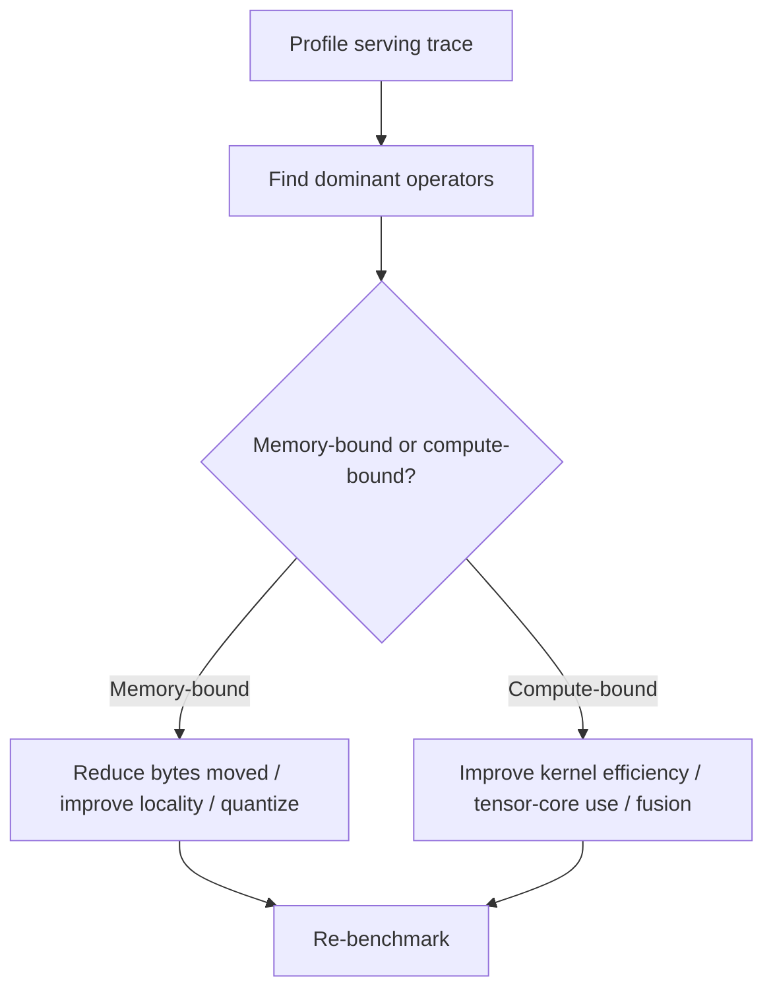

# Inference Kernel Bottlenecks: Operator-Level Thinking for H100 and MI300X

This document connects generic CUDA/HIP knowledge to operator-level reasoning about inference bottlenecks.

## 1. The key question

When serving a VLM, which operators dominate runtime, and are they limited by **compute**, **memory bandwidth**, or *
*scheduler / launch overhead**?

## 2. Arithmetic intensity and roofline intuition

A useful first principle is arithmetic intensity:

$$
\mathrm{AI} = \frac{\text{FLOPs}}{\text{Bytes moved}}.
$$

Low AI suggests a memory-bound operator. High AI suggests a compute-bound operator, assuming implementation quality is
decent.

A rough latency model for an operator is

$$
T \approx \max\left(\frac{\text{FLOPs}}{\text{peak compute}}, \frac{\text{Bytes}}{\text{memory bandwidth}}\right) + T_{\text{overhead}}.
$$

## 3. Which operators usually matter in serving

### Prefill-heavy path

- attention projections
- attention score/value application
- MLP / feed-forward layers
- vision encoder blocks
- projection or fusion layers

### Decode-heavy path

- incremental attention using KV cache
- KV-cache reads and writes
- small but repeated normalization and projection work
- sampling / logits processing overheads

## Diagram: serving path by phase

## 4. Why decode often becomes memory-bound

During autoregressive decoding, the model repeatedly reads weights and KV-cache state for a small amount of new
computation per token. That frequently leads to a bandwidth-bound regime.

This is why the effective time per output token often tracks memory movement more than raw peak FLOPs.

## 5. Why VLMs are harder than text-only serving

VLMs add one or more of these costs:

- a vision encoder before the decode loop
- many visual tokens entering the language stack
- larger prefill cost and larger KV-cache footprint
- high-resolution image or document handling

That means both TTFT and memory pressure can increase sharply.

## 6. H100 vs MI300X reasoning

A good hardware-aware answer is not just “which GPU is faster?” but “which bottleneck dominates?”

### If memory capacity is the limiting factor

MI300X can be attractive because larger memory enables:

- larger batch sizes
- larger contexts
- larger document/image inputs
- fewer compromises on model size or visual token count

### If software stack maturity and kernel ecosystem dominate

H100 can be attractive because the NVIDIA optimization ecosystem is often more mature.

### Capacity vs bandwidth vs software maturity

A deployment decision is really a three-way tradeoff:

$$
\text{system value} \approx f(\text{capacity}, \text{bandwidth}, \text{software maturity}).
$$

## 7. Common inference bottlenecks to mention

- attention kernels limited by memory movement
- KV-cache fragmentation and cache-management overhead
- quantize/dequantize overhead if compression is poorly chosen
- kernel launch overhead for many small ops
- poor fusion leaving bandwidth on the table
- visual-token explosion from high-resolution inputs

## 8. Why fusion matters

If multiple small operations are fused into one kernel, bytes are often moved fewer times. That improves arithmetic
intensity and reduces launch overhead.

A qualitative relation is:

$$
T_{\text{fused}} < \sum_i T_i,
$$

because intermediate writes and reads are reduced.

## Diagram: bottleneck analysis loop

## 9. Practical summary

A concise summary is:

> At operator level, I first ask whether serving is compute-bound or memory-bound. For decode this is often a
> memory-bandwidth story because of repeated weight and KV-cache movement. For VLMs, the prefill side can also become
> expensive because of the vision encoder and visual token inflation. So I think in terms of arithmetic intensity, bytes
> moved, KV pressure, and the software maturity of the target stack, especially when comparing H100 and MI300X.
