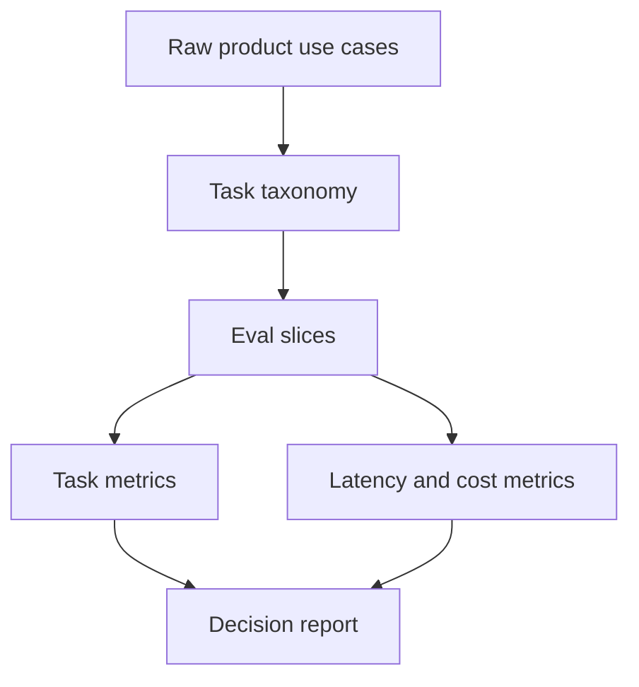
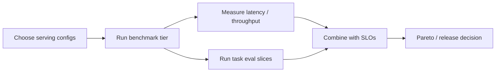

# VLM Evaluation, Custom Evaluation Sets, and SLO-Aware Benchmarking

Benchmarking a VLM is not only about reporting a single score. It is about connecting:

- model quality
- grounding quality
- document/task realism
- latency, throughput, and cost under service constraints

## 1. Why custom evaluation sets matter

Generic public benchmarks are useful, but product quality depends on the distribution that actually matters.

For a serious production workflow, the evaluation set should reflect:

- target document types or image domains
- language mix
- OCR difficulty
- resolution and page complexity
- long-context usage patterns
- business-critical failure cases

## 2. Build evaluation by slices, not just one aggregate score

A good eval set is stratified into slices such as:

- easy vs hard OCR
- single-page vs multi-page
- Latin vs non-Latin scripts
- natural images vs screenshots vs documents
- short vs long prompts
- low-resolution vs high-resolution inputs

If overall score is

$$
M = \sum_{k=1}^{K} w_k M_k,
$$

the slice metrics $M_k$ are often more informative than the overall weighted average.

## Diagram: evaluation stack

## 3. Align metrics to the model family

Different VLM families need different primary metrics:

- **dual encoders**: Recall@K, ranking quality, zero-shot accuracy
- **fusion encoders**: classification, entailment, VQA accuracy
- **grounding-native models**: IoU-thresholded accuracy, box AP, phrase-region accuracy
- **document models**: exact match, normalized edit distance, field F1, table structure metrics
- **generative multimodal models**: answer accuracy, groundedness, hallucination rate, citation or evidence quality

## 4. Task-quality metrics by problem family

### Retrieval

$$
\mathrm{Recall@K} = \frac{1}{N}\sum_{i=1}^{N} \mathbf{1}(\text{relevant item in top-}K).
$$

### Classification

$$
\mathrm{Accuracy} = \frac{1}{N}\sum_{i=1}^{N} \mathbf{1}(\hat{y}_i = y_i).
$$

### Structured extraction

For precision and recall,

$$
\mathrm{Precision} = \frac{TP}{TP+FP},
\qquad
\mathrm{Recall} = \frac{TP}{TP+FN},
$$

and

$$
F_1 = \frac{2PR}{P+R}.
$$

### Grounding / REC

Use IoU-thresholded accuracy:

$$
\mathrm{Acc}@\tau = \frac{1}{N}\sum_i \mathbf{1}(\mathrm{IoU}(b_i, \hat{b}_i) \ge \tau).
$$

### OCR-like text similarity

For string-style extraction, normalized edit distance is common:

$$
\mathrm{NED}(x, y) = \frac{\mathrm{EditDistance}(x, y)}{\max(|x|, |y|)}.
$$

## 5. Service metrics

A deployment decision should also include:

- TTFT
- TPOT
- ITL
- E2E latency
- requests/sec
- tokens/sec
- P50 / P95 / P99
- memory usage
- cost per request or per generated token

## 6. SLO-aware evaluation

A useful operational metric is **goodput**, not raw throughput.

If the system processes $\lambda$ requests per second and only a fraction $p_{\text{SLO}}$ meet latency and correctness
constraints, then

$$
\mathrm{goodput} = \lambda p_{\text{SLO}}.
$$

One can make this stricter by requiring both service and quality constraints:

$$
\mathrm{goodput}_{\text{qualified}} = \lambda \cdot
\Pr(\mathrm{latency} \le L_{\max},\ \mathrm{quality} \ge Q_{\min}).
$$

## 7. Pareto selection

Each configuration $c$ has a vector of outcomes such as:

$$
\phi(c) = (\mathrm{TTFT}(c), \mathrm{TPOT}(c), \mathrm{throughput}(c), \mathrm{quality}(c)).
$$

A configuration is useful only if it is not clearly dominated by another one for the objectives that matter. This is the
operational use of a Pareto frontier.

## Diagram: benchmark and selection loop

## 8. Why this matters for documents and VLMs

Document VLMs often fail in ways aggregate benchmarks hide:

- they may answer fluently while extracting the wrong field
- small-font OCR may collapse before general visual QA does
- multilingual slices may fail earlier than English slices
- tail latency may spike on large pages even when median latency looks fine

The same issue appears in grounding tasks: an answer can look plausible while the box, mask, or evidence span is wrong.

## 9. Practical summary

A concise summary is:

> It is rarely enough to rely on one global benchmark number. Slice-based evaluation should reflect the actual task
> distribution, and both task-quality and service metrics should be tracked. For multimodal systems, especially
> grounding- and document-heavy ones, the key question is not only whether the model is fluent, but whether it grounds
> correctly, extracts the right fields, and still meets latency targets on the hard slices.
