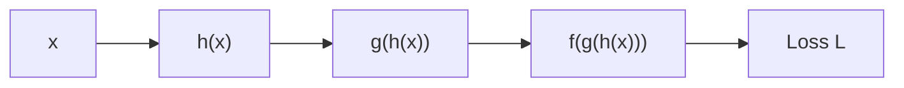

# Optimization, Derivatives, and Backpropagation

Training a neural network means minimizing a loss function with respect to model parameters.

## 1. Derivative: the local rate of change

For a scalar function $f(x)$,

$$
f'(x)=\lim_{h\to 0}\frac{f(x+h)-f(x)}{h}.
$$

Interpretation:

- the slope of the tangent line
- the best local linear approximation
- sensitivity of the output to a small change in the input

Locally,

$$
f(x+h)\approx f(x)+f'(x)h.
$$

## 2. Gradients, Jacobians, and the chain rule

For a multivariable function $L(\theta_1,\dots,\theta_p)$, the gradient is

$$
\nabla_\theta L =
\begin{bmatrix}
\frac{\partial L}{\partial \theta_1}\\
\vdots\\
\frac{\partial L}{\partial \theta_p}
\end{bmatrix}.
$$

It points in the direction of steepest increase of the loss. Gradient descent therefore moves in the negative gradient
 direction.

If a vector-valued function $y=f(x)$ maps $\mathbb{R}^m \to \mathbb{R}^n$, its derivative is the Jacobian

$$
J_f(x)=\frac{\partial y}{\partial x}\in\mathbb{R}^{n\times m}.
$$

For compositions, Jacobians multiply. If

$$
y=f(g(x)),
$$

then

$$
\frac{\partial y}{\partial x}=\frac{\partial y}{\partial g}\frac{\partial g}{\partial x}.
$$

This is the matrix form of the chain rule and is the algebraic core of backpropagation.

## 3. Forward pass vs backward pass

### Forward pass

Given parameters $\theta$, compute:

1. pre-activations
2. activations
3. predictions
4. loss

### Backward pass

Use the chain rule to compute gradients of the loss with respect to every parameter.

If

$$
L = f(g(h(x))),
$$

then

$$
\frac{dL}{dx} = \frac{dL}{df}\frac{df}{dg}\frac{dg}{dh}\frac{dh}{dx}.
$$

Backpropagation is just systematic application of this rule to a computational graph.



## 4. Worked example: a 2-layer network

Take

$$
z_1 = w_1x + b_1,
\qquad
h = \operatorname{ReLU}(z_1),
$$

$$
z_2 = w_2 h + b_2,
\qquad
\hat y = \sigma(z_2),
$$

with binary cross-entropy loss

$$
L = -\left[y\log \hat y + (1-y)\log(1-\hat y)\right].
$$

A useful identity is

$$
\frac{\partial L}{\partial z_2} = \hat y - y
$$

for a sigmoid output with binary cross-entropy.

Then

$$
\frac{\partial L}{\partial w_2} = (\hat y-y)h,
\qquad
\frac{\partial L}{\partial b_2} = \hat y-y.
$$

The gradient passed to the hidden unit is

$$
\frac{\partial L}{\partial h} = (\hat y-y)w_2.
$$

Back through ReLU:

$$
\frac{\partial h}{\partial z_1} =
\begin{cases}
1 & z_1 \gt 0,\\
0 & z_1 \lt 0.
\end{cases}
$$

At $z_1=0$, ReLU is not differentiable. In practice, autodiff systems pick a subgradient, often $0$.

Hence

$$
\frac{\partial L}{\partial z_1} =
\frac{\partial L}{\partial h}\frac{\partial h}{\partial z_1}.
$$

Finally,

$$
\frac{\partial L}{\partial w_1} = \frac{\partial L}{\partial z_1}x,
\qquad
\frac{\partial L}{\partial b_1} = \frac{\partial L}{\partial z_1}.
$$

## 5. Vectorized mini-batch view

For a mini-batch of size $B$, let $X\in\mathbb{R}^{B\times d_{\text{in}}}$, hidden activations
$H\in\mathbb{R}^{B\times d_h}$, and output logits $Z\in\mathbb{R}^{B\times d_{\text{out}}}$.

A linear layer computes

$$
Z = XW + \mathbf{1}b^\top.
$$

If the upstream gradient is $G=\partial L/\partial Z$, then the parameter gradients are

$$
\frac{\partial L}{\partial W}=X^\top G,
\qquad
\frac{\partial L}{\partial b}=\sum_{i=1}^{B} G_i,
$$

and the gradient propagated to the input is

$$
\frac{\partial L}{\partial X}=GW^\top.
$$

This is why backprop in dense networks is largely a sequence of matrix multiplies.

## 6. Parameter updates

Gradient descent uses

$$
\theta \leftarrow \theta - \eta \nabla_\theta L,
$$

where $\eta$ is the learning rate.

Mini-batch SGD uses a noisy estimate of the full gradient.

## 7. Optimizer families

### SGD

Simple and robust:

$$
\theta_{t+1} = \theta_t - \eta g_t.
$$

### Momentum

Adds an exponentially decaying velocity:

$$
v_{t+1} = \beta v_t + g_t,
\qquad
\theta_{t+1} = \theta_t - \eta v_{t+1}.
$$

Useful when the surface has narrow valleys or oscillatory directions.

### Adam

Tracks first and second moments of the gradient:

$$
m_t=\beta_1 m_{t-1} + (1-\beta_1)g_t,
\qquad
v_t=\beta_2 v_{t-1} + (1-\beta_2)(g_t \odot g_t).
$$

Because $m_t$ and $v_t$ are biased toward zero early in training, Adam usually applies bias correction:

$$
\hat m_t = \frac{m_t}{1-\beta_1^t},
\qquad
\hat v_t = \frac{v_t}{1-\beta_2^t}.
$$

The update is then

$$
\theta_{t+1} = \theta_t - \eta \frac{\hat m_t}{\sqrt{\hat v_t}+\varepsilon}.
$$

Adam is often faster to tune, though SGD with momentum sometimes generalizes better.

## 8. Why gradients vanish or explode

When many Jacobians are multiplied together:

- derivatives smaller than $1$ can shrink gradients toward $0$
- derivatives larger than $1$ can blow them up

This is why initialization, normalization, residual connections, activation choice, and gating matter.

A simple scalar mental model is

$$
\frac{dL}{dx_0} = \prod_{t=1}^{T} a_t.
$$

If typical $|a_t| \lt 1$, the product tends to vanish; if typical $|a_t| \gt 1$, it tends to explode.

## 9. Small code example

```python
optimizer.zero_grad()
logits = model(x_batch)
loss = criterion(logits, y_batch)
loss.backward()      # backpropagation
optimizer.step()     # parameter update
```

## 10. What to remember

- Forward pass computes predictions and loss.
- Backward pass computes gradients by the chain rule.
- In vectorized implementations, gradients are mostly matrix multiplies.
- Optimization updates parameters to reduce the loss.
- Training stability depends on both the objective and the geometry of gradient flow.
