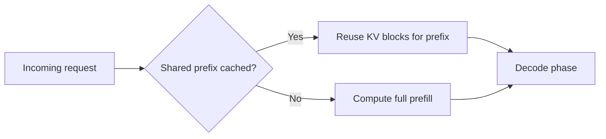
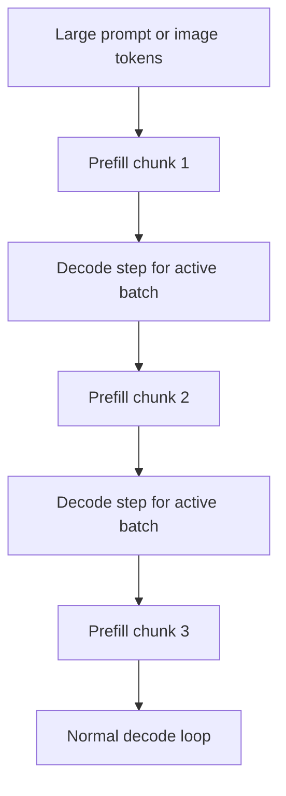
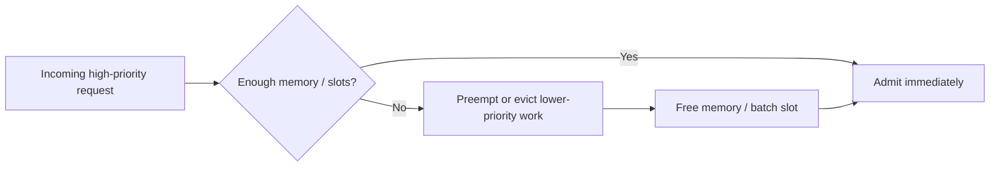
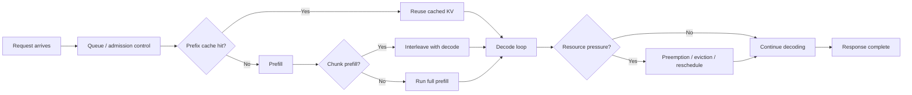

# Advanced Serving Features: Prefix Caching, Chunked Prefill, Preemption, and Runtime Tradeoffs

The repository already explains batching and KV cache. This document covers the next layer of serving concepts that
matter in practical inference systems.

## 1. Prefix caching

### Idea

If many requests share the same prompt prefix, the server can reuse previously computed KV-cache entries for that shared
prefix instead of recomputing them.

This is especially useful for:

- repeated system prompts
- repeated long instructions
- shared document context prefixes
- templated enterprise prompts

### Cost reduction intuition

Let the prefill cost for a request be

$$
C_{\text{prefill}} = c \cdot L,
$$

where $L$ is prefix length. If a fraction $h$ of the prefix is already cached, the remaining prefill cost is roughly

$$
C_{\text{prefill,new}} \approx c \cdot (1-h)L.
$$

So with a high cache hit ratio $h$, TTFT can drop substantially.

### Diagram: prefix caching

## 2. Chunked prefill

### Why it exists

Long prompts or large visual inputs can monopolize GPU time during prefill. Chunked prefill breaks large prefill work
into smaller pieces so the scheduler can interleave it with decode work from ongoing requests.

### Intuition

Without chunking, one huge prefill can create head-of-line blocking. With chunking, the system can preserve
responsiveness for short interactive requests.

If a prompt of length $L$ is split into chunks of size $c$, the number of chunks is

$$
N_{\text{chunks}} = \left\lceil \frac{L}{c} \right\rceil.
$$

The scheduling benefit comes from allowing decode work to be inserted between these chunks.

### Diagram: chunked prefill scheduling

## 3. Preemption

### Idea

When GPU memory or scheduler capacity is constrained, the serving system may pause, evict, or reschedule lower-priority
work so higher-priority or better-fitting requests can proceed.

In practice, preemption appears in different forms:

- scheduler-level priority handling
- request pausing and resumption
- KV-cache eviction / recomputation tradeoffs

### Core tradeoff

Preemption can improve tail latency for important requests, but it may increase total work if evicted state must be
recomputed later.

A simple way to think about this is:

$$
\text{effective cost} = \text{forward cost} + \text{recompute overhead} + \text{scheduler overhead}.
$$

### Diagram: preemption under pressure

## 4. TTFT, TPOT, ITL, and E2E latency

These metrics should be related, not memorized in isolation.

Let:

- $t_q$ = queueing time
- $t_p$ = prefill time
- $t_{d,1}$ = time to first decode token
- $N$ = number of generated output tokens
- $t_{d,i}$ = decode time for token $i$

Then a useful approximation is

$$
\mathrm{TTFT} \approx t_q + t_p + t_{d,1}.
$$

End-to-end latency is

$$
\mathrm{E2E} = t_q + t_p + \sum_{i=1}^{N} t_{d,i}.
$$

If $N > 1$, a common TPOT-style approximation is

$$
\mathrm{TPOT} \approx \frac{\mathrm{E2E} - \mathrm{TTFT}}{N-1}.
$$

Inter-token latency can be thought of as the sequence

$$
\mathrm{ITL}_i = t_{d,i+1} - t_{d,i}
$$

or, more operationally, the spacing between successive emitted tokens.

## 5. Goodput under SLOs

Throughput alone is not enough if many requests violate latency SLOs.

If the offered throughput is $\lambda$ and the fraction of requests meeting the SLO is $p_{\text{SLO}}$, then a useful
operational metric is

$$
\mathrm{goodput} = \lambda \cdot p_{\text{SLO}}.
$$

This is why a high-throughput configuration can still be operationally bad.

## 6. Why these features matter more for VLMs

VLMs intensify these issues because:

- long prompts and large visual token counts increase prefill cost
- document pages and high-resolution images can create bursty memory use
- decoder-side KV pressure is often already high before image-heavy prompts are added
- interactive multimodal products are especially sensitive to TTFT

## Diagram: full request lifecycle

## Practical summary

A concise summary is:

> After batching and KV cache, the next serving concepts I think about are prefix caching, chunked prefill, and
> preemption. Prefix caching reduces repeated prefill work, chunked prefill protects interactive latency when prompts
> are long, and preemption is a scheduler tool for dealing with contention and memory pressure. I relate all of them
> back to TTFT, TPOT, ITL, E2E latency, and especially goodput under SLOs.
