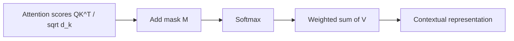
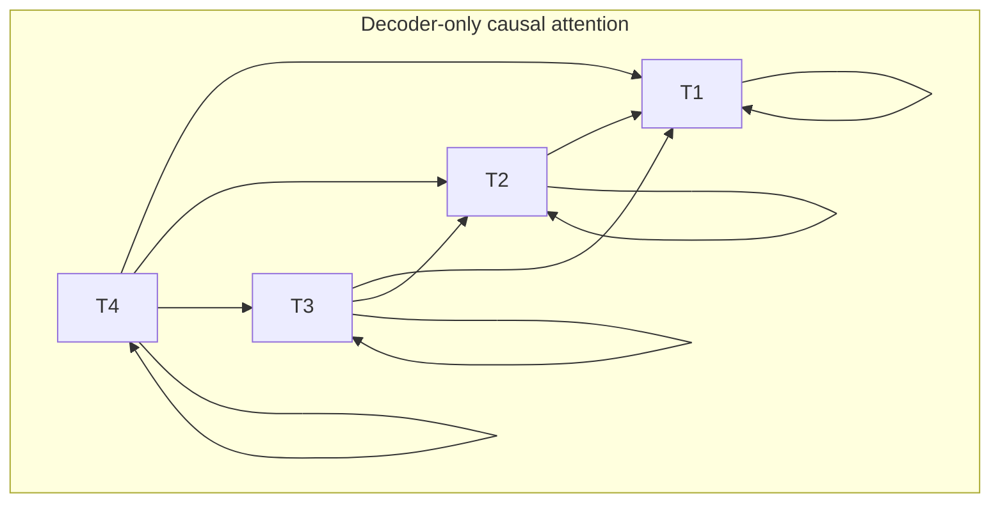
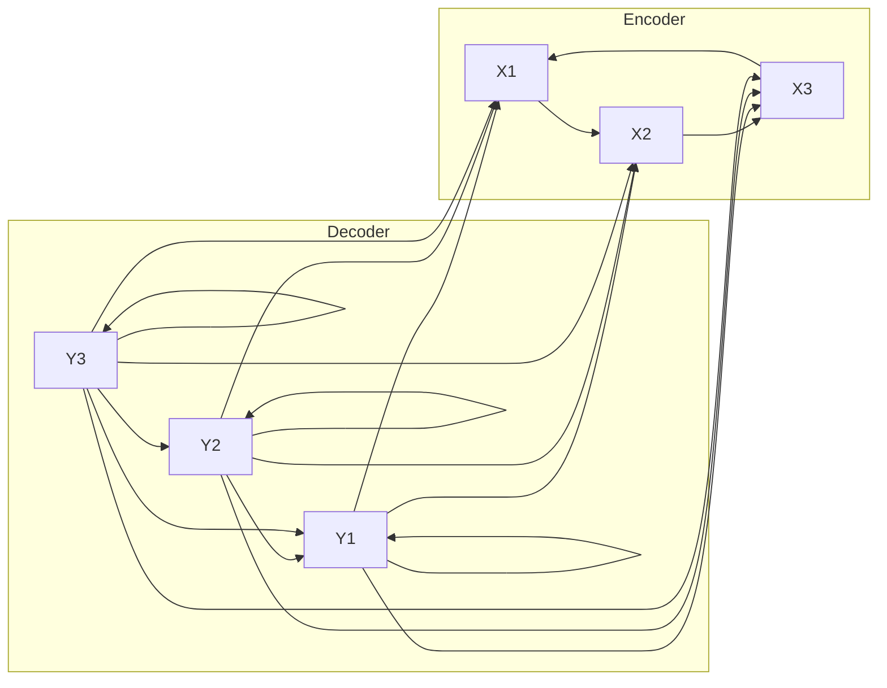
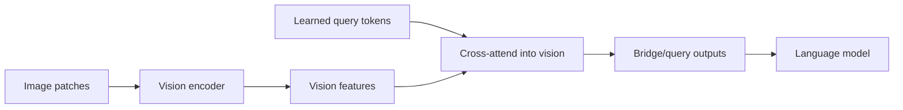

# Attention Masking and Attention Patterns

Attention is not just a similarity mechanism. It is also a **constraint mechanism**.

The mask tells the model which token-to-token interactions are legal. That single design choice determines whether a
model is:

- bidirectional or causal,
- encoder-only, decoder-only, or encoder-decoder,
- padding-aware,
- local or global,
- and, in multimodal systems, whether text can see image tokens, whether image tokens can see text, and at what stage.

## 1. Masked attention in one formula

Scaled dot-product attention is

$$
\mathrm{Attention}(Q,K,V)=\mathrm{softmax}\left(\frac{QK^\top}{\sqrt{d_k}}\right)V.
$$

With masking, we add a mask matrix $M$ before the softmax:

$$
\mathrm{MaskedAttention}(Q,K,V;M)=\mathrm{softmax}\left(\frac{QK^\top}{\sqrt{d_k}} + M\right)V.
$$

A common convention is:

$$
M_{ij}=\begin{cases}
0 & \text{if token } i \text{ is allowed to attend to token } j,\\
-\infty & \text{if token } i \text{ is not allowed to attend to token } j.
\end{cases}
$$

Why this works:

- adding $0$ leaves valid logits unchanged,
- adding $-\infty$ drives the corresponding softmax probability to $0$.

In practice, implementations often use a very large negative constant instead of literal $-\infty$.

## 2. Why masking is necessary

A Transformer without masking can mix information from any position with any other position. That is useful for
representation learning, but it breaks autoregressive generation.

Example: in next-token prediction for

$$
[x_1, x_2, x_3, x_4],
$$

the hidden state at position $3$ must not use information from $x_4$ if the training objective is to predict future
tokens causally.

So the mask determines the model's **information flow graph**.

## 3. Padding masks

In minibatches, sequences often have different lengths. Shorter sequences are padded to a common length.

Suppose a batch contains:

$$
[a,b,c], \qquad [u,v].
$$

After padding:

$$
[a,b,c], \qquad [u,v,\text{PAD}].
$$

We do not want attention to spend probability mass on `PAD`, because the pad token is not semantic content.

So if position $j$ is padding, then for all queries $i$:

$$
M_{ij}=-\infty.
$$

### Consequences

- better numerical behavior,
- cleaner learned representations,
- more efficient batching logic.

### Pros

- simple,
- necessary for variable-length batching,
- compatible with almost every Transformer variant.

### Cons

- none conceptually; it is standard.

## 4. Causal masks

A causal mask prevents position $i$ from attending to positions $j>i$.

The mask is upper-triangular:

$$
M_{ij}=\begin{cases}
0 & j \le i,\\
-\infty & j > i.
\end{cases}
$$

For a length-4 sequence, the legal attention pattern is

$$
\begin{bmatrix}
1 & 0 & 0 & 0\\
1 & 1 & 0 & 0\\
1 & 1 & 1 & 0\\
1 & 1 & 1 & 1
\end{bmatrix}.
$$

### Why causal masking matters

For autoregressive modeling, the training objective is

$$
\log p(x_1,\dots,x_T)=\sum_{t=1}^T \log p(x_t\mid x_{<t}).
$$

Without causal masking, the model could leak future tokens into the hidden state and artificially solve the prediction
problem.

### Pros

- correct for generation,
- matches incremental decoding,
- enables KV-cache reuse during serving.

### Cons

- each token has less context than a fully bidirectional model,
- decoder-only models often need more scale or instruction tuning for understanding tasks.

## 5. Bidirectional masks

Encoder-only models such as BERT typically allow all non-padding tokens to attend to all other non-padding tokens.

Then

$$
M_{ij}=0
$$

for all valid non-pad pairs.

This gives a dense all-to-all pattern.

### Why it helps

For understanding tasks such as classification, tagging, and retrieval, the token at position $i$ benefits from seeing
both left and right context.

### Pros

- strong contextual representations,
- ideal for masked-language-model objectives,
- good for classification, extraction, and retrieval.

### Cons

- not directly usable for left-to-right generation,
- requires a different pretraining objective than causal next-token prediction.

## 6. Encoder-decoder masking

Encoder-decoder Transformers combine three attention types:

1. **encoder self-attention**: bidirectional,
2. **decoder self-attention**: causal,
3. **cross-attention**: decoder queries attend to encoder outputs.

The decoder state at step $t$ uses:

- only past decoder tokens in self-attention,
- all encoder tokens in cross-attention.

This architecture is ideal for conditional generation such as translation, summarization, OCR transcription, and
structured document extraction.

## 7. Prefix-LM and prompt-style masks

A useful hybrid is the **prefix mask**.

Suppose the sequence is split into a prefix and a suffix:

$$
[x_1, \dots, x_m, x_{m+1}, \dots, x_T].
$$

The prefix may be fully visible internally, while the suffix is causal.

This is useful when the prefix is a conditioning context, prompt, retrieved evidence block, or vision-token block.

### Intuition

- the context block behaves like a bidirectional memory,
- the generated continuation remains autoregressive.

This is conceptually close to how many multimodal or instruction-tuned systems reason over fixed prompt context and then
decode text.

## 8. Local, block-sparse, and sliding-window masks

Full attention has quadratic complexity in sequence length $n$:

$$
O(n^2 d)
$$

time and

$$
O(n^2)
$$

attention-map memory.

A local mask restricts attention to a neighborhood of radius $w$:

$$
M_{ij}=\begin{cases}
0 & |i-j| \le w,\\
-\infty & \text{otherwise.}
\end{cases}
$$

Then the effective complexity drops to roughly

$$
O(nwd),
$$

which is linear in $n$ when $w$ is fixed.

### Pros

- much cheaper for long contexts,
- better cache locality,
- often good enough when dependencies are mostly local.

### Cons

- loses global interactions unless combined with global tokens or memory tokens,
- quality can drop on tasks with long-range dependencies.

## 9. Cross-attention masks in multimodal systems

In VLMs, attention masks are also part of the architecture definition.

Suppose a sequence contains vision tokens $v_1,\dots,v_N$ and text tokens $t_1,\dots,t_M$.

There are several common patterns.

### Pattern A: fused decoder-only multimodal model

All prior tokens are in one causal stream:

$$
[v_1,\dots,v_N,t_1,\dots,t_M].
$$

The text tokens can attend to the image tokens because the image tokens appear earlier in the causal prefix.

### Pattern B: dual-stream with cross-attention

A vision encoder builds image features

$$
z_v = f_{\text{vision}}(I)
$$

and a text decoder cross-attends to them:

$$
\mathrm{CrossAttn}(Q_{\text{text}}, K_{\text{vision}}, V_{\text{vision}}).
$$

### Pattern C: query-bridge / Q-Former style

A small set of learnable query tokens attends into vision features, compresses them, and passes a smaller representation
to the language model.

### Why masking matters in VLMs

The choice of mask changes:

- what modality can influence what,
- how many tokens participate in attention,
- whether serving cost scales with all image patches or only compressed bridge tokens,
- how grounding behavior emerges.

## 10. Attention masking and serving

Mask design is not just a modeling detail. It changes serving behavior.

### Causal decode and KV cache

For decoder-only generation, past keys and values can be cached. At step $t$, instead of recomputing old states, the
model computes:

- the new query for the current token,
- the new key/value for the current token,
- attention of the new query against cached past keys/values.

Without caching, naive decoding would repeatedly re-run the full prefix.

### Prefix caching

If many requests share a common prompt prefix, that prefix can be cached once and reused. This is especially valuable
when masks treat the shared prompt as a visible prefix for all later generation.

### Local and sparse masks

Windowed or sparse masks reduce memory traffic and sometimes improve latency. However, they may require specialized
kernels to deliver their theoretical speedups in practice.

### FlashAttention perspective

Even with full causal masks, performance depends on how efficiently the attention kernel avoids materializing large
intermediate matrices and exploits on-chip SRAM.

So the mask changes the **legal graph**, while the kernel changes the **actual runtime efficiency**.

## 11. Common mask-related mistakes

### Mistake 1: forgetting that masking happens before softmax

If masking is applied after softmax, probability mass has already been assigned incorrectly.

### Mistake 2: confusing padding masks and causal masks

Padding masks remove fake tokens.

Causal masks remove illegal future dependencies.

A decoder often needs both.

### Mistake 3: assuming every multimodal model uses the same attention pattern

Some VLMs fuse vision tokens directly into the LLM context.

Others use cross-attention.

Others compress vision into a small latent bridge.

The attention pattern is part of the architecture.

## 12. Practical summary

A concise summary is:

> Attention masking controls the legal information flow in a Transformer. Mathematically, it adds a matrix $M$ to the
> attention logits before softmax, with $0$ for allowed interactions and $-\infty$ for disallowed ones. Padding masks
> suppress fake pad tokens; causal masks prevent future-token leakage in autoregressive models; encoder-decoder systems
> combine bidirectional encoder attention, causal decoder attention, and cross-attention from decoder to encoder. In
> long-context or multimodal systems, local, sparse, prefix, or cross-modal masks are architectural choices that affect
> both model quality and serving cost.

## 13. What to remember

- **Masking defines visibility.**
- **Causal masking is required for next-token generation.**
- **Padding masking is about batching correctness.**
- **Cross-attention masks define how modalities or source/target streams interact.**
- **Sparse masks can reduce asymptotic cost, but only if the kernel implementation realizes the gain.**
