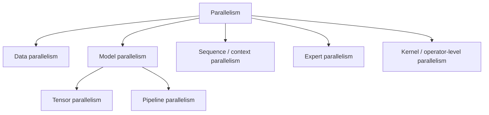

# Model Complexity, Parallelism, and Hardware

This note explains two different questions that are often mixed together:

1. **What is the asymptotic complexity of a model family?**
2. **Why can a theoretically expensive model still run fast on modern hardware?**

The first question is about algorithmic scaling.

The second is about parallelism, memory hierarchy, kernel design, precision, and hardware utilization.

## 1. Two complementary cost models

### Algorithmic complexity

We often describe a model by asymptotic time and memory, for example:

$$
O(n^2 d)
$$

for full self-attention with sequence length $n$ and hidden size $d$.

This tells us how cost grows as the problem size grows.

### Hardware-aware runtime model

Actual latency is closer to

$$
T \approx \max\left(\frac{\text{FLOPs}}{\text{peak compute}}, \frac{\text{bytes moved}}{\text{memory bandwidth}}\right) + \text{overheads}.
$$

This is roofline-style reasoning:

- some operators are **compute-bound**,
- others are **memory-bandwidth-bound**,
- some are limited by launch overheads, synchronization, or poor occupancy.

So the same asymptotic complexity can run very differently depending on hardware and kernel quality.

## 2. Parallel speedup is never free

A useful mental model is Amdahl's law. If a fraction $f_s$ of a workload is strictly sequential, then the maximum
speedup on $p$ processors is

$$
S(p)=\frac{1}{f_s + \frac{1-f_s}{p}}.
$$

Interpretation:

- if a workload is mostly parallel, hardware helps a lot,
- if a workload has a hard sequential bottleneck, additional hardware gives diminishing returns.

That is exactly why RNNs parallelize worse than Transformers during training.

## 3. MLPs

A dense layer is

$$
y = Wx + b,
$$

with matrix multiplication cost roughly

$$
O(d_{\text{in}} d_{\text{out}})
$$

per token or example.

For a batch of size $B$:

$$
O(B d_{\text{in}} d_{\text{out}}).
$$

### Why MLPs run well on GPUs

Dense matrix multiplication maps almost perfectly to highly optimized GEMM kernels.

### Main hardware accelerants

- **batch parallelism** across examples,
- **tensor cores / matrix engines** for FP16, BF16, FP8, INT8,
- **kernel fusion** for affine + bias + activation,
- **tensor parallelism** by splitting matrix dimensions across devices.

### Main bottlenecks

- small batch sizes underutilize hardware,
- activation memory can dominate in very deep stacks,
- communication becomes important in distributed training.

## 4. CNNs

For a 2D convolution with output size $H_{out} \times W_{out}$, kernel size $k \times k$, input channels $C_{in}$, and
output channels $C_{out}$, the rough multiply-add cost is

$$
O(H_{out} W_{out} k^2 C_{in} C_{out}).
$$

### Why CNNs are efficient despite heavy arithmetic

CNNs exploit two strong structural priors:

- **local connectivity**,
- **weight sharing**.

Without weight sharing, a dense mapping from an image to another image-sized representation would be much larger.

### How hardware reduces practical cost

#### 1. Lower parameter count from weight sharing

A single kernel is reused over all spatial positions.

#### 2. Massive spatial parallelism

Different output pixels, channels, and batch elements can be computed in parallel.

#### 3. Lowering to GEMM

Many convolution implementations transform the operation into a matrix multiply, because GPUs are extremely good at
GEMM.

#### 4. Specialized convolution algorithms

Depending on the kernel and feature map shape, systems may use:

- direct convolution,
- im2col + GEMM,
- Winograd methods,
- FFT-based methods for larger kernels.

### Typical bottlenecks

- memory bandwidth for feature maps,
- data layout conversions,
- activation storage in training,
- small convolutions with poor arithmetic intensity.

### Why CNNs stayed attractive for edge deployment

They are often easier to quantize and deploy efficiently than long-context Transformers, especially on vision hardware
with optimized conv kernels.

## 5. RNNs

A vanilla RNN update can be written as

$$
h_t = \phi(W_{xh}x_t + W_{hh}h_{t-1} + b).
$$

For sequence length $T$, input size $d_x$, and hidden size $d_h$, the rough cost is

$$
O\big(T(d_x d_h + d_h^2)\big).
$$

### The key issue: sequential dependence

Even if each step is not extremely expensive, the recurrence means step $t+1$ depends on the result of step $t$.

So training and inference over time cannot be fully parallelized across the sequence.

### Hardware helps less than for Transformers

You can parallelize across:

- batch elements,
- hidden units inside each matrix multiply,
- stacked layers.

But you cannot fully parallelize across time because of the recurrence.

### Practical mitigations

- **cuDNN fused RNN kernels** reduce launch overhead and fuse gates,
- **bucketing** groups similar sequence lengths,
- **truncated BPTT** limits backprop length,
- **streaming** uses the compact recurrent state to avoid storing full context.

### Complexity vs latency tradeoff

An RNN may have better asymptotic memory than full attention, but worse hardware utilization because the sequential
dependency limits parallel speedup.

## 6. LSTMs and GRUs

LSTMs replace a simple recurrence with gated updates:

$$
\begin{aligned}
i_t &= \sigma(W_i x_t + U_i h_{t-1} + b_i),\\
f_t &= \sigma(W_f x_t + U_f h_{t-1} + b_f),\\
o_t &= \sigma(W_o x_t + U_o h_{t-1} + b_o),\\
\tilde c_t &= \tanh(W_c x_t + U_c h_{t-1} + b_c),\\
c_t &= f_t \odot c_{t-1} + i_t \odot \tilde c_t,\\
h_t &= o_t \odot \tanh(c_t).
\end{aligned}
$$

### Cost

Compared with a vanilla RNN, an LSTM has a larger constant factor because it computes several gates per step. Roughly,
it is still linear in $T$, but each step is heavier.

A GRU is similar but usually a bit cheaper than an LSTM.

### Why they still matter

- stable sequence modeling,
- good streaming behavior,
- strong on modest-scale temporal tasks,
- still relevant when latency per step and bounded memory matter more than maximum training parallelism.

### Parallelism limits remain

Gating improves optimization, not sequence-level parallelism. The recurrence is still sequential.

## 7. Temporal CNNs and dilated convolutions

A temporal 1D convolution with width $k$ has cost roughly

$$
O(T k C_{in} C_{out}).
$$

With dilation, the receptive field grows without increasing the number of parameters proportionally.

### Why they can outperform RNNs operationally

- parallel across time positions,
- regular convolution kernels map well to GPU hardware,
- receptive field can grow quickly with dilation.

### Main tradeoff

They encode locality more rigidly than attention.

## 8. Transformers

For sequence length $n$ and hidden width $d$, full self-attention costs roughly

$$
O(n^2 d)
$$

for the attention interaction term, and stores an attention map of size

$$
O(n^2).
$$

The MLP blocks add roughly

$$
O(n d^2).
$$

So the dominant term depends on the regime:

- for long sequences, attention often dominates,
- for large hidden widths and moderate sequence lengths, MLP cost can also be large.

### Why Transformers train so well on GPUs

Unlike RNNs, all positions in a training sequence can be processed in parallel within a layer.

That makes them highly compatible with:

- large batch sizes,
- tensor cores,
- tensor parallelism,
- data parallelism,
- pipeline parallelism.

### The main issue: quadratic attention

As $n$ grows, full attention becomes expensive in both compute and memory.

### Key practical reductions

#### 1. FlashAttention and fused kernels

The asymptotic complexity is still quadratic, but IO is reduced dramatically by tiling attention and avoiding
materialization of large intermediate matrices in HBM.

#### 2. Causal KV caching during decoding

At decode step $t$, with a KV cache, you avoid recomputing old keys and values. The per-step attention cost becomes
proportional to the current context length rather than recomputing the full prefix from scratch.

A rough comparison:

- naive repeated decoding over $t$ steps: repeatedly reprocesses the prefix,
- cached decoding: reuse past K/V and compute only the new query plus the new key/value.

#### 3. Multi-query attention (MQA) and grouped-query attention (GQA)

Sharing or grouping K/V heads reduces KV-cache size and memory bandwidth.

#### 4. Sparse, local, or sliding-window attention

Replace full attention with a restricted pattern, reducing cost from roughly

$$
O(n^2 d)
$$

to something closer to

$$
O(n w d)
$$

for window size $w$.

#### 5. Sequence / context parallelism

Long contexts can be split across devices, though communication becomes more complex.

## 9. Vision Transformers

If an image of size $H \times W$ is divided into patches of size $P \times P$, then the token count is

$$
N = \frac{H}{P} \cdot \frac{W}{P}.
$$

A ViT layer with full attention therefore has roughly

$$
O(N^2 d)
$$

attention cost.

### Why high resolution hurts

If you halve the patch size, the number of tokens grows by about $4\times$, and quadratic attention becomes much more
expensive.

### Common reductions

- larger patch sizes,
- hierarchical backbones,
- local window attention such as Swin,
- patch merging / downsampling,
- token pruning or token pooling.

## 10. U-Nets and encoder-decoder vision stacks

U-Nets mix downsampling and upsampling paths with skip connections.

### Cost intuition

Most compute sits in the high-resolution convolution blocks, while the bottleneck layers are cheaper spatially but
richer semantically.

### Why they are efficient for dense prediction

They preserve fine spatial detail through skip connections without forcing all computation to stay at full resolution.

### Hardware story

- conv-heavy workloads exploit mature kernels,
- mixed precision helps a lot,
- memory pressure can still be high because dense activations are large.

## 11. Mixture-of-Experts (MoE)

An MoE layer activates only a subset of experts per token.

If there are $E$ experts but only $k \ll E$ are used per token, then the model's total parameter count may be very
large, while per-token compute is closer to using only $k$ experts.

### Why this is attractive

It increases capacity without scaling compute linearly with total parameter count.

### Hidden systems cost

MoE introduces routing and communication overhead. Tokens must be dispatched to experts, often across devices.

So theoretical compute savings can be offset by all-to-all communication.

## 12. VLMs

A VLM typically combines:

- a vision encoder,
- a bridge or projector,
- a language model.

If the image produces $N_v$ visual tokens and the text uses $N_t$ text tokens, then the multimodal token budget is often
closer to

$$
N = N_v + N_t.
$$

In fused attention blocks, the cost may then scale like

$$
O((N_v + N_t)^2 d).
$$

### Why VLM serving is harder than LLM serving

- high-resolution images can explode $N_v$,
- vision encoders add extra compute before generation starts,
- multimodal prompts create larger prefills,
- grounding quality depends on preserving enough spatial detail.

### Main reductions

- patch pooling or patch compression,
- learned query bridges such as Q-Former-style compression,
- projector bottlenecks,
- region selection or cropping,
- caching reused prefixes and shared image encodings when valid,
- quantization where the quality tradeoff is acceptable.

## 13. Training parallelism vs inference parallelism

### Training

The main axes are:

- **data parallelism**: different minibatches on different devices,
- **tensor parallelism**: split large matrix multiplications across devices,
- **pipeline parallelism**: split layers across devices,
- **expert parallelism**: distribute MoE experts,
- **sequence/context parallelism**: split long sequences.

### Inference

The main goals shift toward:

- minimizing latency,
- maximizing throughput,
- controlling KV-cache memory,
- batching many requests without breaking latency SLOs.

So a design that is easy to train is not always the easiest to serve efficiently.

## 14. Hardware features that change the practical picture

### Tensor cores / matrix engines

These accelerate dense matrix operations in lower precision such as FP16, BF16, FP8, or INT8.

### Memory hierarchy

On-chip registers and SRAM/shared memory are much faster than HBM/VRAM. Good kernels tile work to maximize data reuse in
fast memory.

### High-bandwidth memory

Large models and KV caches are often memory-bandwidth-limited rather than pure-FLOP-limited.

### Interconnects

In distributed setups, NVLink, NVSwitch, PCIe, or InfiniBand can determine whether model parallelism is practical.

### Specialized kernels

FlashAttention, fused MLP kernels, fused normalization, and optimized convolutions often matter more than small
theoretical improvements.

## 15. Practical summary

A concise summary is:

> The asymptotic complexity tells us how a model scales, but the wall-clock performance depends on how well its
> operations map to hardware. CNNs are efficient because locality and weight sharing reduce parameter count and map well
> to optimized convolution kernels. RNNs are linear in sequence length but have a sequential dependency that limits
> parallel speedup. Transformers have expensive quadratic attention, but they train well because positions are parallel
> within each layer, and modern systems reduce practical cost with fused kernels, FlashAttention, KV caching, sparse
> attention, and distributed parallelism. For VLMs, the added challenge is that visual tokens can dominate the prefill
> and
> memory footprint, so token compression and careful serving design matter.

## 16. What to remember

- **Asymptotic complexity is necessary but not sufficient.**
- **Parallelizability matters as much as raw FLOPs.**
- **Memory movement is often the real bottleneck.**
- **RNNs are sequentially constrained.**
- **CNNs are hardware friendly because of locality and weight sharing.**
- **Transformers are parallel-friendly but attention can become quadratic.**
- **VLMs inherit Transformer costs and add vision-token and prefill pressure.**
