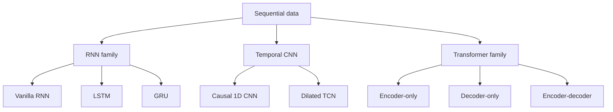

# Sequential Models

Sequential models process ordered data:

$$
(x_1, x_2, \dots, x_T).
$$

The main question is how to represent dependencies across time or position under a particular training and serving budget.

## Main sequence tasks
- **Sequence classification**: predict one label for the whole sequence
- **Sequence labeling**: predict one label per position
- **Language modeling**:
  $$
  p(x_1,\dots,x_T)=\prod_{t=1}^T p(x_t\mid x_{<t})
  $$
- **Sequence-to-sequence modeling**: map an input sequence to an output sequence

## Architecture map

## RNN family

A recurrent model compresses the past into a hidden state:

$$
h_t = f(W_{xh}x_t + W_{hh}h_{t-1} + b).
$$

### Why use it
- natural online processing
- constant-size state
- good fit for streaming or memory-constrained systems

### Main limitation
- long-range information must pass through many steps
- training can suffer from vanishing and exploding gradients

See [RNN, LSTM, GRU, and gradient stability](rnn_lstm_gru_and_gradient_stability.md).

## LSTM and GRU

LSTM and GRU add gates so the model can preserve or overwrite memory more selectively.

### Why they matter
- better long-range memory than vanilla RNNs
- still sequential in time, so they are less parallel than Transformers

## Temporal CNNs

A temporal CNN uses convolutions over time. With dilation, the receptive field grows rapidly:

$$
y_t = \sum_{\tau=0}^{k-1} K_{\tau} x_{t-d\tau}.
$$

### Why use it
- more parallelizable than recurrence
- cheaper than full self-attention
- useful for many signal-processing and time-series tasks

### Limitation
- dependency patterns are tied to receptive-field design, not dynamically chosen per token

## Transformers

A Transformer lets each token interact with others by self-attention:

$$
\mathrm{Attention}(Q,K,V)=\mathrm{softmax}\left(\frac{QK^\top}{\sqrt{d_k}}\right)V.
$$

### Why use it
- short path between distant positions
- strong global context modeling
- highly parallel training

### Limitation
- full attention cost grows roughly quadratically with sequence length
- serving cost creates KV-cache and memory tradeoffs

## Quick comparison

| Family | Best strength | Best use case | Main weakness |
|---|---|---|---|
| RNN | Compact online state | Streaming / edge inference | Long-range training difficulty |
| LSTM / GRU | More stable memory than vanilla RNN | Speech, time series, online sequence tasks | Sequential bottleneck |
| Temporal CNN | Parallel and efficient local temporal modeling | Time series and signals | Less adaptive than attention |
| Transformer | Global context and large-scale pretraining | NLP, long-context sequence modeling | Attention and KV-cache cost |

## What to remember

- Sequence modeling is mostly about the tradeoff between **compact state**, **global access**, and **systems cost**.
- RNNs and LSTMs are still useful when online updates and bounded state matter.
- Transformers dominate when long-range context and scale matter more than strict online efficiency.
