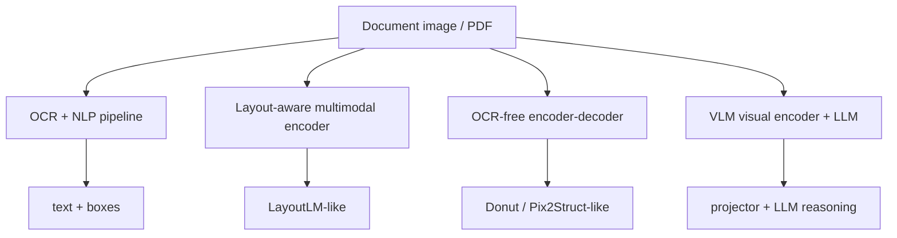

# Document Understanding

Document understanding is the multimodal problem of extracting, structuring, and reasoning over document content, where
meaning depends on **text**, **layout**, **visual appearance**, and often **multi-page context**.

## 1. Why document understanding is different

A document is not just plain text. It contains:

- reading order
- layout regions
- tables
- key-value structure
- stamps, signatures, logos, checkboxes
- multi-column or nested structure

A document model therefore needs more than OCR. It needs grounding between content and layout.

## 2. Core tasks

- **OCR**: recover text from pixels
- **layout analysis**: detect lines, blocks, tables, figures, forms
- **key-value extraction**: map fields such as invoice number or total amount
- **table extraction**: recover grid structure and cell content
- **document VQA**: answer questions about the document
- **classification**: classify page or document type
- **entity grounding**: point to where the answer came from

## 3. Main architecture families

### 3.1 OCR + NLP pipeline

Pipeline:

1. detect text regions
2. run OCR
3. recover reading order and table structure
4. pass structured text to downstream models

**Strength**: modular and interpretable.

**Weakness**: OCR errors propagate downstream.

### 3.2 Layout-aware encoders

These combine text, bounding boxes, and sometimes image features. A token embedding may look like:

$$
e_i = e_i^{\text{text}} + e_i^{\text{2D-pos}} + e_i^{\text{visual}}.
$$

This explicitly incorporates both content and location.

### 3.3 OCR-free encoder-decoder models

Models like Donut or Pix2Struct-style systems treat the document image as input and generate structured output directly.

**Strength**: end-to-end training.

**Weakness**: harder to debug and sometimes data hungry.

### 3.4 VLM projector + LLM

A high-resolution vision encoder produces visual tokens or features, which are projected into an LLM token space.

**Strength**: flexible reasoning and instruction following.

**Weakness**: expensive serving due to high visual token counts and long textual outputs.

## 4. Why document understanding is hard for VLMs

### Small text and high resolution

If the input resolution is too low, tiny text disappears. If the resolution is high, visual token count and memory usage
rise sharply.

### Reading order is not trivial

Two nearby words may not belong together if the page has columns, tables, or nested sections.

### Multi-page context

Many tasks require information from multiple pages, forms, annexes, or prior sections.

### Mixed objectives

The model must both **perceive** and **reason**:

- detect text and structure
- align regions with semantics
- answer correctly with source fidelity

## 5. Spatial grounding mathematics

Suppose token $i$ has text embedding $t_i$ and bounding box $b_i=(x_{1i}, y_{1i}, x_{2i}, y_{2i})$. A layout-aware
encoder often uses:

$$
h_i^{(0)} = t_i + p(b_i) + v_i,
$$

where $p(b_i)$ is a learned 2D positional embedding and $v_i$ is an optional visual-region embedding.

Attention can then mix tokens by both content and position:

$$
\mathrm{Attention}(Q,K,V)=\mathrm{softmax}\left(\frac{QK^\top}{\sqrt{d}} + B_{\text{layout}}\right)V,
$$

where $B_{\text{layout}}$ biases attention using relative spatial geometry.

## 6. Architecture tradeoffs

| Family                   | Best strength                             | Main weakness                                 | Best when                            |
|--------------------------|-------------------------------------------|-----------------------------------------------|--------------------------------------|
| OCR + NLP                | Interpretable, modular, controllable      | OCR error propagation                         | Enterprise extraction pipelines      |
| Layout-aware encoder     | Strong text-layout fusion                 | Needs good OCR/text tokens                    | Forms, invoices, structured docs     |
| OCR-free encoder-decoder | End-to-end structured generation          | Harder to debug and scale                     | Clean specialized extraction tasks   |
| VLM + LLM                | Flexible reasoning, instruction following | Expensive and prone to hallucinated grounding | Complex question answering over docs |

## 7. Evaluation metrics

A good document system is not judged by text fluency alone.

### Extraction metrics

- exact match / field accuracy
- normalized edit distance
- table structure accuracy
- token- or entity-level F1

### Grounding metrics

- region IoU
- answer-with-evidence correctness
- source attribution quality

### System metrics

- TTFT
- end-to-end latency
- throughput
- failure rate under high-resolution and multi-page inputs

## 8. Failure modes

- reading-order mistakes
- OCR corruption
- table row/column confusion
- answers that are fluent but not grounded in the page
- multi-page leakage or context truncation
- poor multilingual performance on mixed-language documents

## 9. Practical summary

> Document understanding is harder than plain NLP because semantics depends on text, layout, and image evidence jointly.
> I would think in terms of OCR-based pipelines, layout-aware encoders, OCR-free models, and projector-plus-LLM systems.
> The right choice depends on whether I need strict extraction fidelity, flexible reasoning, or enterprise
> interpretability.
