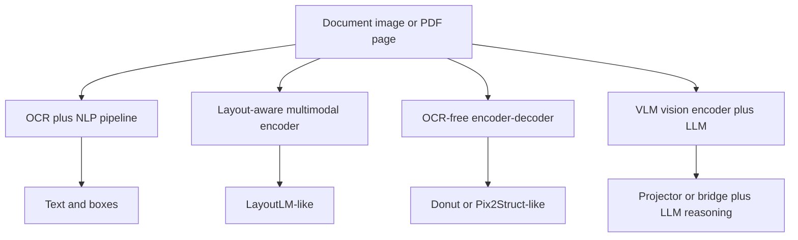
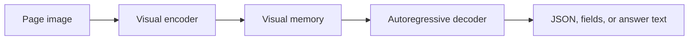

# Document Understanding

Document understanding is the multimodal problem of extracting, structuring, and reasoning over document content, where
meaning depends on **text**, **layout**, **visual appearance**, and often **multi-page context**.

## 1. Why document understanding is different

A document is not just plain text. It contains:

- reading order
- layout regions
- tables
- key-value structure
- stamps, signatures, logos, checkboxes
- multi-column or nested structure
- page-to-page dependencies

A document model therefore needs more than OCR. It needs grounding between content and layout.

## 2. Core tasks

- **OCR**: recover text from pixels
- **layout analysis**: detect lines, blocks, tables, figures, forms
- **key-value extraction**: map fields such as invoice number or total amount
- **table extraction**: recover grid structure and cell content
- **document VQA**: answer questions about the document
- **classification**: classify page or document type
- **entity grounding**: point to where the answer came from

## 3. Notation for cost models

I will use:

- page image size: $H \times W$
- patch size: $P \times P$
- visual token count: $N_v = \frac{H}{P}\frac{W}{P}$
- OCR token count: $N_{\text{ocr}}$
- output length: $N_y$
- hidden width: $d$

The biggest operational challenge is that documents push both **resolution** and **text density** upward at the same
time.

## 4. Architecture map

## 5. OCR plus NLP pipelines

Pipeline:

1. detect text regions
2. run OCR
3. recover reading order and table structure
4. pass structured text to downstream models

### Why this family remains important

It is modular, interpretable, and controllable. In many enterprise settings, that matters more than having a single
end-to-end model.

### Cost intuition

If OCR detection and recognition cost $C_{\text{ocr}}$ and the downstream NLP model sees $N_{\text{ocr}}$ tokens, the
rough pipeline cost is

$$
O(C_{\text{ocr}}) + O(N_{\text{ocr}}^2 d)
$$

for a Transformer-style downstream model.

### When to use

Use an OCR pipeline when:

- exact extracted text matters
- auditability matters
- you need modular control over OCR, parsing, and business rules
- multi-language OCR is already strong in your stack

### When not to use

Avoid it when OCR is unreliable for the script, the layout is highly visual, or you want end-to-end generation with
minimal pipeline glue.

## 6. Layout-aware multimodal encoders: LayoutLM-style thinking

Layout-aware models combine text, bounding boxes, and sometimes image patches.
A token embedding may look like:

$$
e_i = e_i^{\text{text}} + e_i^{\text{2D-pos}} + e_i^{\text{visual}}.
$$

A layout-biased attention layer can be written abstractly as

$$
\operatorname{Attention}(Q,K,V)=\operatorname{softmax}\left(\frac{QK^\top}{\sqrt{d}} + B_{\text{layout}}\right)V,
$$

where $B_{\text{layout}}$ biases attention using relative spatial geometry.

### LayoutLMv3 mental model

LayoutLMv3 unifies text masking and image masking and also uses word-patch alignment. So it is a strong default mental
model for **text plus layout plus image** document encoding.

### Complexity

If the model uses OCR tokens and image patches jointly, a rough full-attention cost is

$$
O\!\left((N_{\text{ocr}} + N_v)^2 d\right).
$$

In practice, OCR-heavy documents can make $N_{\text{ocr}}$ very large even before the image-patch side becomes a
problem.

### When to use

Use a LayoutLM-style model when:

- OCR is available and reasonably good
- forms, receipts, invoices, and key-value extraction matter
- spatial structure is as important as the text itself

### When not to use

Avoid it when you do not want OCR dependency or when the task is better framed as free-form generation rather than
structured encoding.

## 7. Donut: OCR-free encoder-decoder for documents

Donut is an OCR-free document understanding Transformer. The core idea is to encode the page image directly and decode a
textual or structured output.

A generic formulation is

$$
p(y_{1:N_y} \mid x_{\text{page}})
= \prod_{t=1}^{N_y} p\!\left(y_t \mid y_{\lt t}, E(x_{\text{page}})\right),
$$

where $E(\cdot)$ is the visual encoder memory.

### Complexity

If the visual encoder uses $N_v$ page tokens and the decoder emits $N_y$ output tokens, a rough cost model is

$$
O(N_v^2 d) + O(N_y^2 d) + O(N_y N_v d).
$$

That is encoder self-attention, decoder self-attention, and decoder-to-encoder cross-attention.

### When to use

Use Donut-style models when:

- you want an OCR-free pipeline
- outputs are naturally JSON-like, field-like, or textual
- you can fine-tune on a relatively specific document distribution

### When not to use

Be careful when:

- text is tiny and page resolution must be very high
- exact character fidelity matters more than end-to-end elegance
- the document distribution is extremely broad and noisy

## 8. Pix2Struct: screenshot and visually situated language generation

Pix2Struct is also encoder-decoder generative, but it is especially useful to think of it as a model for **visually
situated language**, including screenshots, UIs, charts, and documents.

A useful abstraction is again

$$
p(y_{1:N_y} \mid x_{\text{image}}, x_{\text{prompt}})
= \prod_{t=1}^{N_y} p\!\left(y_t \mid y_{\lt t}, E(x_{\text{image}}, x_{\text{prompt}})\right).
$$

### Why it matters for documents

It is a strong fit when the page or screenshot contains mixed text, layout, icons, charts, tables, and structural cues
that are all useful for the answer.

### Complexity

If the encoder processes $N_v$ visual tokens and possibly prompt tokens too, the rough cost remains

$$
O(N_v^2 d) + O(N_y^2 d) + O(N_y N_v d).
$$

Its main practical advantage is not a fundamentally different asymptotic formula, but that its pretraining and input
representation are designed for visually situated tasks.

### When to use

Use Pix2Struct-style models when:

- the input is a screenshot, UI, chart, or visually structured page
- the answer is naturally text generation
- you want one model family that covers several visually situated tasks

### When not to use

It is not the first choice for:

- large-scale embedding retrieval
- simple OCR replacement when a classical OCR system already works very well
- extremely long multi-page context without additional orchestration

## 9. VLM plus LLM document reasoners

Another pattern is to use a high-resolution vision encoder or visual tokenizer, then hand compressed visual tokens to a
large language model.

A generic abstraction is

$$
Z_v = P(V),
$$

where $V$ are dense visual features and $P$ is a projector or query bridge. The LLM then reasons over text plus
compressed visual tokens.

### Complexity

If the document image produces $N_v$ tokens and the bridge compresses them to $q$ tokens, then the language-side
multimodal prefix length is closer to $q + N_t$ than to $N_v + N_t$.

A rough cost model is therefore

$$
O(N_v^2 d_v) + O(q N_v d) + O((q+N_t)^2 d)
$$

for vision encoding, compression, and LLM prefill.

### When to use

Use this family when:

- you need flexible question answering over pages
- instruction following matters
- the document may contain mixed visual and textual evidence

### When not to use

It is not the best default when you need strict field extraction, exact provenance, or predictable latency under very
high page counts.

## 10. Comparison of major document families

| Family                   | Best strength                             | Main weakness                                 | Best when                                      |
|--------------------------|-------------------------------------------|-----------------------------------------------|------------------------------------------------|
| OCR plus NLP             | interpretable, modular, controllable      | OCR error propagation                         | enterprise extraction pipelines                |
| Layout-aware encoder     | strong text-layout fusion                 | depends on OCR and token quality              | forms, invoices, receipts, structured docs     |
| Donut-style OCR-free     | end-to-end structured generation          | high-resolution tiny text remains hard        | specialized document extraction                |
| Pix2Struct-style         | strong for visually situated generation   | not retrieval-first, still resolution-heavy   | screenshots, UIs, charts, mixed documents      |
| VLM plus LLM             | flexible reasoning and instruction        | expensive and can hallucinate grounding       | open-ended QA over visually complex documents  |

## 11. Why document understanding is hard for VLMs

### Small text and high resolution

If the input resolution is too low, tiny text disappears. If the resolution is high, visual token count and memory usage
rise sharply.

### Reading order is not trivial

Two nearby words may not belong together if the page has columns, tables, or nested sections.

### Multi-page context

Many tasks require information from multiple pages, forms, annexes, or prior sections.

### Mixed objectives

The model must both **perceive** and **reason**:

- detect text and structure
- align regions with semantics
- answer correctly with source fidelity

## 12. Evaluation metrics

A good document system is not judged by text fluency alone.

### Extraction metrics

- exact match or field accuracy
- normalized edit distance
- table structure accuracy
- token-level or entity-level F1

### Grounding metrics

- region IoU
- answer-with-evidence correctness
- source attribution quality

### System metrics

- TTFT
- end-to-end latency
- throughput
- failure rate under high-resolution and multi-page inputs

## 13. Failure modes

- reading-order mistakes
- OCR corruption
- table row and column confusion
- answers that are fluent but not grounded in the page
- multi-page leakage or context truncation
- poor multilingual performance on mixed-language documents

## 14. Practical summary

> Document understanding is harder than plain NLP because semantics depends on text, layout, and image evidence
> jointly. I would think in terms of OCR-based pipelines, layout-aware encoders, OCR-free encoder-decoders such as
> Donut and Pix2Struct, and projector-plus-LLM systems. The right choice depends on whether the main requirement is
> exact extraction fidelity, flexible reasoning, or enterprise interpretability.
