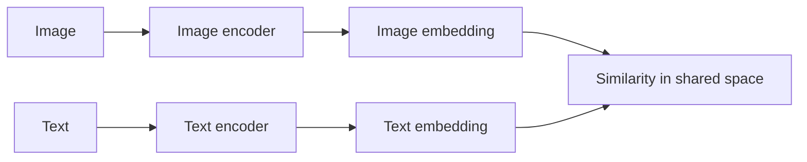
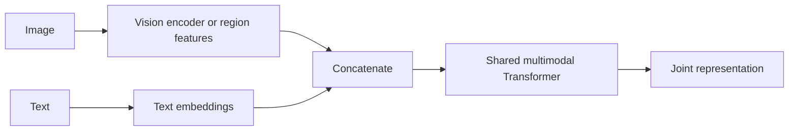
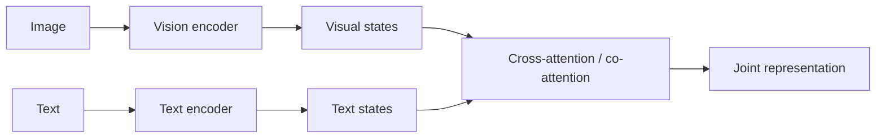
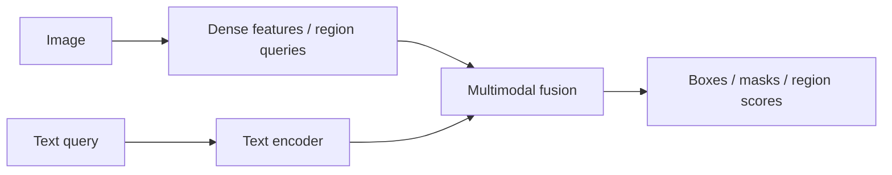
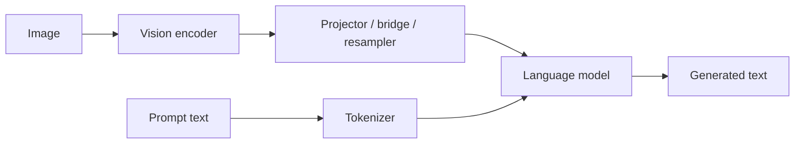

# Multimodal Embeddings & Cross-Modal Alignment

This document explains how vision-language models (VLMs) relate images and text in latent space, and how that story
changes across retrieval models, fusion encoders, grounding models, document models, and generative multimodal systems.

## 1. Core idea: representation compatibility

A multimodal system needs image and text representations that are compatible enough for the downstream task.

At a high level, that can mean one of several things:

- **shared embedding alignment** for retrieval or zero-shot classification
- **joint token-level interaction** for VQA, entailment, or multimodal classification
- **region-text alignment** for grounding and referring expression comprehension
- **token-space adaptation into an LLM** for multimodal generation
- **layout-aware alignment** for documents, OCR tokens, and 2D structure

So “embedding alignment” is not one single mechanism. It depends on the model family.

## 2. Dual-encoder alignment: CLIP and SigLIP

In a retrieval-style VLM, an image encoder and a text encoder produce embeddings in a shared latent space.

A standard contrastive view is:

$$
\mathcal{L}_{\mathrm{clip}}
= -\sum_i \log \frac{\exp(s(v_i,t_i)/\tau)}{\sum_j \exp(s(v_i,t_j)/\tau)}
$$

with a symmetric term in the reverse direction.

### What alignment means here

Alignment means that matched image-text pairs are close and mismatched pairs are far apart under a similarity function,
often cosine similarity.

### Best use cases

- image-text retrieval
- zero-shot classification
- reranking
- embedding search at scale

### Limitation

A dual encoder usually does **not** explain *why* a caption matches an image at the token or region level.

## 3. Fusion encoders: token-level multimodal interaction

For fusion encoders, embeddings do not just need to be globally similar. They need to interact inside a joint model.

Two major subfamilies are common:

### Single-stream fusion encoders

Examples: **VisualBERT**, **UNITER**, **ViLT**

### Two-stream fusion encoders

Examples: **ViLBERT**, **LXMERT**

### What alignment means here

Alignment is no longer just a shared final space. It is the ability of visual tokens and text tokens to exchange
information in a way that supports reasoning over a paired input.

### Best use cases

- VQA on fixed inputs
- multimodal classification
- entailment
- phrase-level interaction
- grounding-oriented reasoning

## 4. Grounding-native models: region-text alignment

For models such as **MDETR** or **GLIP-style** systems, alignment is explicitly spatial.

Here the important question is not just whether an image matches a sentence, but whether a particular phrase binds to a
particular object or region.

### Best use cases

- referring expression comprehension
- phrase grounding
- grounded detection
- region-level supervision

## 5. Bridge-to-LLM alignment: Flamingo, BLIP-2, LLaVA

In generative multimodal systems, alignment often means mapping visual features into a representation that a language
model can condition on.

Common patterns include:

- **cross-attention bridges** such as Flamingo
- **query bottlenecks** such as BLIP-2 / Q-Former
- **projector-plus-LLM systems** such as LLaVA

A simplified picture is:

### What alignment means here

Alignment means that the language model can interpret visual features as conditioning context that changes generation in
a grounded way.

### Best use cases

- multimodal assistants
- captioning
- multimodal chat
- free-form VQA
- open-ended visual reasoning

### Limitation

These systems are flexible, but fluent generation can hide weak grounding.

## 6. Document-specialized alignment

Document models add another kind of alignment problem: the model must connect text with **2D layout**, page structure,
and sometimes OCR output.

Two major subfamilies are common:

- **OCR-plus-layout models** such as **LayoutLM**
- **OCR-free encoder-decoder models** such as **Donut** and **Pix2Struct-style** document parsers

Here alignment includes:

- word-to-box alignment
- patch-to-token alignment
- table/grid structure
- reading order
- cross-lingual script handling
- extraction fidelity

## 7. Modality gap

Even after training, image and text embeddings often cluster differently. This is commonly called the **modality gap**.

Typical ways to reduce it include:

- contrastive learning on image-caption pairs
- learned projectors or adapters
- query bottlenecks or resamplers
- instruction tuning for grounded generation
- region-level or box-level supervision
- document-specific pretraining with OCR, layout, or screenshot tasks

## 8. Practical summary

A concise way to think about multimodal embeddings is:

> In retrieval models, alignment means shared image-text embeddings. In fusion encoders, it means token-level multimodal
> interaction. In grounding models, it means phrase-to-region binding. In bridge-to-LLM systems, it means adapting
> visual features into language-model conditioning. In document models, it also includes layout and OCR alignment.
