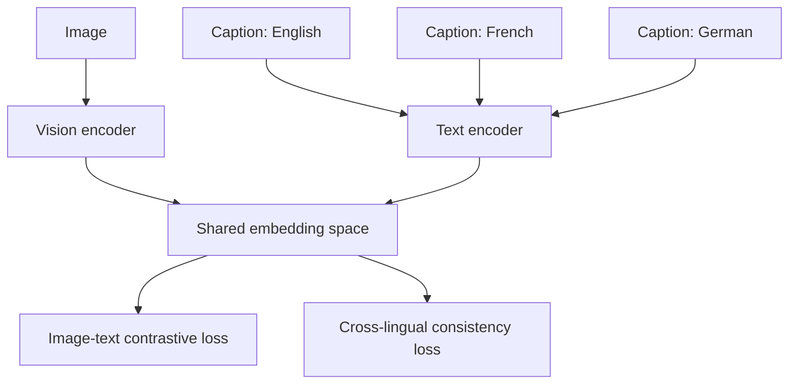

# Multilingual Alignment in Vision-Language Models

Multilingual alignment is the problem of making a VLM preserve semantic correspondence across:

- images
- captions in multiple languages
- prompts and answers in different languages
- cross-lingual retrieval and reasoning tasks
- OCR and document content written in different scripts

## 1. Core goal

Given an image $I$ and captions $t^{(1)}, t^{(2)}, \dots, t^{(m)}$ in different languages that describe the same
content, we want semantically aligned representations:

$$
z_I \approx z_{t^{(1)}} \approx z_{t^{(2)}} \approx \cdots \approx z_{t^{(m)}}.
$$

## 2. Symmetric contrastive alignment

A natural starting point is contrastive learning over image-text pairs:

$$
\mathcal{L}_{\text{img}\to\text{text}} = -\sum_i \log
\frac{\exp(s(z_{I_i}, z_{t_i})/\tau)}{\sum_j \exp(s(z_{I_i}, z_{t_j})/\tau)}.
$$

You usually pair it with a reverse term:

$$
\mathcal{L}_{\text{text}\to\text{img}} = -\sum_i \log
\frac{\exp(s(z_{t_i}, z_{I_i})/\tau)}{\sum_j \exp(s(z_{t_i}, z_{I_j})/\tau)}.
$$

For multilingual training, one can extend this so different-language captions for the same image are all pulled toward
the same image representation.

## 3. Cross-lingual consistency

A simple consistency idea is to enforce similarity between multiple language descriptions of the same image:

$$
\mathcal{L}_{\text{xling}} = \sum_i \sum_{a \ne b}
\lVert z_{t_i^{(a)}} - z_{t_i^{(b)}} \rVert_2^2.
$$

This encourages semantic agreement across languages.

## Diagram: multilingual alignment training

## 4. Where multilingual alignment appears in different VLM families

### Dual encoders

In **CLIP**- or **SigLIP**-style models, multilingual alignment mainly means learning a shared image-text space that
works across languages.

### Fusion encoders

In **VisualBERT**, **UNITER**, **ViLT**, **ViLBERT**, or **LXMERT** style models, alignment also means that token-level
interaction remains semantically consistent across languages.

### Grounding-native models

For **MDETR**- or **GLIP-style** systems, the model must preserve phrase-to-region grounding across languages, not just
sentence-level similarity.

### Generative multimodal models

For **Flamingo**, **BLIP-2**, **LLaVA**, **PaLI**, or **Pix2Struct-style** systems, multilingual alignment also affects
answer quality, OCR robustness, and instruction following.

### Document models

For **LayoutLM**, **Donut**, and document-oriented **Pix2Struct-style** models, multilingual alignment must preserve
layout semantics under different scripts, reading orders, and OCR conditions.

## 5. Why multilingual alignment is hard

It is not only a translation problem. The model must preserve:

- object identity
- cultural phrasing variation
- OCR and layout cues in multiple languages
- language-specific scripts and morphology
- cross-lingual grounding consistency

A model may be fluent in many languages but still be poorly aligned visually in some of them.

## 6. Multilingual document understanding

For document tasks, multilingual alignment also includes:

- reading order in different scripts
- date, number, and currency formats
- multilingual tables and mixed-language pages
- OCR noise that differs by script
- field names that are translated but occupy different layouts

This can be framed as a joint objective:

$$
\mathcal{L} = \lambda_1 \mathcal{L}_{\text{vision-text}} +
\lambda_2 \mathcal{L}_{\text{xling}} +
\lambda_3 \mathcal{L}_{\text{task}}.
$$

## 7. Evaluation

Typical evaluation families include:

- cross-lingual image-text retrieval
- multilingual VQA
- multilingual document extraction
- multilingual grounding
- zero-shot transfer from one language to another

For retrieval, Recall@K is common:

$$
\mathrm{Recall@K} = \frac{1}{N}\sum_{i=1}^{N} \mathbf{1}(\text{correct match appears in top-}K).
$$

For classification or extraction one may also track F1, exact match, or task-specific structured accuracy.

## 8. Failure modes to watch

- the image aligns strongly with English captions but weakly with other languages
- translation-equivalent queries retrieve different visual concepts
- OCR-heavy scripts degrade much more than Latin-script inputs
- multilingual answers are fluent but semantically inconsistent with the image
- grounding quality drops across languages even when answer fluency remains high

## Practical summary

A concise summary is:

> Multilingual alignment means more than translating prompts. The model has to preserve the same visual semantics across
> languages. Depending on the architecture, that may mean shared retrieval embeddings, token-level fusion consistency,
> phrase-to-region grounding, or OCR-plus-layout robustness across scripts and document formats.
