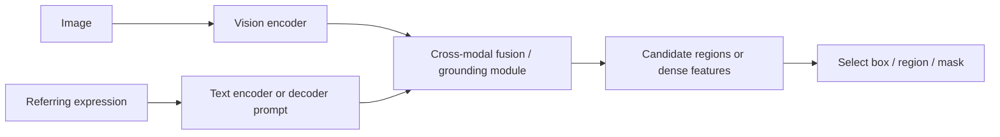
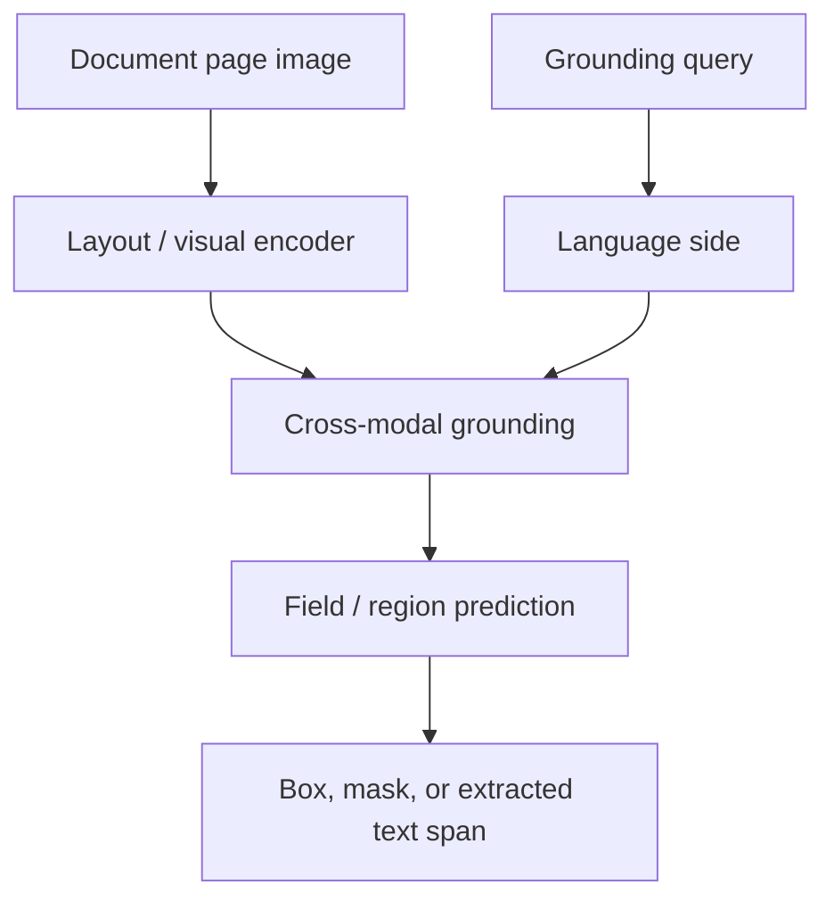

# Referring Expression Comprehension (REC)

Referring Expression Comprehension is the task of grounding a natural-language expression in an image, usually by
identifying the object or region the expression refers to.

Examples:

- “the man in the blue jacket near the white car”
- “the third button from the left”
- “the signature box at the bottom right of the page”

REC is a grounding task: the output is not just a fluent sentence, but a specific region, box, or mask.

## 1. Formal problem

Given an image $I$ and a referring expression $x$, predict a region $b$ such that

$$
b^* = \arg\max_{b \in \mathcal{B}(I)} p(b \mid I, x).
$$

Here $\mathcal{B}(I)$ is a set of candidate boxes, regions, or segmentation masks.

## 2. Why REC is hard

REC is harder than generic captioning because the model must use:

- object identity
- attributes
- relationships
- spatial language
- counting or ordering cues

The challenge is not just recognition but **disambiguation**.

## Diagram: REC pipeline

## 3. Common modeling styles

### Candidate-region ranking

Generate candidate boxes, then score each one:

$$
s_k = f_\theta(I, x, b_k),
\qquad
p(b_k \mid I, x) = \frac{e^{s_k}}{\sum_j e^{s_j}}.
$$

Loss:

$$
\mathcal{L}_{\text{rank}} = -\log p(b_{\text{gt}} \mid I, x).
$$

### Dense prediction / box regression

Predict coordinates directly:

$$
\hat{b} = (\hat{x}, \hat{y}, \hat{w}, \hat{h}).
$$

A standard regression loss might be

$$
\mathcal{L}_{\text{box}} = \lVert b - \hat{b} \rVert_1 + \lambda \mathcal{L}_{\text{IoU}}.
$$

### Segmentation-style grounding

For pixel-level REC, predict a mask $M$ and optimize a mask loss such as Dice or BCE.

## 4. Model families commonly used for REC

### Fusion encoders

Single-stream or two-stream fusion encoders, such as **VisualBERT**, **UNITER**, **ViLT**, **ViLBERT**, or
**LXMERT**, can be used for referring-expression reasoning when the output head scores regions or proposals.

### Grounding-native models

Models such as **MDETR** or **GLIP-style** systems are often a better conceptual fit because the architecture is built
around phrase-to-region or text-conditioned localization.

### Grounded generative models

Some modern multimodal LLMs can emit region references, coordinates, or grounded spans, but for strict REC they are
often judged by the same localization metrics as other grounding models.

## 5. Evaluation

A common REC metric is accuracy at an IoU threshold:

$$
\mathrm{IoU}(b, \hat{b}) = \frac{|b \cap \hat{b}|}{|b \cup \hat{b}|}.
$$

Then

$$
\mathrm{Acc}@\tau = \frac{1}{N}\sum_{i=1}^{N} \mathbf{1}(\mathrm{IoU}(b_i, \hat{b}_i) \ge \tau).
$$

Typical thresholds include $\tau = 0.5$.

## 6. Why REC matters for VLM evaluation and serving

REC is a task where “fluent output” is not enough. A model can sound plausible and still ground the wrong region.

This task usefully forces a distinction between:

- language quality
- visual grounding quality
- region-level localization quality
- latency and serving efficiency

## 7. REC in document understanding

REC is not only for natural images. In documents, REC-like behavior appears in prompts such as:

- “find the due date field”
- “highlight the clause about early termination”
- “point to the total amount cell in the table”

This connects REC directly to enterprise extraction workflows, document VQA, and layout-aware parsing.

## Diagram: REC in documents

## 8. Failure modes

- confusing two nearby objects with similar appearance
- failing on relational language like “left of” or “behind”
- missing small text regions in documents
- collapsing to generic saliency instead of exact grounding
- predicting a plausible answer without localizing the evidence

## Practical summary

A concise summary is:

> REC is a grounding task where the model must map language to a specific region, object, or field. It is useful to
> think about REC as a conditional localization problem, often evaluated with IoU-thresholded accuracy. It is a key test
> of whether a multimodal model truly binds language to visual evidence.
