# VLM Architectures and Basics

This note consolidates the main architecture families used in retrieval, grounding, multimodal reasoning,
document understanding, and multimodal generation.

---

## 1. What counts as a VLM?

In the **broad sense**, a **vision-language model (VLM)** is any model that jointly processes visual input and text, or
that learns a shared image-text space useful for downstream multimodal tasks.

Under that broad definition, **yes**: a model with a ViT image encoder, a text encoder, and later cross-attention or
fusion layers **is absolutely a VLM**.

There is, however, an important naming distinction in practice:

- **VLM** often means the broad umbrella: any image-text model, including retrieval models, fusion encoders, and
  generative models.
- **MLLM** or **LVLM** often means the newer **generative multimodal LLM** family: models that take image + text and
  generate text autoregressively, such as LLaVA-like assistants, Flamingo-style systems, or PaliGemma-like models.

So:

- **CLIP** is usually called a VLM.
- **LXMERT / ViLBERT / UNITER / VisualBERT** are VLMs.
- **Pix2Struct / Donut / PaLI / OFA** are VLMs.
- **LLaVA / Flamingo / BLIP-2 / PaliGemma / Kosmos-2** are VLMs, and more specifically are usually discussed as
  **MLLMs/LVLMs** when people want to emphasize generation and instruction following.

A useful mental model is:

> **VLM is the umbrella. MLLM is a generative subfamily.**

---

## 2. What a VLM has to do

A VLM jointly processes images and text. The goal is not only to produce plausible language, but to make that language
depend on actual visual evidence.

A VLM therefore has to solve two related problems:

1. **Representation alignment**: image and text representations referring to the same concept should be compatible.
2. **Cross-modal conditioning**: the text-side computation should actually use the visual input when producing an
   answer.

Typical tasks include:

- image-text retrieval
- zero-shot classification
- phrase grounding and referring expression comprehension (REC)
- image captioning
- VQA
- multimodal chat
- screenshot and document understanding
- grounded generation over images, charts, or pages
- region-level or box-level outputs
- extraction from invoices, receipts, PDFs, tables, and UI screenshots

A useful extra distinction is:

- **Alignment-heavy tasks**: retrieval, reranking, zero-shot labeling
- **Fusion-heavy tasks**: VQA, REC, grounding, entailment
- **Generation-heavy tasks**: captioning, document parsing, multimodal chat
- **Structured extraction tasks**: OCR, key-value extraction, layout understanding, HTML/JSON generation from pages

---

## 3. Core notation for complexity

I will use the following symbols throughout.

- image size: $H \times W$
- patch size: $P \times P$
- visual token count: $N_v = \frac{H}{P}\frac{W}{P}$ for a plain ViT-style patching scheme
- text prompt length: $N_t$
- generated output length: $N_y$
- hidden width: $d$
- number of bridge or query tokens: $q$
- number of multimodal decoder layers: $L$
- number of image regions or proposals: $R$

For Transformer blocks, the most important scaling terms are usually:

- self-attention: $O(n^2 d)$
- cross-attention: $O(n m d)$ for query length $n$ and memory length $m$
- MLP: $O(n d^2)$

When talking about inference, it helps to split cost into:

- **prefill cost**: encode the image and initial prompt
- **decode cost**: generate new tokens autoregressively
- **KV-cache memory**: memory that grows with retained context length

For grounding and region-based models, it also helps to track:

- **proposal cost / region cost** from object detectors or query sets
- **high-resolution sensitivity** for OCR, charts, and documents
- **box or region decoding cost** if the model predicts coordinates or region tokens

---

## 4. Main architecture families

The most important missing point in many summaries is that there are really **two different taxonomies**:

1. **Taxonomy by architecture**
2. **Taxonomy by task/output style**

This document mainly organizes by architecture, but I will keep pointing out where each family fits best.

---

### 4.1 Dual encoders: CLIP and SigLIP

Dual encoders use one image encoder and one text encoder, then align them in a shared embedding space.

A standard CLIP-style contrastive objective is

$$
\mathcal{L}_{\mathrm{clip}}
= -\sum_i \log \frac{\exp(s(v_i, t_i)/\tau)}{\sum_j \exp(s(v_i, t_j)/\tau)}
$$

with a symmetric text-to-image term as well.

Here:

- $v_i$ is an image embedding
- $t_i$ is a text embedding
- $s(\cdot,\cdot)$ is a similarity score, often cosine similarity
- $\tau$ is a temperature parameter

A SigLIP-style pairwise sigmoid loss can be written as

$$
\mathcal{L}_{\mathrm{sig}}
= - \sum_{i,j} \log \sigma\!\left(y_{ij} s_{ij}\right),
$$

where $y_{ij}\in\{-1,+1\}$ indicates whether the image-text pair matches.

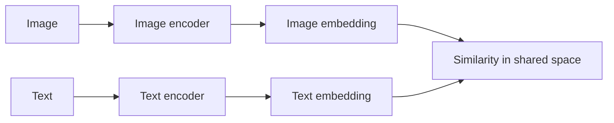

#### Intuition

CLIP does **not** reason over image regions token by token with text. It learns that matched image-text pairs should be
close in embedding space and mismatched pairs should be far apart.

That is why it is excellent for:

- retrieval
- zero-shot classification
- reranking
- serving as a strong vision backbone for later VLMs

#### Complexity

If the vision backbone is a ViT with $N_v$ image tokens and the text encoder sees $N_t$ text tokens, then the dominant
encoder costs are roughly

$$
O(N_v^2 d) + O(N_t^2 d).
$$

During training with batch size $B$, the similarity matrix introduces an additional in-batch comparison cost of roughly

$$
O(B^2 d).
$$

At inference for retrieval, the expensive part is usually encoding once and then searching embeddings. That is one
reason dual encoders are operationally attractive.

#### When to use

Use CLIP or SigLIP when the product is fundamentally about **retrieval**, **ranking**, or **zero-shot labeling**.

#### When not to use

Do not expect a plain dual encoder to be the best choice for:

- detailed grounded reasoning
- OCR-heavy document tasks
- long multimodal conversations
- free-form multimodal generation

---

### 4.2 Fusion encoders, single-stream: VisualBERT, UNITER, VL-BERT, ViLT

This is a major family in the multimodal literature.

Single-stream fusion models concatenate or otherwise jointly feed visual and text tokens into one shared Transformer
stack.

A simple abstraction is

$$
Z = [Z_v; Z_t], \qquad H = \mathrm{Transformer}(Z)
$$

where $Z_v$ are visual tokens and $Z_t$ are text tokens.

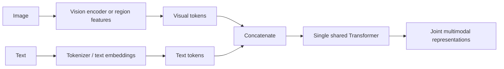

#### Intuition

This family performs **early or joint fusion**. Instead of separately encoding vision and text and only comparing them
at the end, it lets all tokens interact inside one multimodal encoder.

That makes it stronger than CLIP-like models for:

- VQA
- multimodal classification
- visual entailment
- REC
- phrase grounding
- cross-modal matching where token-level interaction matters

#### Why it matters

This family is historically important because it made the jump from **global alignment** to **joint multimodal
reasoning**.

#### Complexity

If the fused sequence length is

$$
N = N_v + N_t,
$$

then the shared self-attention cost is roughly

$$
O((N_v + N_t)^2 d)
$$

per layer.

This is one reason these models become expensive when the visual token count is large.

#### Strengths

- strong fine-grained alignment
- clean joint reasoning story
- good fit for encoder-side tasks

#### Weaknesses

- expensive with many visual tokens
- usually less natural for open-ended generation than decoder-based MLLMs
- many early models relied on detector regions rather than native dense image tokens

#### When to use

Use this family when the output is mostly **classification**, **matching**, **scoring**, or **reasoning over a fixed
input pair**, rather than long open-ended generation.

---

### 4.3 Fusion encoders, two-stream / dual-stream with cross-attention: ViLBERT and LXMERT

This is a common architecture in the multimodal literature.

There are separate image and text streams, followed by explicit **cross-attention / co-attention / cross-modality**
layers.

A useful abstraction is:

$$
H_v = \mathrm{VisionEncoder}(V), \qquad H_t = \mathrm{TextEncoder}(T)
$$

followed by layers such as

$$
\tilde H_t = \mathrm{CrossAttn}(H_t, H_v), \qquad
\tilde H_v = \mathrm{CrossAttn}(H_v, H_t).
$$

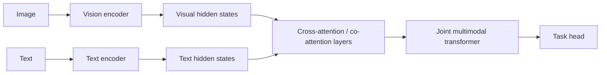

#### What this family is called

This family is commonly described as:

- **two-stream**
- **dual-stream**
- **cross-attention fusion**
- **co-attention**
- **cross-modality encoder**

So yes: **it is a VLM**, and more specifically it is a **fusion-encoder VLM**, not a plain CLIP-like dual encoder.

#### Intuition

Compared with single-stream fusion:

- it preserves separate modality-specific processing earlier
- it allows more controlled interaction later
- it can be easier to reason about what is modality-specific and what is shared

Compared with CLIP:

- it does actual token-level cross-modal interaction
- it is much stronger for grounding and reasoning
- it is less efficient for large-scale retrieval

#### Complexity

Let visual length be $N_v$ and text length be $N_t$.

- separate self-attention costs: $O(N_v^2 d) + O(N_t^2 d)$
- cross-attention costs: roughly $O(N_v N_t d)$ per cross layer

This is often more structured than a single-stream model, but still expensive when both streams are long.

#### When to use

Use this family for:

- VQA
- REC
- phrase grounding
- visual reasoning
- multimodal matching with strong token interaction

#### When not to use

It is usually not the first choice for:

- pure embedding retrieval
- cheapest serving path
- modern assistant-style multimodal chat systems

---

### 4.4 Region-based or detector-based grounding models: MDETR, GLIP-style families

This is another important family, especially for grounding and referring expression comprehension (REC).

These models are built around the idea that the output is not just text, but often a **region**, **box**, **mask**, or
**grounded phrase-region alignment**.

A generic formulation is:

- image features are extracted densely or via DETR-style object queries
- text is encoded jointly or conditionally
- the model predicts boxes or aligned regions conditioned on the text

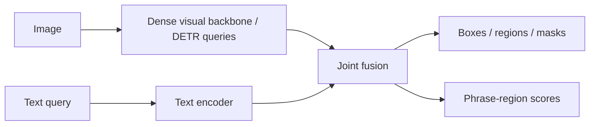

#### Why this family matters

For tasks like:

- referring expression comprehension
- phrase grounding
- grounded VQA
- detection conditioned on text

a generic captioning-style model is often not the best abstraction.

You want the model to answer:

- **which region**
- **which object**
- **which span corresponds to which box**

not just “generate a likely sentence.”

#### Complexity intuition

These models often replace or supplement image patches with:

- detector proposals
- object queries
- region tokens

So the critical sequence length is often driven by the number of regions or queries $R$, rather than raw dense patches
alone.

A rough fusion cost often looks like:

$$
O(R^2 d) + O(N_t^2 d) + O(R N_t d)
$$

plus detector or backbone cost.

#### Strengths

- strong for REC and grounding
- output space is naturally spatial
- often more controllable than free-text generation

#### Weaknesses

- more specialized output heads
- less naturally general-purpose for assistant-like chat
- may depend on detector/query design choices

#### When to use

Use this family when the product requires:

- precise localization
- box or mask outputs
- robust phrase-region binding
- measurable grounding quality

#### Useful distinction

It is often useful to distinguish:

- **retrieval-style VLMs**
- **fusion encoders for reasoning**
- **grounding-native models** that output regions or region tokens

---

### 4.5 Cross-attention bridges: Flamingo-style models

Flamingo-style systems start from strong pretrained vision and language backbones, then insert cross-attention layers
that let the language model attend to visual information.

A simple abstraction is:

$$
h_\ell' = h_\ell + \mathrm{CrossAttn}\!\left(h_\ell, R(V)\right),
$$

where:

- $V$ is the set of dense visual features from the vision encoder
- $R(\cdot)$ is a resampler that compresses them to a smaller memory
- $h_\ell$ is the language hidden state at layer $\ell$

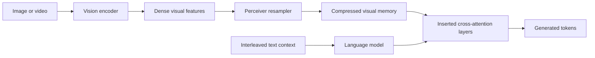

#### Why this family matters

Flamingo is important because it supports **interleaved image-text prompting** and strong **few-shot multimodal
conditioning** without retraining the whole language model from scratch.

#### Complexity

Suppose the resampler outputs $q$ visual tokens.

- visual compression is roughly $O(q N_v d)$
- each language-side cross-attention layer adds roughly $O(N_t q d)$ during prefill
- during decoding, the per-token visual cross-attention cost is roughly $O(q d)$ per such layer

The crucial point is that the resampler turns a potentially large $N_v$ into a smaller fixed-size memory $q$.

#### When to use

Use this family when you need:

- interleaved image-text context
- few-shot multimodal prompting
- a stronger grounding story than a pure shared embedding model

#### When not to use

This is usually not the first choice for:

- the cheapest possible serving path
- extremely latency-sensitive single-image classification
- offline embedding search

---

### 4.6 Vision encoder + projector + LLM: LLaVA-style models

This is the most common modern multimodal assistant recipe.

- a vision encoder extracts visual tokens
- a projector maps them into the language model embedding space
- a decoder-only LLM consumes both visual and text tokens

Let $V\in\mathbb{R}^{N_v\times d_v}$ be vision features and let $P$ be the projector. Then

$$
Z_v = P(V)
$$

produces projected visual tokens $Z_v\in\mathbb{R}^{N_v\times d}$, which are concatenated with text tokens and fed to a
causal decoder.

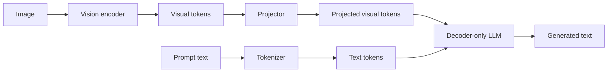

#### Why it became popular

It reuses strong pretrained LLMs and turns them into multimodal assistants with relatively simple engineering.

#### Complexity

If projected visual tokens are kept explicitly inside the decoder context, then the multimodal prefill length is roughly

$$
N = N_v + N_t.
$$

The prefill cost of decoder self-attention is therefore roughly

$$
O\!\left((N_v + N_t)^2 d\right)
$$

per layer, plus MLP cost $O((N_v+N_t)d^2)$.

If the model generates $N_y$ output tokens, decode-time self-attention grows with the retained prefix. A rough
KV-cache memory scaling is

$$
O\!\left(L (N_v + N_t + N_y) d\right).
$$

This is why large visual token counts directly hurt batch size and latency.

#### When to use

Use this family for:

- multimodal chat
- captioning
- VQA
- assistant-like interfaces
- instruction-tuned multimodal products

#### When not to use

Avoid it when the product is really just retrieval or when strict visual grounding and extraction fidelity matter more
than conversational flexibility.

---

### 4.7 Query bridges: BLIP-2 and Q-Former-style models

Instead of forwarding all visual tokens to the LLM, BLIP-2 uses a learned set of query tokens that pull relevant
information from a frozen image encoder before passing a compact representation onward.

A useful abstraction is

$$
Q' = \mathrm{QFormer}(Q, V),
$$

where $Q\in\mathbb{R}^{q\times d}$ is a learned query set and $V$ are visual features from the image encoder.

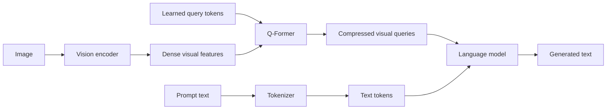

#### Complexity

The bridge itself has a dominant visual-query interaction cost roughly

$$
O(q N_v d),
$$

plus query self-attention and MLP terms of roughly

$$
O(q^2 d) + O(q d^2).
$$

If only $q$ compressed tokens are handed to the LLM, the downstream language model sees a shorter multimodal prefix
than a projector-only design that forwards all $N_v$ visual tokens.

#### Why this is useful

This is a practical compromise when you want to keep strong frozen backbones and reduce multimodal token inflation.

#### When to use

Use it when:

- trainable parameter budget matters
- you want to reuse a frozen vision encoder and a frozen LLM
- you need a more efficient bridge than naively passing all $N_v$ visual tokens

#### When not to use

It may not be the best choice when extremely fine spatial detail must be preserved, because the bridge is a bottleneck.

---

### 4.8 Unified encoder-decoder generation: Pix2Struct, PaLI, OFA, Donut-like families

These models treat the task as conditional generation. The image and possibly a text prompt are encoded, then a decoder
generates text or structured output.

A generic factorization is

$$
p(y_{1:N_y} \mid x_{\mathrm{image}}, x_{\mathrm{text}})
= \prod_{t=1}^{N_y} p\!\left(y_t \mid y_{\lt t}, E(x_{\mathrm{image}}, x_{\mathrm{text}})\right),
$$

where $E(\cdot)$ is the encoder memory.

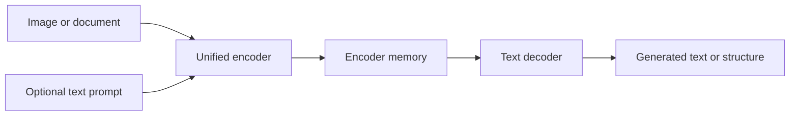

#### Complexity

If the encoder sees $N_v$ visual tokens and $N_t$ text-prompt tokens, a rough full-attention cost is

$$
O\!\left((N_v + N_t)^2 d\right).
$$

If the decoder emits $N_y$ tokens, then decoder-side cost is roughly

$$
O(N_y^2 d) + O\!\left(N_y (N_v + N_t) d\right)
$$

from self-attention plus cross-attention.

#### When to use

This family is strong for:

- image-conditioned generation
- screenshot parsing
- document extraction
- multilingual multimodal generation
- structured JSON/HTML/text outputs from pages

#### When not to use

It is often heavier than necessary for pure retrieval and can be expensive for interactive chat if the visual encoder is
high-resolution.

#### Important distinction inside this family

This family actually contains two subfamilies that are worth separating:

1. **General encoder-decoder VLMs**  
   Example mental model: PaLI, OFA, Pix2Struct  
   Best when you want general visual-to-text generation.

2. **Document-oriented encoder-decoder VLMs**  
   Example mental model: Donut, Nougat, document parsing models  
   Best when you want OCR-free or structure-aware extraction.

---

### 4.9 OCR-based, layout-aware document models: LayoutLM-style families

This is another important family in a complete VLM taxonomy.

These models are often VLMs in the broad sense, but they are specialized for documents. Their input is not only pixels
or image patches; it may also include:

- OCR tokens
- 2D bounding boxes for words
- layout positions
- sometimes visual crop features

A simplified abstraction is:

$$
Z = \mathrm{Fuse}(\text{text token}, \text{2D box}, \text{visual feature})
$$

followed by a multimodal encoder.

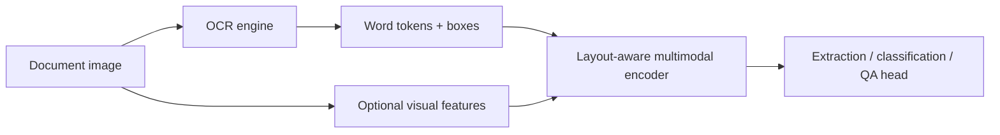

#### Why this family exists

Natural-image VLMs are not automatically good at documents, because documents require:

- reading small text
- preserving 2D structure
- associating keys with values across lines or columns
- reasoning over layout, tables, and forms

A document is not just an image; it is an image with a strong **symbolic and spatial structure**.

#### Strengths

- strong for forms, receipts, invoices, tables
- explicit handling of document layout
- often easier to supervise for extraction tasks

#### Weaknesses

- OCR dependency can introduce error propagation
- OCR quality can vary by language, scan quality, or typography
- less end-to-end than OCR-free visual generation models

#### When to use

Use this family when:

- the product is structured extraction from documents
- you already have a strong OCR pipeline
- explainability via tokens and boxes matters

---

### 4.10 OCR-free document VLMs: Donut, Pix2Struct-style document parsing, screenshot parsers

This is adjacent to the previous family but conceptually different.

Instead of taking OCR output as a required intermediate, these models try to parse the page **directly from pixels into
structured text**.


#### Why this matters

OCR-based systems decompose the task into:

1. read text
2. understand layout
3. extract fields

OCR-free systems try to learn the mapping end to end.

This can be very attractive when:

- OCR is brittle
- multilingual OCR is a bottleneck
- the output format is structured text
- the document has strong visual cues that OCR alone misses

#### Main risk

If very tiny text is critical, the entire system becomes extremely sensitive to:

- input resolution
- visual token budget
- downsampling
- cropping strategy

That is why document understanding often becomes a **high-resolution systems problem** as much as a modeling problem.

---

### 4.11 Grounded generative MLLMs: Kosmos-2 and related models

This family is worth separating from ordinary assistant-style MLLMs.

A grounded generative MLLM does not only output text. It may also generate:

- location tokens
- region references
- bounding boxes
- grounded spans linked to boxes

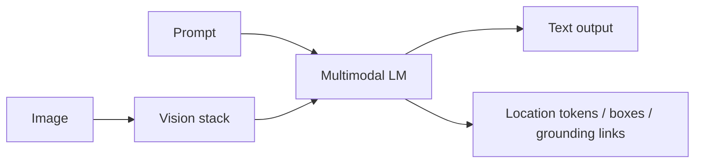

#### Why this family matters

It sits between:

- generic multimodal chat
- and explicit grounding systems like MDETR

This is useful if you want one model to both:

- talk about the image
- and refer to where things are

#### When to use

Use this family when the application requires:

- grounded explanations
- references to regions inside generated answers
- a single generative model that still exposes localization

#### Trade-off

These models are flexible, but they can still be weaker than specialized detector-style systems on strict localization
metrics.

---

### 4.12 Native unified autoregressive / encoder-free multimodal decoders: Fuyu-style models

This family is also missing and is useful as a conceptual edge case.

Instead of using a separate vision encoder, some models directly project image patches into the decoder token stream and
let a single autoregressive Transformer process everything.

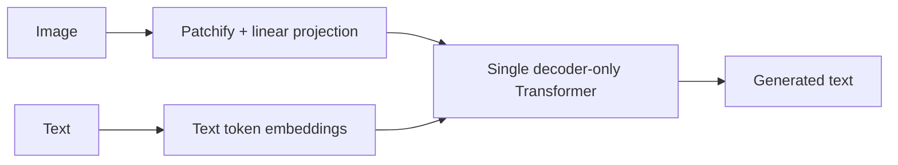

#### Why people explore this family

It is architecturally simple:

- no separate vision tower
- no separate multimodal projector stack beyond basic patch projection
- one unified autoregressive backbone

#### Potential advantages

- conceptual simplicity
- flexible image resolution handling in some designs
- fewer modality-specific moving parts

#### Potential disadvantages

- raw image token count can explode
- may be weaker than specialized visual encoders on many perception tasks
- serving efficiency depends heavily on token count and compression strategy

#### When to use

Think of this family as an important research direction, but not the default first choice for most production systems
unless its simplicity gives a strong systems advantage.

---

## 5. A better taxonomy: architecture vs product goal

One reason people get confused is that models are often grouped inconsistently. A more useful view is:

### A. Retrieval-first VLMs

- CLIP
- SigLIP

These mainly answer: **Do this image and text belong together?**

### B. Fusion-encoder VLMs

- single-stream: VisualBERT, UNITER, ViLT
- two-stream / co-attention: ViLBERT, LXMERT

These mainly answer: **Can I jointly reason over image and text tokens?**

### C. Grounding-native VLMs

- MDETR
- GLIP-like text-conditioned detection
- grounded box-predicting systems

These mainly answer: **Which region or object does the text refer to?**

### D. Generative encoder-decoder VLMs

- Pix2Struct
- OFA
- PaLI
- Donut
- Nougat

These mainly answer: **Given a visual input, what text or structure should I generate?**

### E. Bridge-to-LLM VLMs / MLLMs

- Flamingo
- BLIP-2
- LLaVA
- PaliGemma-like projector-to-LLM families

These mainly answer: **How do I turn a strong LLM into a multimodal assistant?**

### F. Grounded generative MLLMs

- Kosmos-2 and related grounded-output models

These answer: **Can I generate language that also points back to image regions?**

### G. Document-specialized VLMs

- OCR-based layout-aware: LayoutLM family
- OCR-free end-to-end: Donut, Pix2Struct-style document parsers

These answer: **Can I read and extract structured information from pages?**

### H. Native unified multimodal decoders

- Fuyu-like models
- newer single-transformer, early-fusion decoder designs

These answer: **Can I handle vision and language with one autoregressive backbone and minimal modality-specific stacks?**

---

## 6. Important named models and how to think about them

### CLIP

Think of CLIP as a **shared embedding space model**.

- best for retrieval and zero-shot classification
- often reused as a vision tower inside later VLMs
- operationally attractive because embeddings can be precomputed offline

### SigLIP

Think of SigLIP as a **CLIP-like dual encoder with a different training loss**.

- similar serving use cases to CLIP
- especially interesting when batch-size behavior during training matters

### VisualBERT / UNITER / ViLT

Think of these as **fusion encoders**.

- stronger than CLIP for joint reasoning
- not modern assistant-style chat models
- historically central for VQA, REC, matching, and multimodal classification

### ViLBERT / LXMERT

Think of these as **two-stream fusion encoders with cross-attention**.

- this is the family matching: “ViT/text encoder outputs go into cross-attention then a joint transformer”
- good mental model for co-attention-based multimodal reasoning
- stronger fusion than CLIP, less assistant-like than LLaVA

### MDETR / grounding-native models

Think of these as **text-conditioned detection or grounding models**.

- good for REC, phrase grounding, grounded VQA
- output space is spatial, not just textual
- especially relevant when localization quality matters

### Flamingo

Think of Flamingo as a **frozen LM plus visual cross-attention memories**.

- best when interleaved multimodal prompting matters
- more complex serving path than a plain dual encoder
- stronger few-shot multimodal story than CLIP-like models

### BLIP-2

Think of BLIP-2 as a **query bottleneck between a frozen image encoder and a frozen LLM**.

- good engineering compromise
- smaller trainable bridge than full end-to-end multimodal tuning
- useful when visual compression is acceptable

### LLaVA

Think of LLaVA as a **projector plus instruction-tuned LLM assistant**.

- strong default baseline for multimodal chat and VQA
- easy mental model and common in practice
- main risk is fluent but weakly grounded output

### Pix2Struct

Think of Pix2Struct as **visual-input-to-text generation**, especially good for screenshots, UIs, and visually situated
language.

- natural when the output is text or structured text
- not a retrieval-first model
- high-resolution inputs can still dominate cost

### LayoutLM

Think of LayoutLM as **OCR-plus-layout multimodal document understanding**.

- strong when OCR tokens and 2D page structure are central
- not an end-to-end OCR-free parser
- very useful when explainable document extraction matters

### Donut

Think of Donut as **OCR-free end-to-end document parsing**.

- attractive when you want direct visual-to-structure extraction
- avoids OCR error propagation
- highly sensitive to image quality and resolution

### Kosmos-2

Think of Kosmos-2 as a **grounded generative MLLM**.

- tries to preserve assistant-like generation while also exposing localization
- useful bridge between chat and grounding

### Fuyu-like models

Think of these as **native multimodal autoregressive decoders**.

- single-decoder simplicity
- conceptually clean
- can become expensive if image token count is not controlled

---

## 7. Architecture choice by product goal

| Product goal                         | Usually start with                                  | Why                                                                |
|--------------------------------------|-----------------------------------------------------|--------------------------------------------------------------------|
| image-text retrieval                 | CLIP or SigLIP                                      | shared embedding space and offline indexing                        |
| zero-shot labeling                   | CLIP or SigLIP                                      | promptable label space                                             |
| multimodal classification            | single-stream or two-stream fusion encoder          | stronger token-level multimodal interaction                        |
| VQA on fixed image-question pairs    | fusion encoder or encoder-decoder VLM               | joint reasoning matters more than retrieval                        |
| referring expression comprehension   | grounding-native model or strong fusion encoder     | output is fundamentally spatial                                    |
| phrase grounding                     | grounding-native model                              | direct region prediction or alignment                              |
| multimodal assistant                 | LLaVA-style projector + LLM                         | strong conversational interface                                    |
| few-shot interleaved prompting       | Flamingo-style cross-attention                      | better support for mixed image-text context                        |
| parameter-efficient multimodal build | BLIP-2 or Q-Former bridge                           | compact trainable bridge                                           |
| screenshot or document generation    | Pix2Struct or another encoder-decoder               | output is naturally text or structure                              |
| strict extraction over documents     | LayoutLM-style or Donut/Pix2Struct document models  | layout, OCR, and high-resolution constraints dominate architecture |
| grounded text + localization         | Kosmos-2-style or box-generating grounded MLLM      | need language plus region references                               |
| simplest unified research baseline   | Fuyu-style native decoder                           | architectural simplicity                                           |

---

## 8. Complexity cheat sheet

The table below focuses on dominant sequence terms and omits constants.

| Family                              | Prefill complexity                                      | Decode-side intuition                                   | Main memory pressure                   |
|-------------------------------------|---------------------------------------------------------|---------------------------------------------------------|----------------------------------------|
| CLIP or SigLIP                      | $O(N_v^2 d) + O(N_t^2 d)$                               | usually no autoregressive decode                        | encoder activations or embedding index |
| Single-stream fusion encoder        | $O((N_v+N_t)^2 d)$                                      | usually encoder-only or shallow decoder/task head       | fused encoder activations              |
| Two-stream fusion encoder           | $O(N_v^2 d)+O(N_t^2 d)+O(N_vN_t d)$                     | encoder-side joint reasoning                            | both streams plus fusion states        |
| Grounding-native detector/fusion    | $O(R^2 d)+O(N_t^2 d)+O(RN_t d)$ plus backbone cost      | output often boxes/masks, not long text                 | region/query states                    |
| Flamingo                            | $O(N_v^2 d) + O(q N_v d) + O(N_t q d)$                  | per generated token still attends to visual memory      | LM KV cache plus visual memory         |
| LLaVA-style                         | $O(N_v^2 d_v) + O((N_v+N_t)^2 d)$                       | decode cost grows with retained multimodal prefix       | large decoder KV cache                 |
| BLIP-2-style                        | $O(N_v^2 d_v) + O(q N_v d) + O((q+N_t)^2 d)$            | shorter multimodal prefix than projector-only           | smaller decoder context, bridge states |
| Pix2Struct / PaLI / OFA / Donut     | $O((N_v+N_t)^2 d) + O(N_y(N_v+N_t)d + N_y^2 d)$         | encoder-decoder generation                              | encoder memory plus decoder cache      |
| LayoutLM-style document encoder     | depends on OCR token count and layout fusion            | usually encoder-side extraction/classification          | token/layout states                    |
| Grounded generative MLLM            | similar to bridge-to-LLM families, plus region outputs  | decode emits text and possibly box/location tokens      | decoder cache plus grounding outputs   |
| Fuyu-style unified decoder          | roughly $O((N_v+N_t)^2 d)$ in the decoder itself        | image token count directly impacts autoregressive stack | very large decoder context             |

---

## 9. Main failure modes

### Hallucination

The model gives a fluent answer that is not actually supported by the image.

### Weak grounding

The answer is plausible but tied to the wrong region, object, or page element.

### OCR and small-text failure

Charts, tables, receipts, screenshots, and documents often fail because tiny text requires more spatial resolution than
ordinary image captioning.

### Over-compression

Query bridges and token compression improve serving efficiency, but they can remove information that later reasoning
would have needed.

### Region granularity mismatch

The model may identify the right object category but fail to predict the exact box, phrase span, or page cell.

### Layout blindness

A natural-image VLM can be semantically correct but structurally wrong on documents because it ignores rows, columns,
reading order, nesting, or key-value geometry.

### Prompt-format dependence

Some multimodal LLMs are very sensitive to:

- whether OCR text is included externally
- whether a region crop is provided
- whether the question is phrased extractively or conversationally

### High-resolution collapse

As image resolution rises, token count or memory pressure rises sharply. Systems often respond by aggressive resizing or
compression, which can silently destroy the evidence needed for OCR or grounding.

---

## 10. Minimal code sketches

### Dual encoder

```python
image_emb = image_encoder(image)
text_emb = text_encoder(text)
score = similarity(image_emb, text_emb)
```

### Two-stream fusion encoder

```python
v = vision_encoder(image)
t = text_encoder(text)
t2 = cross_attend_text_to_vision(t, v)
v2 = cross_attend_vision_to_text(v, t)
joint = multimodal_transformer(t2, v2)
out = task_head(joint)
```

### LLaVA-style assistant

```python
visual_tokens = vision_encoder(image)
projected = projector(visual_tokens)
text_tokens = tokenizer(prompt)
output = decoder_llm(text_tokens, projected)
```

### Document encoder-decoder

```python
memory = encoder(image, prompt)
result = decoder.generate(memory)
```

### Grounding-native model

```python
visual_queries = detector_backbone(image)
text_states = text_encoder(query)
fused = multimodal_fusion(visual_queries, text_states)
boxes = box_head(fused)
scores = grounding_head(fused)
```

---

## 11. Additional families worth including in a complete taxonomy

The main missing architecture families were:

1. **Single-stream fusion encoders**
   - VisualBERT
   - UNITER
   - ViLT
   - VL-BERT

2. **Two-stream / co-attention fusion encoders**
   - ViLBERT
   - LXMERT

3. **Grounding-native detector / box-predicting models**
   - MDETR
   - GLIP-style text-conditioned grounding

4. **Document-specialized OCR-based layout models**
   - LayoutLM family

5. **OCR-free document-specialized parsers as a distinct subfamily**
   - Donut
   - document-oriented Pix2Struct-like systems

6. **Grounded generative MLLMs**
   - Kosmos-2 and related models

7. **Native unified decoder-only multimodal models**
   - Fuyu-style systems

A complete taxonomy should include not only assistant-oriented multimodal models, but also historically important
**fusion-encoder** families and task-critical **grounding** and **document-specialized** families.

---

## 12. Compact answer to “is this architecture a VLM?”

For the question

> “A ViT encoder and a text encoder feed a cross-attention layer and then a Transformer. Is that a VLM?”

a concise answer is:

> **Yes. It is a vision-language model, specifically a fusion-encoder VLM with two streams and cross-attention.**
> It is not just a CLIP-style dual encoder, because the modalities interact token by token through cross-attention.

A short accurate label is:

> **two-stream vision-language fusion encoder**
>
> or
>
> **dual-stream cross-attention VLM**

---

## 13. What to remember

- **VLM** is the umbrella term; **MLLM/LVLM** is usually the generative subfamily.
- CLIP and SigLIP are **retrieval-first VLMs**.
- VisualBERT, UNITER, ViLT, ViLBERT, and LXMERT are **fusion-encoder VLMs**.
- The architecture “vision encoder + text encoder + cross-attention + transformer” is a **two-stream fusion-encoder VLM**.
- MDETR-style systems are **grounding-native VLMs** and are especially relevant for **REC**.
- Flamingo is a **cross-attention bridge** for interleaved multimodal prompting.
- BLIP-2 uses a **query bottleneck** to connect frozen backbones efficiently.
- LLaVA-style systems are strong **assistant baselines** but can be weakly grounded.
- Pix2Struct-style models are natural when the output is **visual-input-to-text generation**.
- LayoutLM-style models are **OCR-plus-layout document VLMs**.
- Donut-style models are **OCR-free document parsers**.
- Kosmos-2-style models are **grounded generative MLLMs**.
- Fuyu-style models are **native unified multimodal decoders**.
- In serving, **visual token count** and **resolution strategy** are often the first quantities to estimate.

---

## 14. Compact one-line taxonomy

A compact way to classify the VLM landscape is:

> “I split VLMs into retrieval models, fusion encoders, grounding-native models, encoder-decoder generators, LLM-bridged
> multimodal assistants, document-specialized models, and grounded generative MLLMs.”

That framing is compact and technically correct.
