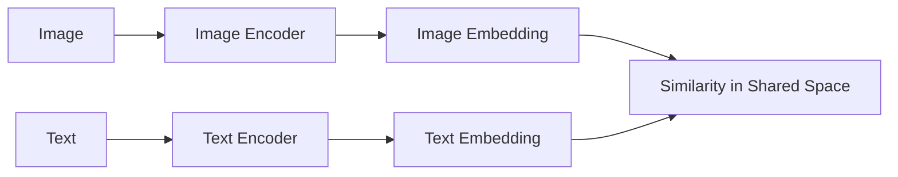
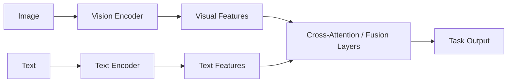
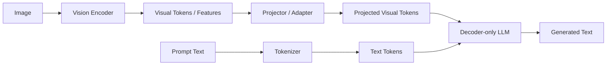
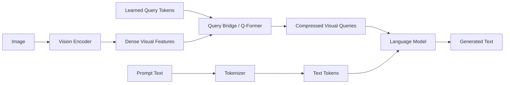
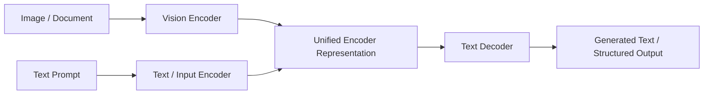
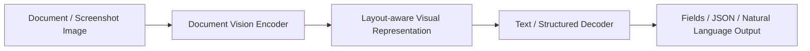
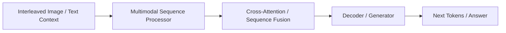
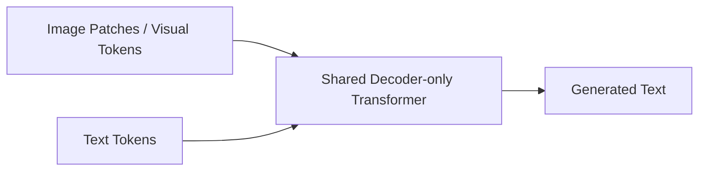

# VLM Architectures and Basics

This note consolidates the high-level introduction to vision-language models and the main architecture families used in retrieval, grounding, multimodal reasoning, and generation.

## Vision-Language Models (VLMs)

A vision-language model jointly processes images and text. The goal is to align visual representations with language
representations so the system can describe, retrieve, classify, ground, or reason over visual content using text.

### Core problem

A VLM must solve two related problems:

1. **Representation alignment**: image and text representations referring to the same concept should be close in a
   shared space
2. **Cross-modal conditioning**: the model should use information from one modality to guide predictions in the other

Typical tasks:

- image-text retrieval
- image captioning
- visual question answering
- grounded conversation over images or videos
- multimodal generation and tool use
- document and screenshot understanding

### Why VLMs are harder than text-only LLMs

A text-only LLM only has to model **one modality**: text.

A VLM must deal with:

- **different input statistics**: images and text have different structures and distributions
- **different encoders**: visual features and language features are not naturally in the same space
- **grounding**: a plausible answer is not enough; the answer must correspond to actual visual evidence
- **serving cost**: images introduce preprocessing, visual encoding, extra tokens, and more memory pressure

This creates two different kinds of difficulty:

#### Modeling difficulty

A VLM must learn a bridge between:

- visual features derived from pixels, patches, regions, layout, or objects
- language features derived from tokens, syntax, and semantics

These are not automatically comparable. The model needs either:

- a **shared embedding space**,
- a **fusion mechanism**, or
- a **projection / bridge module**.

#### Systems difficulty

Serving a VLM is usually harder than serving a text-only LLM because:

- there is often a **vision encoder** before the LLM decode loop
- there may be many **visual tokens**
- **TTFT** tends to increase
- **KV cache pressure** can increase
- batching and scheduling are more complicated

### Main architecture patterns

### 1) Dual-encoder models

Use one encoder for images and one for text, then align them in a shared embedding space.

A common contrastive objective is

$$
\mathcal{L} = -\sum_i \log \frac{\exp(s(v_i, t_i)/\tau)}{\sum_j \exp(s(v_i, t_j)/\tau)}
$$

with a symmetric text-to-image term as well.

Here:

- $v_i$ is an image embedding
- $t_i$ is a text embedding
- $s(\cdot,\cdot)$ is a similarity score, often cosine similarity
- $\tau$ is a temperature parameter

Representative models:

- CLIP
- SigLIP



#### What this solves

It learns cross-modal retrieval and zero-shot classification by making matched image-text pairs similar and mismatched
pairs dissimilar.

#### What CLIP is really doing

CLIP trains:

- an image encoder
- a text encoder

so that **matched image-text pairs** land close together in embedding space, while mismatched pairs are pushed apart.

So yes, conceptually, CLIP learns that:

- an image of a glass
- and a text like "a photo of a drinking glass"

should produce similar vectors.

More precisely:

- it does **not** just align single words to single pixels
- it aligns **whole image semantics** with **whole text semantics**

In training, a batch of image-text pairs is contrasted against itself:

- the correct image-text pairs should score highly
- the wrong pairs should score poorly

#### Zero-shot classification

This is one of the most important consequences of CLIP-like training.

##### Intuition

Instead of training a classifier head for each label, you write labels as text prompts, for example:

- "a photo of a cat"
- "a photo of a dog"
- "a photo of a glass"

Then:

1. encode the image
2. encode each text label prompt
3. compare similarities
4. choose the label whose text embedding is closest to the image embedding

So the model performs classification **without task-specific classifier training** for that exact label set.

##### Why it is called zero-shot

Because the model can often classify categories it was **not explicitly trained as a classifier for**.

It has seen large-scale image-text pairs and learned a shared semantic space, so at inference time you can define a new
classification task only through prompts.

##### Example

Suppose the candidate labels are:

- "a photo of a drinking glass"
- "a photo of eyeglasses"
- "a photo of a dog"

Given an image of a drinking glass, the image embedding should be closest to the first text embedding.

That is zero-shot classification in the CLIP sense.

##### Strengths

- efficient retrieval
- clean shared embedding space
- strong zero-shot classification when trained on large image-text corpora
- easy to build retrieval systems and embedding search

##### Weaknesses

- limited fine-grained generative reasoning by itself
- interaction between modalities is weaker than in fully fused architectures
- prompt phrasing can matter a lot
- ambiguity remains hard when the text label is underspecified

### 2) Fusion / cross-attention models

Image features and text features are allowed to interact through cross-attention or multimodal fusion layers.

Representative directions:

- ALBEF-style fusion
- Flamingo-style cross-attention bridges



#### What this solves

It supports tasks where the text must attend to particular regions or objects, or where fine-grained grounding matters.

#### Strengths

- richer multimodal interaction
- better for VQA, grounding, and detailed reasoning
- stronger token-level or region-level interaction than simple shared-space matching

#### Weaknesses

- more expensive than simple dual encoders
- usually less retrieval-friendly than a clean shared-space model
- more complex serving path

### 3) Image encoder + projector + LLM

A common modern VLM structure is:

- a **vision encoder** (CNN or ViT) extracts visual tokens or features
- a **projection layer / adapter** maps them into the language model embedding space
- a **decoder-only LLM** consumes both text tokens and visual tokens

Representative models:

- LLaVA
- many multimodal assistant-style LLMs



#### What this solves

It lets a pretrained language model perform multimodal generation with relatively small vision-specific adaptation.

#### Why this is attractive

- reuses the strong reasoning and generation abilities of large language models
- integrates naturally with instruction tuning and conversational interfaces
- supports captioning, VQA, and multimodal dialogue with one core model

#### Main tradeoff

The language model may sound coherent even when the visual grounding is weak. Good language fluency is not the same as
faithful visual reasoning.

#### Why alignment is different here than in CLIP

In CLIP:

- image embeddings and text embeddings are trained into a **shared comparable space**

In projector + LLM systems:

- the vision features are usually **not directly comparable** to language embeddings at first
- the projector learns how to map the visual representation into the space the LLM can consume

So this is not mainly about nearest-neighbor matching in a shared retrieval space. It is about
**conditioning a generative language model on visual information**.

### 4) Query-bridge architectures

These models compress or query visual information before handing it to the language model.

Representative models:

- BLIP-2
- Q-Former-style bridges



#### What this solves

It allows strong frozen vision and language components to be connected efficiently, often with fewer trainable
multimodal parameters.

#### Strengths

- parameter-efficient adaptation
- lower visual-token pressure than naïvely forwarding many image features
- practical engineering compromise

#### Weaknesses

- bottleneck may discard useful detail
- architecture is less direct than a simple projector
- can lose fine-grained information if the bridge is too compressive

### 5) Unified encoder-decoder generative models

These models expose a single text-generation interface over both image and text inputs.

Representative models:

- PaLI
- Pix2Struct



#### What this solves

It is useful when the final product is naturally framed as image-conditioned text generation, including multilingual or
document-heavy tasks.

#### Strengths

- unified generation interface
- strong fit for multilingual and document tasks
- natural for structured extraction and explanation

#### Weaknesses

- more expensive than retrieval-oriented systems
- often not the best choice when retrieval is the core need
- can be heavy for very large-scale interactive serving

### 6) OCR-free document specialists

Representative models:

- Donut
- Pix2Struct



#### What this solves

It avoids a separate OCR stage and directly predicts the desired textual or structured output from page images or
screenshots.

#### Strengths

- simpler end-to-end document pipeline
- less OCR error propagation
- good fit for invoices, forms, screenshots, and UI parsing

#### Weaknesses

- dense pages and tiny text remain hard
- less explicit intermediate structure than OCR + layout systems
- high resolution remains expensive

### 7) Interleaved multimodal sequence models

Representative models:

- Flamingo
- Kosmos-style systems



#### What this solves

It supports prompting with richer interleavings of images and text rather than one image followed by one question.

#### Strengths

- closer to assistant-like multimodal interaction
- strong few-shot and in-context multimodal prompting story
- flexible prompting format

#### Weaknesses

- more complex serving and caching behavior
- harder to optimize operationally
- longer multimodal contexts can be expensive

### 8) Encoder-free / pure decoder multimodal models

Representative direction:

- Fuyu-style systems



#### What this solves

It pushes toward a more unified token-processing stack by avoiding a separate vision encoder.

#### Strengths

- conceptually simple sequence processing story
- avoids some mismatch between an external vision encoder and the LLM
- clean “single decoder” mental model

#### Weaknesses

- less established as the default production recipe
- still more of a research and exploration direction for many teams
- training efficiency and quality tradeoffs can be challenging

### Comparison of major architecture families

| Family                          | Core idea                               | Best for                                  | Main weakness                         |
|---------------------------------|-----------------------------------------|-------------------------------------------|---------------------------------------|
| Dual encoder                    | Shared image/text embedding space       | retrieval, zero-shot classification       | weak generative reasoning             |
| Fusion / cross-attention        | richer token-level interaction          | VQA, grounding                            | higher compute                        |
| Projector + LLM                 | map visual tokens into LLM space        | multimodal assistants                     | fluent but weakly grounded answers    |
| Query bridge                    | compress useful visual information      | parameter-efficient multimodal adaptation | information bottleneck                |
| Unified encoder-decoder         | one text-generation interface           | multilingual/document generation          | heavier serving cost                  |
| OCR-free document model         | predict output directly from page image | end-to-end document extraction            | tiny text and dense pages remain hard |
| Interleaved multimodal sequence | images and text mixed in context        | multimodal prompting                      | serving/caching complexity            |
| Encoder-free multimodal decoder | one decoder over all tokens             | unified research direction                | less mature production recipe         |

### Visual tokenization

Images are not fed in as raw pixels to an LLM directly. Common steps are:

1. encode image patches or regions with a vision backbone
2. produce a sequence of visual embeddings
3. project those embeddings into the multimodal token space

This is analogous to text tokenization in spirit: the continuous image is converted into discrete positions or feature
tokens that later modules can process sequentially.

### Training objectives

Different VLMs combine several objectives.

#### Contrastive alignment

Match paired image/text items and separate mismatched ones.

Why it is used: excellent for retrieval and shared semantic space learning.

#### Image captioning / autoregressive loss

Predict text conditioned on an image:

$$
\log p(y_1,\dots,y_T \mid \text{image}).
$$

Why it is used: teaches fluent image-conditioned generation.

#### Matching / binary classification losses

Predict whether an image and a text belong together.

Why it is used: strengthens pairwise compatibility reasoning.

#### Instruction tuning

Train on multimodal instruction-response pairs.

Why it is used: turns a base VLM into a useful assistant that follows user prompts over images.

### Typical components

| Component                             | Role                               | Why it is needed                                                                  |
|---------------------------------------|------------------------------------|-----------------------------------------------------------------------------------|
| Vision encoder                        | Extract visual features            | Images have strong spatial structure that is best handled before fusion with text |
| Text encoder or LLM                   | Process language                   | Provides semantic composition and generation                                      |
| Projector / adapter                   | Align feature spaces               | Vision and language embeddings usually have different dimensions and statistics   |
| Cross-attention or multimodal decoder | Fuse modalities                    | Needed when fine-grained conditioning matters                                     |
| Query bridge                          | Compress useful visual information | Helps balance multimodal quality with serving cost                                |

### Main tradeoffs

| Design choice                 | Benefit                                            | Cost                                       |
|-------------------------------|----------------------------------------------------|--------------------------------------------|
| Dual encoder                  | Retrieval-friendly, scalable contrastive training  | Weaker token-level cross-modal interaction |
| Cross-attention fusion        | Better grounding and detailed multimodal reasoning | Higher compute and complexity              |
| LLM-based VLM                 | Strong generation and instruction following        | Risk of fluent but weakly grounded answers |
| Query bridge                  | Lower multimodal adaptation cost                   | Possible information bottleneck            |
| High-resolution visual tokens | Better detail                                      | More memory and slower inference           |
| OCR-free document model       | Simpler end-to-end document stack                  | Dense pages remain expensive               |

### Failure modes

#### Hallucination

The model describes objects or relations not actually present.

Why it happens: the language prior can dominate the visual evidence.

#### Weak grounding

The answer is plausible but not tied to the correct region or object.

#### OCR and fine-detail failure

Small text, charts, tables, or dense scenes can require higher resolution or specialized modules.

#### Over-compression of visual context

A compact bridge can reduce serving cost, but if it removes too much visual information, the model may miss details that
matter for grounding or extraction.

### Minimal code sketch

```python
image_tokens = vision_encoder(image)
image_tokens = projector(image_tokens)
text_tokens = tokenizer(prompt)
output = multimodal_llm(text_tokens, image_tokens)
```

### What to remember

- VLMs solve both representation alignment and cross-modal conditioning
- Dual encoders are excellent for retrieval; fused or LLM-based models are better for rich multimodal generation
- CLIP-style zero-shot classification works by comparing an image embedding to candidate label prompts in a shared space
- A modern VLM often combines a vision encoder, an adapter or query bridge, and a language model
- The main quality risk is not fluency but **faithful grounding in the visual input**
- The main systems risk is that more visual detail usually means more memory pressure and slower inference

## Vision-Language Models (VLM): Architecture & Systems

Vision-Language Models (VLMs) combine **visual understanding** with **language understanding and generation**. A VLM
takes visual input such as an image, screenshot, chart, or document page and uses that information to retrieve,
classify, ground, explain, or generate text.

A useful mental model is:

- a **vision module** that turns images into visual features or visual tokens
- a **language module** that reasons over text and often generates output
- an **alignment or fusion mechanism** that lets the model connect the two modalities

VLMs are not all the same. Some are optimized for **retrieval**, others for **grounded reasoning**, and others for
**multimodal generation**. Those choices strongly affect both model behavior and serving cost.

### What problems VLMs solve

Typical VLM tasks include:

- image-text retrieval
- zero-shot image classification
- image captioning
- visual question answering (VQA)
- multimodal chat
- document understanding
- screenshot and UI understanding
- grounded generation over images, pages, or diagrams

### Architecture taxonomy

#### 1. Dual-encoder / contrastive models

**Examples:** CLIP, SigLIP

These models use one encoder for the image and one encoder for the text, then map both into a shared embedding space.

**Best for**

- image-text retrieval
- zero-shot classification
- embedding search
- reranking

**Strengths**

- simple and scalable
- very fast at inference for retrieval use cases
- easy to precompute embeddings and index them offline

**Weaknesses**

- not naturally generative
- weaker token-level grounding and reasoning than fused or generative models
- not ideal for multimodal assistants

**Serving implication**

- usually lower KV-cache pressure than generative VLMs
- often compute-bound for large embedding batches
- a strong choice when the product is search or ranking rather than chat

#### 2. Fusion / cross-attention models

**Examples:** ALBEF-style systems, Flamingo-style cross-attention bridges

These models allow image features and text features to interact through cross-attention or multimodal fusion blocks.

**Best for**

- visual question answering
- grounding
- interleaved image-text conditioning
- few-shot multimodal prompting

**Strengths**

- stronger visual grounding than dual encoders
- better when the text must attend to specific objects or regions

**Weaknesses**

- more complex and more expensive than dual encoders
- less naturally optimized for large-scale retrieval systems

**Serving implication**

- more expensive than contrastive models
- often a middle ground between retrieval models and full multimodal assistants

#### 3. Vision encoder + projector + LLM

**Examples:** LLaVA and many modern multimodal assistants

This is the most common modern pattern:

- a vision encoder extracts visual tokens
- a projector or adapter maps them into the LLM embedding space
- a decoder-only LLM consumes both text tokens and visual tokens and generates text

**Best for**

- multimodal chat
- captioning
- VQA
- assistant-style interfaces

**Strengths**

- reuses strong pretrained LLMs
- easy to instruction-tune
- one model can handle many multimodal text-generation tasks

**Weaknesses**

- fluent answers can still be weakly grounded
- projector quality matters a lot
- visual token count can become a major serving bottleneck

**Serving implication**

- highly relevant for latency, TTFT, and KV-cache analysis
- visual tokens directly increase memory pressure and reduce achievable batch size
- this is the most relevant family for serving experiments in this repo

#### 4. Query-bridge architectures

**Examples:** BLIP-2, Q-Former-style bridges

Instead of passing all visual features directly into the LLM, these models learn a compact set of query tokens that
summarize useful visual information and pass only those to the language model.

**Best for**

- parameter-efficient multimodal adaptation
- lower-cost bridging of strong frozen vision and language components

**Strengths**

- more efficient than end-to-end multimodal retraining
- reduces the amount of visual information pushed into the LLM
- often a strong engineering compromise

**Weaknesses**

- the bottleneck can discard useful visual detail
- less conceptually simple than a direct projector-only design

**Serving implication**

- can reduce token inflation compared with naïvely forwarding many image patches
- a good architecture to discuss when balancing visual fidelity vs serving cost

#### 5. Unified encoder-decoder generative models

**Examples:** PaLI, Pix2Struct

These models provide a unified generative interface over visual and textual input. They are often strong when the output
is text and the model must parse visual structure or multilingual content.

**Best for**

- image-to-text generation
- multilingual multimodal tasks
- document and screenshot understanding
- structured extraction from visual input

**Strengths**

- one generation interface for many tasks
- strong fit for document-heavy and UI-heavy tasks
- natural output format for extraction and explanation

**Weaknesses**

- more expensive than retrieval-only models
- often not the best choice if retrieval is the main product requirement

**Serving implication**

- sensitive to image resolution and long outputs
- document workloads can create especially high visual-token pressure

#### 6. OCR-free document specialists

**Examples:** Donut, Pix2Struct

These models are specialized for documents, forms, screenshots, and UI-like inputs, often avoiding a separate OCR stage.

**Best for**

- invoices and forms
- screenshots and dashboards
- visually grounded extraction
- OCR-free document pipelines

**Strengths**

- simpler end-to-end pipeline than OCR + separate parser
- avoids some OCR error propagation

**Weaknesses**

- may still struggle with very dense layouts or small text
- less explicit intermediate structure than OCR pipelines
- high-resolution inputs remain expensive

**Serving implication**

- document understanding is often more resolution-sensitive than natural-image tasks
- large pages can increase latency sharply

#### 7. Interleaved multimodal sequence models

**Examples:** Flamingo, Kosmos-style systems

These are built for richer image-text interleaving rather than a simple "one image, one question" pattern.

**Best for**

- multimodal in-context learning
- assistant-like prompting over multiple images and text turns
- image-text few-shot examples

**Strengths**

- flexible prompting interface
- closer to real assistant behavior

**Weaknesses**

- more complex training and serving behavior
- less straightforward to optimize than simple single-image flows

**Serving implication**

- caching and scheduling become more subtle when image/text turns are interleaved
- realistic for agent-like and assistant-like products

#### 8. Encoder-free / pure decoder multimodal models

**Examples:** Fuyu-style architectures

These models avoid a separate vision encoder and feed image patches more directly into a decoder-only transformer.

**Best for**

- research into simpler multimodal stacks
- architectures that want a more unified token-processing story

**Strengths**

- conceptually unified sequence model
- avoids some mismatch between a frozen vision encoder and an LLM

**Weaknesses**

- harder to train well
- less common as the default production recipe

**Serving implication**

- research-interesting, but not the first architecture family to optimize for production

### Quick comparison

| Family                             | Representative models  | Best for                                    | Main weakness                             | Serving implication                              |
|:-----------------------------------|:-----------------------|:--------------------------------------------|:------------------------------------------|:-------------------------------------------------|
| Dual-encoder                       | CLIP, SigLIP           | Retrieval, zero-shot classification         | Not naturally generative                  | Fast embeddings, lower cache pressure            |
| Fusion / cross-attention           | ALBEF, Flamingo-style  | Grounding, VQA, interleaved conditioning    | More complex and expensive                | Stronger grounding, higher inference cost        |
| Vision encoder + projector + LLM   | LLaVA-style assistants | Multimodal chat and generation              | Can sound fluent without strong grounding | High visual-token and KV-cache pressure          |
| Query bridge                       | BLIP-2                 | Parameter-efficient multimodal adaptation   | Information bottleneck may lose detail    | Lower token inflation than naive projector paths |
| Unified generative encoder-decoder | PaLI, Pix2Struct       | Image-to-text, multilingual, document tasks | Heavier than retrieval models             | Sensitive to resolution and output length        |
| OCR-free document specialist       | Donut, Pix2Struct      | Documents, screenshots, forms               | Dense pages remain expensive              | Document inputs can dominate latency             |
| Interleaved sequence model         | Flamingo, Kosmos-style | Multimodal prompting and context learning   | Harder scheduling and serving             | More realistic assistant-like serving            |
| Encoder-free multimodal decoder    | Fuyu-style             | Research and architectural simplification   | Less established production recipe        | Interesting research direction                   |

### How to choose the right family

Use a **dual encoder** if your main product is retrieval, ranking, or zero-shot classification.

Use a **projector + LLM** or **interleaved assistant model** if your product is a multimodal assistant or image-grounded
conversation.

Use a **query-bridge architecture** if you want a better compromise between multimodal capability and serving cost.

Use a **document specialist** or a **unified generative model** if you care about screenshots, forms, PDFs, or document
parsing.

### Why VLMs are hard to serve

#### Visual token inflation

Images are not processed as single units. They are converted into many visual features or visual tokens. A single image
can consume a large chunk of the model context before the model generates any text.

This increases:

- time to first token (TTFT)
- KV-cache memory usage
- latency for long or high-resolution inputs
- risk of smaller effective batch size

#### Resolution vs. cost

Higher resolution means better detail and better OCR-like behavior, but it also means more visual tokens, more attention
cost, and more memory pressure.

#### Document understanding is especially expensive

Tasks such as document OCR, VQA over charts, or screenshot parsing often need fine-grained spatial detail. That
frequently makes them more expensive than plain natural-image captioning.

### Which families matter most for this repo

For this project, the most important families are:

1. **Dual encoders** for embedding and retrieval experiments
2. **Vision encoder + projector + LLM** for multimodal serving discussions
3. **Document specialists / Pix2Struct-style models** for document understanding and visual token inflation

Those are the families that connect most directly to:

- batching
- KV-cache behavior
- latency vs throughput
- GPU memory pressure
- serving engines such as vLLM and SGLang

---

### Educational discussion

> **What are the main components of a VLM, and why are they hard to serve?**
>
> A modern generative VLM usually has three parts: a vision encoder, a language model, and an alignment component such
> as a projector or query bridge. The vision side turns an image into visual tokens, and the language side reasons over
> those visual tokens together with text tokens.
>
> They are hard to serve because the image already consumes context and memory before text generation even starts. This
> raises time to first token, increases KV-cache pressure, reduces the usable batch size, and makes high-resolution or
> document-heavy workloads much more expensive than text-only serving. Optimizing them often requires better batching,
> cache reuse, and lower-precision execution.
