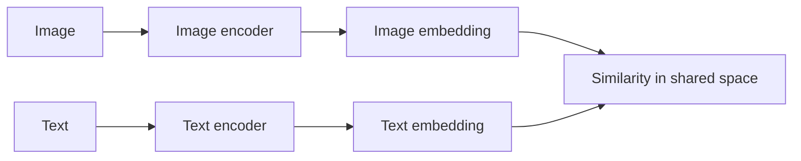
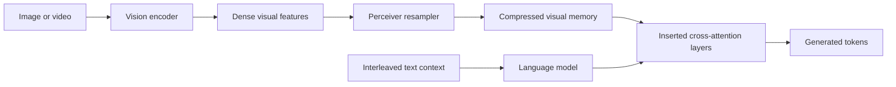
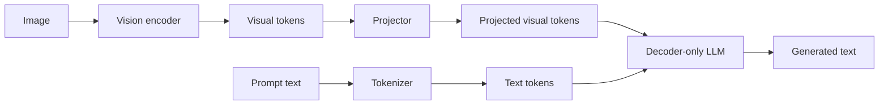
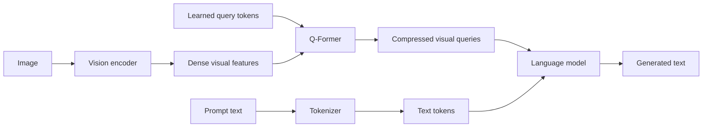
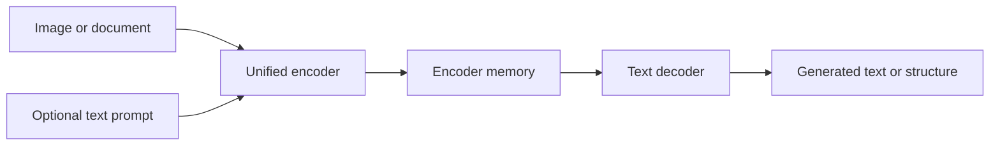

# VLM Architectures and Basics

This note consolidates the main architecture families used in retrieval, grounding, multimodal reasoning, and
multimodal generation.

## 1. What a VLM has to do

A vision-language model jointly processes images and text. The goal is not only to produce plausible language, but to
make that language depend on actual visual evidence.

A VLM therefore has to solve two related problems:

1. **Representation alignment**: image and text representations referring to the same concept should be compatible.
2. **Cross-modal conditioning**: the text-side computation should actually use the visual input when producing an
   answer.

Typical tasks include:

- image-text retrieval
- zero-shot classification
- image captioning
- VQA
- multimodal chat
- screenshot and document understanding
- grounded generation over images, charts, or pages

## 2. Core notation for complexity

I will use the following symbols throughout.

- image size: $H \times W$
- patch size: $P \times P$
- visual token count: $N_v = \frac{H}{P}\frac{W}{P}$ for a plain ViT-style patching scheme
- text prompt length: $N_t$
- generated output length: $N_y$
- hidden width: $d$
- number of bridge or query tokens: $q$
- number of multimodal decoder layers: $L$

For Transformer blocks, the most important scaling terms are usually:

- self-attention: $O(n^2 d)$
- cross-attention: $O(n m d)$ for query length $n$ and memory length $m$
- MLP: $O(n d^2)$

When talking about inference, it helps to split cost into:

- **prefill cost**: encode the image and initial prompt
- **decode cost**: generate new tokens autoregressively
- **KV-cache memory**: memory that grows with retained context length

## 3. Main architecture families

### 3.1 Dual encoders: CLIP and SigLIP

Dual encoders use one image encoder and one text encoder, then align them in a shared embedding space.

A standard CLIP-style contrastive objective is

$$
\mathcal{L}_{\mathrm{clip}}
= -\sum_i \log \frac{\exp(s(v_i, t_i)/\tau)}{\sum_j \exp(s(v_i, t_j)/\tau)}
$$

with a symmetric text-to-image term as well.

Here:

- $v_i$ is an image embedding
- $t_i$ is a text embedding
- $s(\cdot,\cdot)$ is a similarity score, often cosine similarity
- $\tau$ is a temperature parameter

A SigLIP-style pairwise sigmoid loss can be written as

$$
\mathcal{L}_{\mathrm{sig}}
= - \sum_{i,j} \log \sigma\!\left(y_{ij} s_{ij}\right),
$$

where $y_{ij}\in\{-1,+1\}$ indicates whether the image-text pair matches.



#### Intuition

CLIP does **not** reason over image regions token by token with text. It learns that matched image-text pairs should be
close in embedding space and mismatched pairs should be far apart.

That is why it is excellent for:

- retrieval
- zero-shot classification
- reranking
- serving as a strong vision backbone for later VLMs

#### Complexity

If the vision backbone is a ViT with $N_v$ image tokens and the text encoder sees $N_t$ text tokens, then the dominant
encoder costs are roughly

$$
O(N_v^2 d) + O(N_t^2 d).
$$

During training with batch size $B$, the similarity matrix introduces an additional in-batch comparison cost of roughly

$$
O(B^2 d).
$$

At inference for retrieval, the expensive part is usually encoding once and then searching embeddings. That is one
reason dual encoders are operationally attractive.

#### When to use

Use CLIP or SigLIP when the product is fundamentally about **retrieval**, **ranking**, or **zero-shot labeling**.

#### When not to use

Do not expect a plain dual encoder to be the best choice for:

- detailed grounded reasoning
- OCR-heavy document tasks
- long multimodal conversations
- free-form multimodal generation

### 3.2 Cross-attention bridges: Flamingo-style models

Flamingo-style systems start from strong pretrained vision and language backbones, then insert cross-attention layers
that let the language model attend to visual information.

A simple abstraction is:

$$
h_\ell' = h_\ell + \operatorname{CrossAttn}\!\left(h_\ell, R(V)\right),
$$

where:

- $V$ is the set of dense visual features from the vision encoder
- $R(\cdot)$ is a resampler that compresses them to a smaller memory
- $h_\ell$ is the language hidden state at layer $\ell$



#### Why this family matters

Flamingo is important because it supports **interleaved image-text prompting** and strong **few-shot multimodal
conditioning** without retraining the whole language model from scratch.

#### Complexity

Suppose the resampler outputs $q$ visual tokens.

- visual compression is roughly $O(q N_v d)$
- each language-side cross-attention layer adds roughly $O(N_t q d)$ during prefill
- during decoding, the per-token visual cross-attention cost is roughly $O(q d)$ per such layer

The crucial point is that the resampler turns a potentially large $N_v$ into a smaller fixed-size memory $q$.

#### When to use

Use this family when you need:

- interleaved image-text context
- few-shot multimodal prompting
- a stronger grounding story than a pure shared embedding model

#### When not to use

This is usually not the first choice for:

- the cheapest possible serving path
- extremely latency-sensitive single-image classification
- offline embedding search

### 3.3 Vision encoder + projector + LLM: LLaVA-style models

This is the most common modern multimodal assistant recipe.

- a vision encoder extracts visual tokens
- a projector maps them into the language model embedding space
- a decoder-only LLM consumes both visual and text tokens

Let $V\in\mathbb{R}^{N_v\times d_v}$ be vision features and let $P$ be the projector. Then

$$
Z_v = P(V)
$$

produces projected visual tokens $Z_v\in\mathbb{R}^{N_v\times d}$, which are concatenated with text tokens and fed to a
causal decoder.



#### Why it became popular

It reuses strong pretrained LLMs and turns them into multimodal assistants with relatively simple engineering.

#### Complexity

If projected visual tokens are kept explicitly inside the decoder context, then the multimodal prefill length is roughly

$$
N = N_v + N_t.
$$

The prefill cost of decoder self-attention is therefore roughly

$$
O\!\left((N_v + N_t)^2 d\right)
$$

per layer, plus MLP cost $O((N_v+N_t)d^2)$.

If the model generates $N_y$ output tokens, decode-time self-attention grows with the retained prefix. A rough
KV-cache memory scaling is

$$
O\!\left(L (N_v + N_t + N_y) d\right).
$$

This is why large visual token counts directly hurt batch size and latency.

#### When to use

Use this family for:

- multimodal chat
- captioning
- VQA
- assistant-like interfaces
- instruction-tuned multimodal products

#### When not to use

Avoid it when the product is really just retrieval or when strict visual grounding and extraction fidelity matter more
than conversational flexibility.

### 3.4 Query bridges: BLIP-2 and Q-Former-style models

Instead of forwarding all visual tokens to the LLM, BLIP-2 uses a learned set of query tokens that pull relevant
information from a frozen image encoder before passing a compact representation onward.

A useful abstraction is

$$
Q' = \operatorname{QFormer}(Q, V),
$$

where $Q\in\mathbb{R}^{q\times d}$ is a learned query set and $V$ are visual features from the image encoder.



#### Complexity

The bridge itself has a dominant visual-query interaction cost roughly

$$
O(q N_v d),
$$

plus query self-attention and MLP terms of roughly

$$
O(q^2 d) + O(q d^2).
$$

If only $q$ compressed tokens are handed to the LLM, the downstream language model sees a shorter multimodal prefix
than a projector-only design that forwards all $N_v$ visual tokens.

#### Why this is useful

This is a practical compromise when you want to keep strong frozen backbones and reduce multimodal token inflation.

#### When to use

Use it when:

- trainable parameter budget matters
- you want to reuse a frozen vision encoder and a frozen LLM
- you need a more efficient bridge than naively passing all visual tokens

#### When not to use

It may not be the best choice when extremely fine spatial detail must be preserved, because the bridge is a bottleneck.

### 3.5 Unified encoder-decoder generation: Pix2Struct and PaLI-style models

These models treat the task as conditional generation. The image and possibly a text prompt are encoded, then a decoder
generates text or structured output.

A generic factorization is

$$
p(y_{1:N_y} \mid x_{\mathrm{image}}, x_{\mathrm{text}})
= \prod_{t=1}^{N_y} p\!\left(y_t \mid y_{\lt t}, E(x_{\mathrm{image}}, x_{\mathrm{text}})\right),
$$

where $E(\cdot)$ is the encoder memory.



#### Complexity

If the encoder sees $N_v$ visual tokens and $N_t$ text-prompt tokens, a rough full-attention cost is

$$
O\!\left((N_v + N_t)^2 d\right).
$$

If the decoder emits $N_y$ tokens, then decoder-side cost is roughly

$$
O(N_y^2 d) + O\!\left(N_y (N_v + N_t) d\right)
$$

from self-attention plus cross-attention.

#### When to use

This family is strong for:

- image-conditioned generation
- screenshot parsing
- document extraction
- multilingual multimodal generation

#### When not to use

It is often heavier than necessary for pure retrieval and can be expensive for interactive chat if the visual encoder is
high-resolution.

## 4. Important named models and how to think about them

### CLIP

Think of CLIP as a **shared embedding space model**.

- best for retrieval and zero-shot classification
- often reused as a vision tower inside later VLMs
- operationally attractive because embeddings can be precomputed offline

### SigLIP

Think of SigLIP as a **CLIP-like dual encoder with a different training loss**.

- similar serving use cases to CLIP
- especially interesting when batch-size behavior during training matters

### Flamingo

Think of Flamingo as a **frozen LM plus visual cross-attention memories**.

- best when interleaved multimodal prompting matters
- more complex serving path than a plain dual encoder
- stronger few-shot multimodal story than CLIP-like models

### BLIP-2

Think of BLIP-2 as a **query bottleneck between a frozen image encoder and a frozen LLM**.

- good engineering compromise
- smaller trainable bridge than full end-to-end multimodal tuning
- useful when visual compression is acceptable

### LLaVA

Think of LLaVA as a **projector plus instruction-tuned LLM assistant**.

- strong default baseline for multimodal chat and VQA
- easy mental model and common in practice
- main risk is fluent but weakly grounded output

### Pix2Struct

Think of Pix2Struct as **visual-input-to-text generation**, especially good for screenshots, UIs, and visually situated
language.

- natural when the output is text or structured text
- not a retrieval-first model
- high-resolution inputs can still dominate cost

## 5. Architecture choice by product goal

| Product goal                         | Usually start with                      | Why                                                                 |
|--------------------------------------|-----------------------------------------|---------------------------------------------------------------------|
| image-text retrieval                 | CLIP or SigLIP                          | shared embedding space and offline indexing                         |
| zero-shot labeling                   | CLIP or SigLIP                          | promptable label space                                              |
| multimodal assistant                 | LLaVA-style projector + LLM             | strong conversational interface                                     |
| few-shot interleaved prompting       | Flamingo-style cross-attention          | better support for mixed image-text context                         |
| parameter-efficient multimodal build | BLIP-2 or Q-Former bridge               | compact trainable bridge                                            |
| screenshot or document generation    | Pix2Struct or another encoder-decoder   | output is naturally text or structure                               |
| strict extraction over documents     | document-specific models                | layout, OCR, and high-resolution constraints dominate architecture  |

## 6. Complexity cheat sheet

The table below focuses on the dominant sequence terms and omits constants.

| Family                  | Prefill complexity                                  | Decode-side intuition                               | Main memory pressure                    |
|-------------------------|-----------------------------------------------------|-----------------------------------------------------|-----------------------------------------|
| CLIP or SigLIP          | $O(N_v^2 d) + O(N_t^2 d)$                           | usually no autoregressive decode                    | encoder activations or embedding index  |
| Flamingo                | $O(N_v^2 d) + O(q N_v d) + O(N_t q d)$              | per generated token still attends to visual memory  | LM KV cache plus visual memory          |
| LLaVA-style             | $O(N_v^2 d_v) + O((N_v+N_t)^2 d)$                   | decode cost grows with retained multimodal prefix   | large decoder KV cache                  |
| BLIP-2-style            | $O(N_v^2 d_v) + O(q N_v d) + O((q+N_t)^2 d)$        | shorter multimodal prefix than projector-only       | smaller decoder context, bridge states  |
| Pix2Struct or PaLI-type | $O((N_v+N_t)^2 d) + O(N_y(N_v+N_t)d + N_y^2 d)$     | encoder-decoder generation                          | encoder memory plus decoder cache       |

## 7. Main failure modes

### Hallucination

The model gives a fluent answer that is not actually supported by the image.

### Weak grounding

The answer is plausible but tied to the wrong region, object, or page element.

### OCR and small-text failure

Charts, tables, receipts, screenshots, and documents often fail because tiny text requires more spatial resolution than
ordinary image captioning.

### Over-compression

Query bridges and token compression improve serving efficiency, but they can remove information that later reasoning
would have needed.

## 8. Minimal code sketch

```python
visual_tokens = vision_encoder(image)
compressed = projector_or_bridge(visual_tokens)
text_tokens = tokenizer(prompt)
output = multimodal_model(text_tokens, compressed)
```

## 9. What to remember

- VLMs solve both **alignment** and **conditioning**.
- CLIP and SigLIP are retrieval-first models.
- Flamingo is a cross-attention bridge for interleaved multimodal prompting.
- BLIP-2 uses a query bottleneck to connect frozen backbones efficiently.
- LLaVA-style systems are strong assistant baselines but can be weakly grounded.
- Pix2Struct-style models are natural when the final product is visual-input-to-text generation.
- In serving, visual token count is often the first quantity to estimate.
