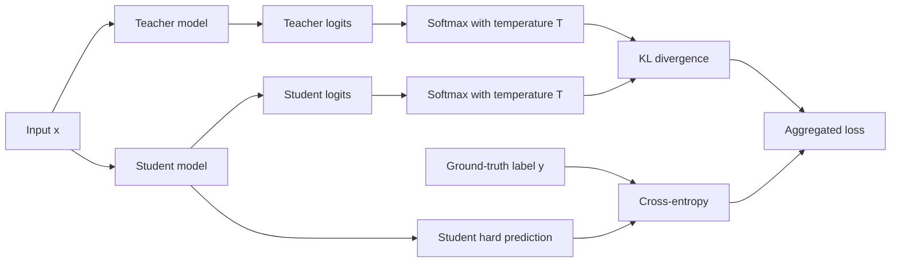
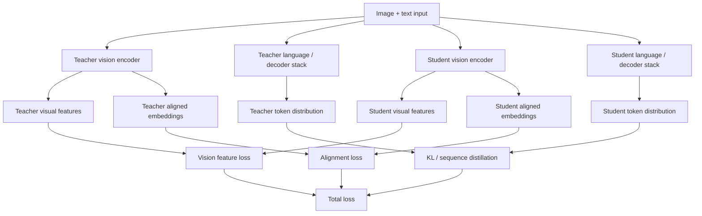

# Knowledge Distillation for VLM and LLM Serving

Knowledge distillation (KD) compresses a larger **teacher** model into a smaller **student** model so that the student
preserves as much useful behavior as possible while serving faster, cheaper, or within tighter memory limits.

A useful mental model is:

- KD is a **teacher-student compression** strategy
- the objective is usually **quality retention under lower serving cost**
- for VLMs, the student must preserve not only fluent outputs but also **grounding** and **alignment**

## 1. Core intuition

A hard label tells the model only which class is correct. A teacher distribution also tells the student:

- which alternatives are plausible
- which classes are semantically similar
- where the teacher is confident or uncertain

That extra structure is the classical **dark knowledge** idea.

## 2. Standard logit distillation

Let the teacher logits be $z^{(t)}$ and the student logits be $z^{(s)}$.
With temperature $T > 1$, the softened distributions are

$$
p_i^{(t)}(T) = \frac{\exp\left(z_i^{(t)} / T\right)}{\sum_j \exp\left(z_j^{(t)} / T\right)}
$$

and

$$
p_i^{(s)}(T) = \frac{\exp\left(z_i^{(s)} / T\right)}{\sum_j \exp\left(z_j^{(s)} / T\right)}.
$$

The standard KD loss is

$$
\begin{aligned}
\mathcal{L}_{\mathrm{KD}}
&= \alpha \, \mathcal{L}_{\mathrm{task}}\!\left(y, p^{(s)}(1)\right) \\
&\quad + (1-\alpha) T^2 \, \mathrm{KL}\!\left(
    p^{(t)}(T) \,\|\, p^{(s)}(T)
\right).
\end{aligned}
$$

For classification,

$$
\mathcal{L}_{\mathrm{task}} = \mathrm{CE}\!\left(y, p^{(s)}(1)\right).
$$

The factor $T^2$ compensates for gradient rescaling under temperature smoothing.

## 3. Why temperature helps

At $T=1$, the softmax may be too sharp. Larger $T$ reveals richer probability structure:

$$
\mathrm{softmax}_T(z)_i = \frac{\exp(z_i / T)}{\sum_j \exp(z_j / T)}.
$$

- large $T$ gives smoother targets
- small $T$ gives sharper targets

## 4. Diagram: classic teacher-student flow

## 5. Worked example

The screenshots correspond to the following pedagogical example.

Assume a three-class problem with softened teacher and student distributions at temperature $T=5$:

$$
t = (0.8668, 0.1173, 0.0159)
$$

and

$$
s = (0.8236, 0.1653, 0.0101).
$$

The KL term is

$$
\mathrm{KL}(t \| s) = \sum_i t_i \ln\!\left(\frac{t_i}{s_i}\right).
$$

Numerically,

$$
\begin{aligned}
\mathrm{KL}(t \| s)
&\approx 0.8668\ln\!\left(\frac{0.8668}{0.8236}\right)
    + 0.1173\ln\!\left(\frac{0.1173}{0.1653}\right) \\
&\quad + 0.0159\ln\!\left(\frac{0.0159}{0.0101}\right)
    \approx 0.0105.
\end{aligned}
$$

If the correct class is the first class, then the label-based cross-entropy term in the same toy example is

$$
\mathrm{CE}(y, s) = -\ln(0.8236) \approx 0.1941.
$$

Using $\alpha = 0.5$ and $T = 5$:

$$
\mathcal{L} = 0.5 \cdot 0.1941 + 0.5 \cdot 25 \cdot 0.0105 = 0.2283.
$$

### Important implementation note

In production implementations, the label loss is usually computed on the student's **untempered** probabilities or
logits, not on the softened probabilities shown in this pedagogical example. The example is still useful because it
makes the role of the two terms explicit.

## 6. Why the $T^2$ factor appears

Let

$$
q_i(T) = \mathrm{softmax}(z_i / T),
$$

and consider a KL term between softened teacher and student distributions. Because the logits are divided by $T$, the
gradient of the softmax with respect to the logits scales like $1/T$. A second factor of $1/T$ appears when the student
log-probabilities are differentiated through the KL term. The overall gradient scale is therefore reduced roughly
by $1/T^2$.

Multiplying the distillation term by $T^2$ keeps its gradient magnitude comparable across different temperatures.

## 7. Feature distillation

For VLMs, distillation often goes beyond final logits. The student may match:

- intermediate visual features
- aligned embeddings
- attention maps
- decoder hidden states
- region-level representations

A simple feature-matching term is

$$
\begin{aligned}
\mathcal{L}_{\mathrm{feat}}
&= \sum_{\ell \in \mathcal{S}} w_\ell \,
    \left\lVert h_\ell^{(t)} - P_\ell\!\left(h_\ell^{(s)}\right) \right\rVert_2^2.
\end{aligned}
$$

where $P_\ell$ projects the student into the teacher space when dimensions differ.

## 8. Sequence distillation for generative models

For autoregressive models, distillation can target full generated sequences.
If the teacher generates $\hat y_{1:T}$, the student can minimize

$$
\mathcal{L}_{\mathrm{seq}} = - \sum_{t=1}^{T} \log p_\theta\!\left(\hat y_t \mid \hat y_{<t}, x\right).
$$

This is useful when the teacher is more reliable than the raw labels or when the student should mimic the teacher's
style or reasoning pattern.

## 9. Distillation targets inside a VLM

A VLM may be distilled at multiple levels:

- **vision encoder distillation**
- **projector / connector distillation**
- **LLM decoder distillation**
- **alignment-space distillation**
- **end-to-end multimodal behavior distillation**

A multi-part objective can look like:

$$
\begin{aligned}
\mathcal{L}_{\mathrm{VLM}}
&= \lambda_1 \mathcal{L}_{\mathrm{text}}
 + \lambda_2 \mathcal{L}_{\mathrm{vision}} \\
&\quad + \lambda_3 \mathcal{L}_{\mathrm{align}}
 + \lambda_4 \mathcal{L}_{\mathrm{KD}}.
\end{aligned}
$$

## 10. Diagram: multi-level VLM distillation

## 11. Operational value

KD is valuable when the teacher is too expensive to deploy. Common goals are:

- fit on a single GPU instead of a multi-GPU setup
- lower TTFT and decode cost
- reduce memory pressure and increase batchability
- lower serving cost at similar task quality

A rough relationship is

$$
\text{throughput} \propto \frac{1}{\text{compute per request} + \text{memory overhead}}.
$$

If the student is smaller and more cache-friendly, throughput often rises and tail latency falls.

## 12. Failure modes

KD can fail when:

- the student is too small to represent the teacher's behavior
- the teacher is miscalibrated or wrong
- the student learns style without grounding
- the language quality remains fluent while visual fidelity degrades

For VLMs, this last point is especially important.

## 13. Best practices

- start from a teacher that is stronger on the target task, not just larger
- tune $T$ and $\alpha$ jointly; there is no universal best setting
- preserve task loss alongside KD loss so the student does not overfit the teacher's mistakes
- for VLMs, evaluate grounding, OCR, retrieval, and hallucination metrics explicitly
- combine KD with quantization or pruning only after a stable student baseline exists

## 14. Practical summary

> Knowledge distillation is a way to move from a high-quality but expensive teacher to a deployment-sized student. I
> would think in terms of logit distillation, feature distillation, and sequence distillation, and for VLMs I would
> explicitly evaluate whether the student preserved grounding, not just text fluency.
