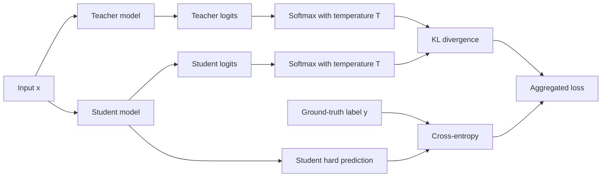
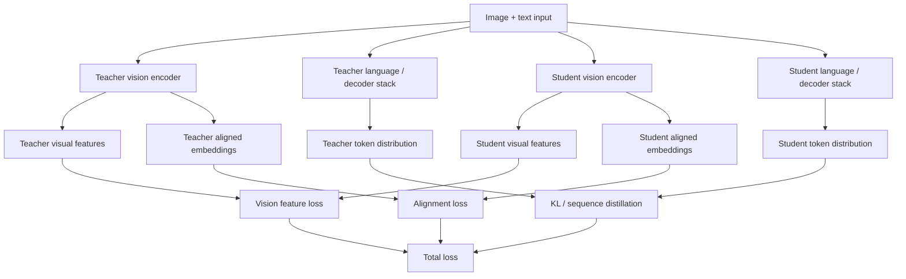

# Knowledge Distillation for VLM and LLM Serving

Knowledge distillation (KD) compresses a larger **teacher** model into a smaller **student** model so that the student preserves as much useful behavior as possible while serving faster, cheaper, or within tighter memory limits.

For interview purposes, the right mental model is:
- KD is a **teacher-student compression** strategy
- the objective is usually **quality retention under lower serving cost**
- for VLMs, the student must preserve not only fluent outputs but also **grounding** and **alignment**

## 1. Core intuition

A hard label tells the model only which class is correct. A teacher distribution also tells the student:
- which alternatives are plausible
- which classes are semantically similar
- where the teacher is confident or uncertain

That extra structure is the classical **dark knowledge** idea.

## 2. Standard logit distillation

Let the teacher logits be $z^{(t)}$ and the student logits be $z^{(s)}$.
With temperature $T > 1$, the softened distributions are

$$
p_i^{(t)}(T) = \frac{\exp(z_i^{(t)}/T)}{\sum_j \exp(z_j^{(t)}/T)},
\qquad
p_i^{(s)}(T) = \frac{\exp(z_i^{(s)}/T)}{\sum_j \exp(z_j^{(s)}/T)}.
$$

The standard KD loss is

$$
\mathcal{L}_{\text{KD}} = \alpha \, \mathcal{L}_{\text{task}}(y, p^{(s)}(1))
+ (1-\alpha) T^2 \, \mathrm{KL}\!\left(p^{(t)}(T) \;\|\; p^{(s)}(T)\right).
$$

For classification,

$$
\mathcal{L}_{\text{task}} = \mathrm{CE}(y, p^{(s)}(1)).
$$

The factor $T^2$ compensates for gradient rescaling under temperature smoothing.

## 3. Why temperature helps

At $T=1$, the softmax may be too sharp. Larger $T$ reveals richer probability structure:

$$
\mathrm{softmax}_T(z)_i = \frac{e^{z_i/T}}{\sum_j e^{z_j/T}}.
$$

- large $T$ gives smoother targets
- small $T$ gives sharper targets

## 4. Classic teacher-student flow

## 5. Worked example

The screenshots used in interview prep correspond to the following pedagogical example.

Assume a three-class problem with softened teacher and student distributions at temperature $T=5$:

$$
t = (0.8668, 0.1173, 0.0159),
\qquad
s = (0.8236, 0.1653, 0.0101).
$$

The KL term is

$$
\mathrm{KL}(t\|s) = \sum_i t_i \ln\frac{t_i}{s_i}.
$$

Numerically,

$$
\mathrm{KL}(t\|s)
\approx 0.8668\ln\frac{0.8668}{0.8236}
+0.1173\ln\frac{0.1173}{0.1653}
+0.0159\ln\frac{0.0159}{0.0101}
\approx 0.0105.
$$

If the correct class is the first class, then the label-based cross-entropy term in the same toy example is

$$
\mathrm{CE}(y,s) = -\ln(0.8236) \approx 0.1941.
$$

Using $\alpha=0.5$ and $T=5$:

$$
\mathcal{L} = 0.5\,(0.1941) + 0.5\,(25)\,(0.0105) = 0.2283.
$$

### Important implementation note

In production implementations, the label loss is usually computed on the student's **untempered** probabilities or logits, not on the softened probabilities shown in this pedagogical example. The example is still useful because it makes the role of the two terms explicit.

## 6. Feature distillation

For VLMs, distillation often goes beyond final logits. The student may match:
- intermediate visual features
- aligned embeddings
- attention maps
- decoder hidden states
- region-level representations

A simple feature-matching term is

$$
\mathcal{L}_{\text{feat}} = \sum_{\ell \in \mathcal{S}} w_\ell \, \lVert h^{(t)}_\ell - P_\ell(h^{(s)}_\ell) \rVert_2^2,
$$

where $P_\ell$ projects the student into the teacher space when dimensions differ.

## 7. Sequence distillation for generative models

For autoregressive models, distillation can target full generated sequences.
If the teacher generates $\hat y_{1:T}$, the student can minimize

$$
\mathcal{L}_{\text{seq}} = - \sum_{t=1}^{T} \log p_\theta(\hat y_t \mid \hat y_{<t}, x).
$$

This is useful when the teacher is more reliable than the raw labels or when the student should mimic the teacher's style or reasoning pattern.

## 8. Distillation targets inside a VLM

A VLM may be distilled at multiple levels:
- **vision encoder distillation**
- **projector / connector distillation**
- **LLM decoder distillation**
- **alignment-space distillation**
- **end-to-end multimodal behavior distillation**

A multi-part objective can look like:

$$
\mathcal{L}_{\text{VLM}} =
\lambda_1 \mathcal{L}_{\text{text}} +
\lambda_2 \mathcal{L}_{\text{vision}} +
\lambda_3 \mathcal{L}_{\text{align}} +
\lambda_4 \mathcal{L}_{\text{KD}}.
$$

## 9. Operational value

KD is valuable when the teacher is too expensive to deploy. Common goals are:
- fit on a single GPU instead of a multi-GPU setup
- lower TTFT and decode cost
- reduce memory pressure and increase batchability
- lower serving cost at similar task quality

A rough relationship is

$$
\text{throughput} \propto \frac{1}{\text{compute per request} + \text{memory overhead}}.
$$

If the student is smaller and more cache-friendly, throughput often rises and tail latency falls.

## 10. Failure modes

KD can fail when:
- the student is too small to represent the teacher's behavior
- the teacher is miscalibrated or wrong
- the student learns style without grounding
- the language quality remains fluent while visual fidelity degrades

For VLMs, this last point is especially important.

## 11. Interview framing

> Knowledge distillation is a way to move from a high-quality but expensive teacher to a deployment-sized student. I would think in terms of logit distillation, feature distillation, and sequence distillation, and for VLMs I would explicitly evaluate whether the student preserved grounding, not just text fluency.
