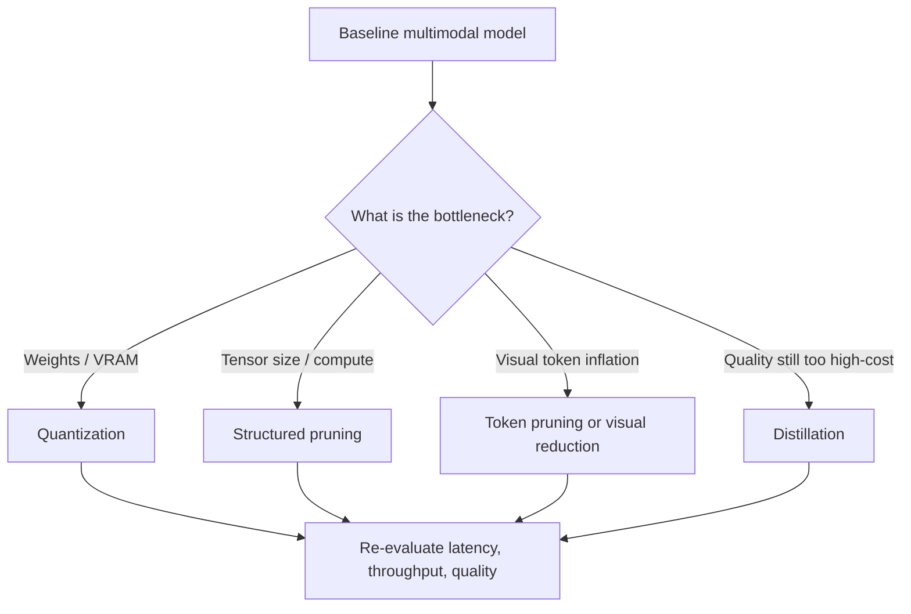
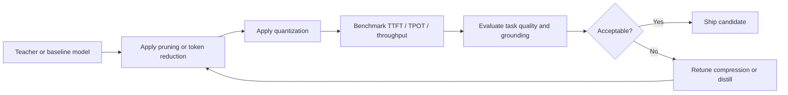

# Pruning and Quantization for Deployment-Sized VLM Serving

Pruning and quantization are two of the main ways to make large multimodal models cheaper to serve.

- **Pruning** removes parameters, channels, heads, or blocks that contribute little to quality.
- **Quantization** stores and computes with lower-precision values.

For interview purposes, the key point is that both techniques trade some amount of model fidelity for lower memory,
lower bandwidth pressure, and potentially higher throughput.

## 1. Pruning

### Main forms of pruning

- **Unstructured pruning**: remove individual weights
- **Structured pruning**: remove heads, channels, neurons, or whole blocks
- **Token pruning / visual token reduction**: remove less useful patches, regions, or intermediate tokens

### Sparsity objective

A simple sparsity-regularized training objective is

$$
\mathcal{L}(\theta) = \mathcal{L}_{\text{task}}(\theta) + \lambda \lVert \theta \rVert_0,
$$

but because $\lVert \theta \rVert_0$ is hard to optimize directly, one often uses proxies such as

$$
\mathcal{L}(\theta) = \mathcal{L}_{\text{task}}(\theta) + \lambda \lVert \theta \rVert_1.
$$

### Magnitude pruning

A common baseline is to prune small-magnitude weights:

$$
\theta_i' = \theta_i \cdot \mathbf{1}(|\theta_i| > \tau).
$$

### Why structured pruning matters more for serving

Unstructured sparsity can reduce parameter count without delivering proportional latency gains unless the kernel stack
is highly optimized for sparse computation.

Structured pruning is usually more deployment-friendly because it reduces real tensor dimensions. That can directly
shrink matrix multiplies and attention cost.

## 2. Quantization

### Uniform affine quantization

For a real-valued tensor $x$, a common quantization rule is

$$
q = \mathrm{clip}\left(\left\lfloor \frac{x}{s} \rceil + z\right, q_{\min}, q_{\max}\right),
$$

and dequantization is

$$
\hat{x} = s(q - z),
$$

where:

- $s$ is the scale
- $z$ is the zero-point
- $q$ is the integer representation

### Memory reduction

If parameters move from FP16 to INT8, memory roughly scales as

$$
\text{memory ratio} \approx \frac{8}{16} = 0.5.
$$

Moving to 4-bit weights gives approximately

$$
\text{memory ratio} \approx \frac{4}{16} = 0.25,
$$

plus metadata overhead for scales and group structure.

### Where quantization helps most

For large-model serving, the decode phase is often heavily **memory-bandwidth bound**. Lower-precision weights reduce
bytes moved per token step, which can improve throughput.

A useful mental model is:

$$
\text{time per token} \approx \max\left(\frac{\text{FLOPs}}{\text{compute rate}}, \frac{\text{Bytes}}{\text{bandwidth}}\right).
$$

Quantization primarily reduces the second term.

## 3. VLM-specific considerations

VLMs introduce additional choices:

- quantize the LLM decoder only
- quantize the vision encoder too
- quantize the projector / bridge
- prune visual tokens before they hit the decoder

This matters because VLM serving cost may come from both:

- the autoregressive decoder loop, and
- the amount of visual information pushed into the language side.

## Diagram: compression decision flow

## 4. Calibration and error

Quantization error can be written as

$$
\varepsilon = x - \hat{x}.
$$

The mean squared quantization error is

$$
\mathbb{E}[\varepsilon^2].
$$

Good post-training quantization tries to choose scales and grouping so this error remains small on important activations
and weights.

## 5. Post-training vs quantization-aware training

### Post-training quantization (PTQ)

- fast to apply
- operationally attractive
- may degrade more on fragile or activation-heavy models

### Quantization-aware training (QAT)

- simulates quantization during training/fine-tuning
- usually preserves more quality
- costs more engineering and tuning effort

In interviews, it is good to say that PTQ is often the fastest deployment lever, while QAT is used when PTQ quality loss
is too high.

## 6. Pruning + quantization together

These techniques can be combined:

$$
\theta \xrightarrow{\text{prune}} \theta' \xrightarrow{\text{quantize}} q(\theta').
$$

But the order matters, and combined compression can amplify error. In practice you usually need re-evaluation and
sometimes re-training.

## Diagram: practical deployment loop

## 7. VLM failure modes to mention

- small OCR text may degrade disproportionately under aggressive compression
- document layout sensitivity may worsen before generic captioning quality does
- grounding errors may increase even when answers still sound fluent
- pruning visual tokens too aggressively can remove exactly the fine detail the model needs

## Interview framing

A strong answer sounds like this:

> For deployment, I would first identify whether the model is limited by weight memory, KV-cache pressure, or visual
> token inflation. Quantization is often the fastest lever for memory and bandwidth, structured pruning is better than
> unstructured pruning when we care about real latency gains, and for VLMs I would also consider token reduction on the
> visual side. Then I would benchmark TTFT, TPOT, throughput, and task-specific grounding metrics to see whether the
> compression is still acceptable.
