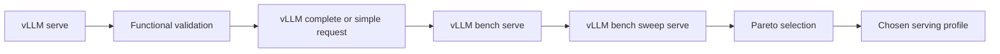
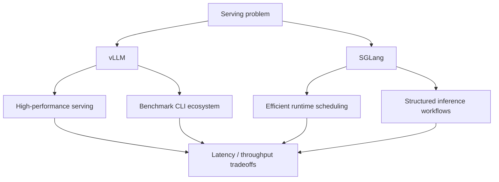

# vLLM CLI and SGLang: Operational Overview

This document is not meant to be a command reference. It provides a mental model for understanding the main tools and
how they fit together.

## 1. Core vLLM commands and what they are for

### `vllm serve`

Purpose:

- start an inference server
- expose an OpenAI-compatible API or related serving endpoints
- control model- and runtime-level serving knobs

Operational focus:

- this is the runtime entrypoint
- you care about model loading, memory use, batching behavior, and latency/throughput tradeoffs

### `vllm bench serve`

Purpose:

- benchmark an already running server
- characterize latency, token timing, concurrency behavior, and throughput

Operational focus:

- this is the serious measurement tool for a live endpoint
- it is much better than writing ad hoc one-off loops when you want credible serving numbers

### `vllm bench sweep serve`

Purpose:

- compare multiple serving configurations
- generate a design-space view rather than a single-point benchmark

Operational focus:

- this is how you search a small tuning surface for Pareto-efficient settings
- useful knobs often include `gpu_memory_utilization`, `max_num_seqs`, and `max_num_batched_tokens`

### `vllm complete`

Purpose:

- issue a quick completion request from the CLI
- useful as a smoke test or a simple reproducible functional check

Operational focus:

- this is the fastest way to validate that the server is responding correctly before running a serious benchmark

### `vllm collect-env`

Purpose:

- capture environment metadata
- useful for reproducibility, debugging, and supportability

Operational focus:

- this matters because serving bugs are often environment-dependent: driver versions, CUDA/ROCm stack, PyTorch build,
  GPU type, and related runtime details

## 2. How to reason about the workflow

A good mental sequence is:

1. start the server
2. issue a simple functional request
3. benchmark one configuration
4. sweep a small number of important knobs
5. keep only the non-dominated operating points

## Diagram: operational workflow

## 3. Pareto reasoning

Suppose each configuration $c$ has latency $L(c)$ and throughput $Q(c)$.
A configuration $c_1$ dominates $c_2$ if

$$
L(c_1) \le L(c_2) \quad \text{and} \quad Q(c_1) \ge Q(c_2),
$$

with at least one strict inequality.

The Pareto frontier is the set of configurations that are not dominated.

## 4. Throughput, latency, concurrency, and queueing

A simple mental model uses Little’s law:

$$
N = \lambda W,
$$

where:

- $N$ is the average number of requests in the system
- $\lambda$ is arrival rate / throughput
- $W$ is average time in system

This reminds you that aggressive concurrency can raise queue length and latency even if raw GPU utilization improves.

## 5. Goodput is better than raw throughput

If $\lambda$ is request throughput and $p_{\text{SLO}}$ is the fraction of requests satisfying latency SLOs, then

$$
\mathrm{goodput} = \lambda p_{\text{SLO}}.
$$

That is often a better production metric than throughput alone.

## 6. Where SGLang fits

SGLang belongs in the same serving conversation because it also focuses on efficient LLM/VLM inference and runtime
scheduling.

A useful comparison is:

- **vLLM**: strong serving engine and benchmark ecosystem, especially useful for rigorous throughput/latency analysis
- **SGLang**: important runtime/framework for efficient structured inference and advanced serving patterns
- both belong to the same systems discussion about batching, memory pressure, and serving efficiency

## Diagram: positioning vLLM vs SGLang

## 7. Practical summary

A concise summary is:

> I think of `vllm serve` as the runtime entrypoint, `vllm complete` as a fast functional smoke test, `vllm bench serve`
> as the serious live-endpoint benchmark, and `vllm bench sweep serve` as the way to map the tuning surface and identify
> Pareto-efficient operating points. I also keep `vllm collect-env` in mind because environment drift explains a
> surprising number of serving issues. I view SGLang and vLLM as part of the same broader serving conversation around
> batching, memory management, and runtime efficiency.
