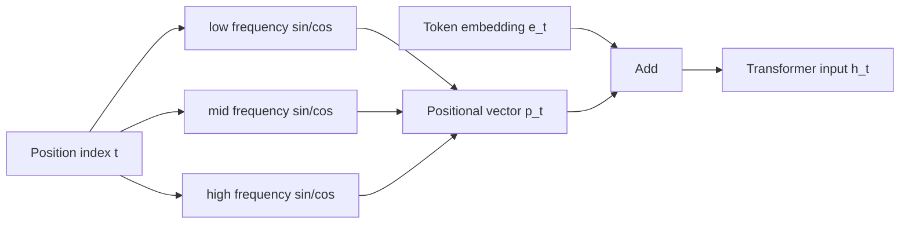
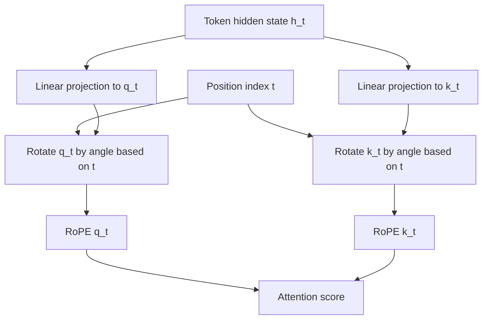
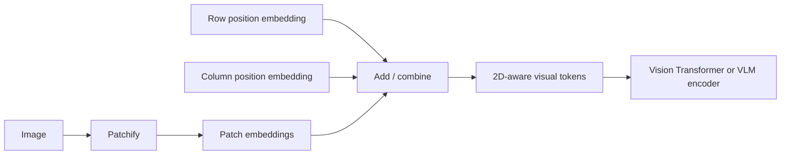

# Position Embeddings and Positional Encoding

Transformers need an explicit notion of order because self-attention by itself is almost permutation-equivariant: it can
compare tokens by content, but it does not automatically know which token came first.

This document explains:

- why positional information is needed,
- the main ways to inject it,
- the mathematics behind each approach,
- tradeoffs between absolute and relative schemes,
- how the story changes for images and VLMs.

---

## 1. Why positional information is needed

Let a sequence of token embeddings be
$$
E = [e_1, e_2, \dots, e_n], \qquad e_t \in \mathbb{R}^d.
$$

Self-attention computes
$$
Q = EW_Q, \qquad K = EW_K, \qquad V = EW_V,
$$
and then
$$
\mathrm{Attention}(Q,K,V)=\mathrm{softmax}\left(\frac{QK^\top}{\sqrt{d_k}}\right)V.
$$

The dot products in $QK^\top$ depend on token content, but not on the absolute order of tokens unless the model is given
order information explicitly.

### Example

The sequences

- `dog bites man`
- `man bites dog`

contain the same tokens but differ in meaning because of order. A Transformer without position information would
struggle to distinguish them reliably.

---

## 2. Two broad ways to encode position

### A. Add a positional vector to each token

We compute or learn a vector $p_t \in \mathbb{R}^d$ for position $t$ and form
$$
h_t^{(0)} = e_t + p_t.
$$

This is the classic **input-level positional encoding** approach.

### B. Modify attention scores directly

Instead of only changing the input representation, we change how token $i$ attends to token $j$:
$$
a_{ij} = \frac{q_i^\top k_j}{\sqrt{d_k}} + \text{position term}(i,j).
$$

This is the **attention-level positional encoding** approach.

---

## 3. Learned absolute positional embeddings

This is the simplest scheme.

Define a trainable matrix
$$
P \in \mathbb{R}^{L \times d},
$$
where $L$ is the maximum context length and $d$ is the hidden dimension.

Then position $t$ gets the embedding
$$
p_t = P[t],
$$
and the Transformer input is
$$
h_t^{(0)} = e_t + P[t].
$$

### Why it works

The model can learn a distinct representation for each position. For example, it can learn that early tokens are often
prompts, later tokens are often completions, or position 1 is often special.

### Pros

- Very simple to implement.
- Fully learnable and flexible.
- Works well when train and inference context lengths are similar.

### Cons

- Requires a fixed maximum length $L$.
- Generalizes poorly beyond trained sequence lengths.
- Absolute position may be less natural than relative distance for many sequence tasks.

### Example

If $d=4$, a learned table might give
$$
P[3] = [0.12, -0.41, 0.08, 0.55].
$$
Then token 3 gets
$$
h_3^{(0)} = e_3 + P[3].
$$

---

## 4. Sinusoidal positional encoding

Instead of learning a table, we define a deterministic encoding:
$$
PE(pos,2i)=\sin\left(\frac{pos}{10000^{2i/d}}\right),
$$
$$
PE(pos,2i+1)=\cos\left(\frac{pos}{10000^{2i/d}}\right).
$$

So each even/odd pair of channels uses a sinusoid with a different frequency.

Then
$$
p_{pos} = PE(pos), \qquad h_{pos}^{(0)} = e_{pos} + PE(pos).
$$

### Intuition

Each position is represented by a mixture of low- and high-frequency waves:

- high-frequency components capture fine local differences,
- low-frequency components capture coarse long-range position.

### Why relative offsets can be inferred

Because
$$
\sin(a+b)=\sin a\cos b + \cos a\sin b,
$$
$$
\cos(a+b)=\cos a\cos b - \sin a\sin b,
$$
position $pos+k$ can be expressed as a linear function of the sine/cosine basis at $pos$. This gives the model a path to
reasoning about **relative displacement**.

### Pros

- No learned parameters.
- Naturally defined for arbitrarily long positions.
- Better extrapolation than learned lookup tables in many settings.

### Cons

- Not always the strongest empirical choice in modern LLMs.
- Adds position only at the input, not directly in attention.
- May be less adaptable than learned or relative schemes.

### Diagram intuition

---

## 5. Relative positional encoding

Absolute schemes encode where a token is in the whole sequence. Relative schemes encode where token $j$ is **relative**
to token $i$.

Standard attention score:
$$
a_{ij}=\frac{q_i^\top k_j}{\sqrt{d_k}}.
$$

With a relative bias table, we use
$$
a_{ij}=\frac{q_i^\top k_j}{\sqrt{d_k}} + b_{i-j},
$$
where $b_{i-j}$ is a learned scalar bias for offset $(i-j)$.

A richer variant uses an embedding $r_{i-j}$:
$$
a_{ij}=\frac{q_i^\top k_j + q_i^\top r_{i-j}}{\sqrt{d_k}}.
$$

### Why it works

In language and sequence modeling, relative distance often matters more than absolute index:

- previous token,
- token three steps back,
- nearby patch in an image,
- token in the same table row.

### Pros

- Better inductive bias for many sequence tasks.
- Often improves length generalization.
- Natural fit for local vs global attention patterns.

### Cons

- More complex than absolute embeddings.
- Relative tables must often be clipped or bucketed for large distances.
- Some implementations become more involved with caching and optimized kernels.

---

## 6. Rotary Position Embedding (RoPE)

RoPE is central in many modern LLMs and is also important in VLM serving.

Instead of adding a positional vector to the input, RoPE rotates query and key coordinates by a position-dependent
angle.

### Pairwise 2D rotation

Take adjacent coordinates as 2D pairs:
$$
(x_{2m}, x_{2m+1}).
$$
For each pair, define a frequency
$$
\theta_m = 10000^{-2m/d}.
$$
At position $p$, rotate that pair by angle $p\theta_m$:
$$
R(p\theta_m)=
\begin{bmatrix}
\cos(p\theta_m) & -\sin(p\theta_m) \\
\sin(p\theta_m) & \cos(p\theta_m)
\end{bmatrix}.
$$

Then
$$
\begin{bmatrix}
x'_{2m} \\
x'_{2m+1}
\end{bmatrix}
=
R(p\theta_m)
\begin{bmatrix}
x_{2m} \\
x_{2m+1}
\end{bmatrix}.
$$

This is applied to queries and keys:
$$
\tilde q_i = \mathrm{RoPE}(q_i, i), \qquad \tilde k_j = \mathrm{RoPE}(k_j, j).
$$
Attention becomes
$$
a_{ij}=\frac{\tilde q_i^\top \tilde k_j}{\sqrt{d_k}}.
$$

### Why it encodes relative distance

Rotations compose cleanly:
$$
R(i\theta)^\top R(j\theta) = R((j-i)\theta).
$$
So the score between positions $i$ and $j$ naturally depends on the relative offset $(j-i)$.

### Pros

- Strong empirical performance in modern decoder-only models.
- Encodes relative distance elegantly inside attention.
- Usually better than plain absolute embeddings for long-context behavior.
- Works well with KV caching in practice because cached keys already contain their position-dependent rotation.

### Cons

- Extrapolation to very long contexts can still degrade.
- Frequency choices matter; scaling tricks are often needed for context extension.
- Slightly more subtle to explain and implement than simple lookup tables.

### Diagram intuition

---

## 7. ALiBi

ALiBi (**Attention with Linear Biases**) does not construct a positional vector at all. It adds a distance-dependent
penalty directly to attention scores.

For causal attention, for $j \le i$:
$$
a_{ij}=\frac{q_i^\top k_j}{\sqrt{d_k}} - m_h (i-j),
$$
where $m_h$ is a head-specific slope.

### Intuition

Different heads receive different locality preferences:

- some heads focus strongly on nearby tokens,
- others are allowed to attend farther away.

### Pros

- Very simple.
- No learned embedding table.
- Often extrapolates to longer contexts better than learned absolute embeddings.

### Cons

- Less expressive than RoPE in geometric terms.
- Does not explicitly represent position as richly as sinusoidal or rotary schemes.

---

## 8. Comparison summary

| Method           | Where position enters | Main idea                               | Strengths                             | Weaknesses                                      |
|------------------|-----------------------|-----------------------------------------|---------------------------------------|-------------------------------------------------|
| Learned absolute | Input                 | learn a vector per position             | simple, flexible                      | weak extrapolation beyond training length       |
| Sinusoidal       | Input                 | deterministic multi-frequency waves     | no learned parameters, extendable     | less adaptive, often weaker than modern methods |
| Relative bias    | Attention             | add offset-dependent score term         | natural for local/relative reasoning  | more implementation complexity                  |
| RoPE             | Attention             | rotate q/k by position-dependent angles | strong modern default, relative-aware | long-context extension still needs care         |
| ALiBi            | Attention             | linear distance penalty                 | simple, length-friendly               | less expressive than RoPE                       |

---

## 9. Position encoding in images and VLMs

In text, position is usually 1D. In vision and document models, position is often **2D**.

If an image is split into patches, patch $(x,y)$ may get an embedding
$$
e_{x,y} \in \mathbb{R}^d.
$$
A learned 2D positional embedding table is
$$
P \in \mathbb{R}^{H \times W \times d},
$$
and the patch representation becomes
$$
h_{x,y}^{(0)} = e_{x,y} + P[x,y].
$$

A separable version uses independent row and column encodings:
$$
p_{x,y} = p_x^{\text{row}} + p_y^{\text{col}}.
$$

### Why 2D position matters in VLMs

For OCR, document understanding, grounding, and REC, spatial location is not optional:

- a value in the top-right corner can mean a date or invoice total,
- the same word inside a table cell vs outside a table has different semantics,
- text near a checkbox or signature line matters differently from text in a paragraph.

### Diagram: 2D image patch encoding

---

## 10. Why RNNs and CNNs need less explicit positional encoding

This contrast is useful when comparing architectures.

### RNNs

An RNN processes tokens sequentially:
$$
h_t = f(x_t, h_{t-1}).
$$
The recurrence itself carries order information because the hidden state depends on previous time steps.

### CNNs

A convolution uses local neighborhoods at fixed offsets. In 1D:
$$
y_t = \sum_{k=-K}^{K} w_k x_{t+k}.
$$
In 2D:
$$
Y(i,j) = \sum_{u,v} W(u,v)X(i+u,j+v).
$$
The operator already encodes spatial structure through local receptive fields and translation-equivariant filters.

### Transformers

Self-attention does not have recurrence or convolutional locality built in. That is why positional information must be
injected explicitly.

---

## 11. Practical serving implications

Position schemes are not only an architecture detail; they affect serving behavior.

### KV cache interaction

In autoregressive decoding, keys and values for previous tokens are cached.

- With learned absolute or sinusoidal input embeddings, positional information is already part of the hidden state.
- With RoPE, cached keys must already include the correct rotation for their original positions.

### Long-context quality

The choice of position method influences:

- context extrapolation,
- retrieval of earlier tokens,
- attention stability over long spans,
- degradation patterns at large sequence lengths.

### VLM implication

When visual patches and text tokens share one attention stack, position becomes more complex because the model must
reason over:

- text order,
- image 2D layout,
- sometimes document boxes and reading order simultaneously.

---

## 12. A small worked example: sinusoidal encoding

Let hidden size be $d=4$ and consider token position $pos=3$.

Then
$$
PE(3,0)=\sin(3), \qquad PE(3,1)=\cos(3),
$$
$$
PE(3,2)=\sin\left(\frac{3}{10000^{2/4}}\right)=\sin(0.03),
$$
$$
PE(3,3)=\cos(0.03).
$$
So
$$
p_3 = [\sin(3), \cos(3), \sin(0.03), \cos(0.03)].
$$
If
$$
e_3 = [0.2,-0.1,0.7,0.4],
$$
then the input to the Transformer is
$$
h_3^{(0)} = e_3 + p_3.
$$

---

## 13. Practical summary

### Concise summary

> Positional encoding is how a Transformer gets order information. In the simplest case, we add a position vector $p_t$
> to each token embedding $e_t$. In more modern schemes such as relative bias, RoPE, or ALiBi, position is injected
> directly into attention so that the score between token $i$ and token $j$ depends on their relative distance. For
> VLMs,
> we often need 2D positional encoding because spatial layout matters for grounding, OCR, and document understanding.

### What to emphasize

- **Absolute vs relative position** is a core conceptual distinction.
- **RoPE** is especially important for modern serving discussions.
- **2D position encoding** matters for document VLMs and visual grounding.
- **Serving consequences** matter: long context, KV cache behavior, and quality degradation with large sequence lengths.

---

## 14. Common misconceptions

- **"Attention automatically knows order."** No. Self-attention compares tokens by content unless order is injected.
- **"Sinusoidal and RoPE are the same."** No. Both use trigonometric structure, but sinusoidal encoding adds vectors to
  inputs, while RoPE rotates queries and keys inside attention.
- **"Learned absolute embeddings always generalize to longer contexts."** Usually not well.
- **"Position is only a text issue."** No. In VLMs, 2D and layout-aware position are often even more important.

---

## 15. What to remember

- A Transformer needs explicit help to represent order.
- Position can be injected at the input level or the attention level.
- Modern LLMs often prefer relative-aware approaches such as RoPE.
- VLMs frequently require 2D or layout-aware positional information.
- The choice affects not only model quality, but also long-context behavior and serving tradeoffs.
