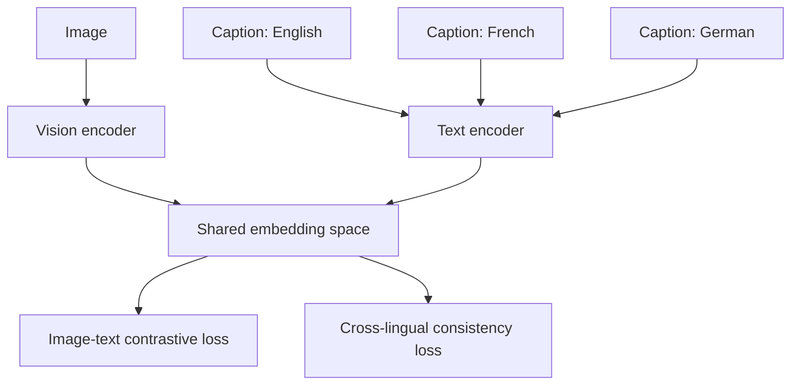

# Multilingual Alignment in Vision-Language Models

Multilingual alignment is the problem of making a VLM preserve semantic correspondence across:
- images
- captions in multiple languages
- prompts and answers in different languages
- cross-lingual retrieval and reasoning tasks

This matters for the Microsoft role because the job description explicitly mentions multilingual compatibility and broad European-market coverage.

## 1. Core goal
Given an image $I$ and captions $t^{(1)}, t^{(2)}, \dots, t^{(m)}$ in different languages that describe the same content, we want semantically aligned representations:

$$
z_I \approx z_{t^{(1)}} \approx z_{t^{(2)}} \approx \cdots \approx z_{t^{(m)}}.
$$

## 2. Symmetric contrastive alignment
A natural starting point is contrastive learning over image–text pairs:

$$
\mathcal{L}_{\text{img}\to\text{text}} = -\sum_i \log
\frac{\exp(s(z_{I_i}, z_{t_i})/\tau)}{\sum_j \exp(s(z_{I_i}, z_{t_j})/\tau)}.
$$

You usually pair it with a reverse term:

$$
\mathcal{L}_{\text{text}\to\text{img}} = -\sum_i \log
\frac{\exp(s(z_{t_i}, z_{I_i})/\tau)}{\sum_j \exp(s(z_{t_i}, z_{I_j})/\tau)}.
$$

For multilingual training, one can extend this so different-language captions for the same image are all pulled toward the same image representation.

## 3. Cross-lingual consistency
A simple consistency idea is to enforce similarity between multiple language descriptions of the same image:

$$
\mathcal{L}_{\text{xling}} = \sum_i \sum_{a \ne b}
\lVert z_{t_i^{(a)}} - z_{t_i^{(b)}} \rVert_2^2.
$$

This encourages semantic agreement across languages.

## Mermaid: multilingual alignment training

## 4. Why multilingual alignment is hard
It is not only a translation problem. The model must preserve:
- object identity
- cultural phrasing variation
- OCR and layout cues in multiple languages
- language-specific scripts and morphology
- cross-lingual grounding consistency

A model may be fluent in many languages but still poorly aligned visually in some of them.

## 5. Multilingual document understanding
For document tasks, multilingual alignment also includes:
- reading order in different scripts
- date / number / currency formats
- multilingual tables and mixed-language pages
- OCR noise that differs by script

This can be framed as a joint objective:

$$
\mathcal{L} = \lambda_1 \mathcal{L}_{\text{vision-text}} +
\lambda_2 \mathcal{L}_{\text{xling}} +
\lambda_3 \mathcal{L}_{\text{task}}.
$$

## 6. Evaluation
Typical evaluation families include:
- cross-lingual image-text retrieval
- multilingual VQA
- multilingual document extraction
- zero-shot transfer from one language to another

For retrieval, Recall@K is common:

$$
\mathrm{Recall@K} = \frac{1}{N}\sum_{i=1}^{N} \mathbf{1}(\text{correct match appears in top-}K).
$$

For classification or extraction you may also track F1, exact match, or task-specific structured accuracy.

## 7. Failure modes to mention
- the image aligns strongly with English captions but weakly with other languages
- translation-equivalent queries retrieve different visual concepts
- OCR-heavy scripts degrade much more than Latin-script inputs
- multilingual answers are fluent but semantically inconsistent with the image

## Interview framing
A strong answer sounds like this:

> Multilingual alignment means more than translating prompts. The model has to preserve the same visual semantics across languages, which I would usually enforce with contrastive image–text alignment plus some form of cross-lingual consistency. For enterprise or European-market settings, I would pay extra attention to document layouts, OCR noise, and script-specific failure modes, because those often break first.
